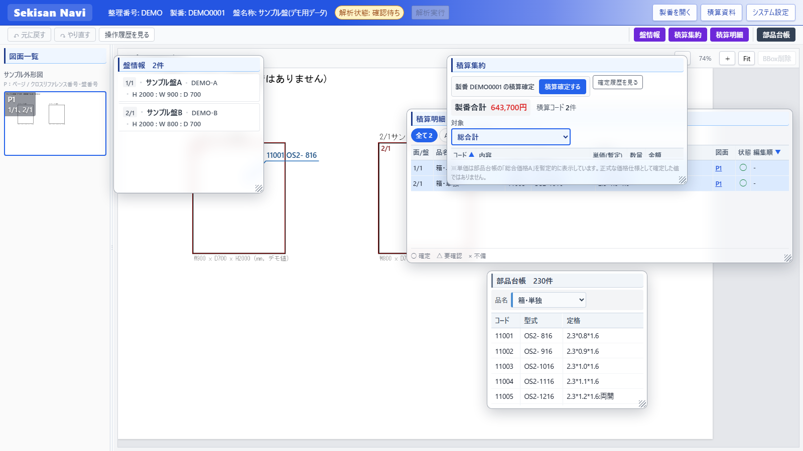

# Sekisan Navi (積算ナビ)

設計データ・図面・AI検出結果などから積算に必要な情報を収集し、ユーザーが図面上の
根拠を確認しながら積算情報を確認・補完・確定できるようにする、社内向け積算情報収集
Webシステムのプロトタイプ(PoC)。「AIによる完全自動積算システム」ではなく、
人の判断を安全に減らしていくための土台という位置付け(詳細は
[Product Vision](docs/product-vision.md)参照)。

## 画面



上記は実際に動作しているSekisan Naviの画面キャプチャ。**製番・盤名称・図面・
積算コードの価格はいずれも安全なサンプルデータ**(実在の企業名・製番・図面を含まない、
撮影専用のデモ製番`DEMO0001`)であり、実業務データではない。撮影方法・データの
安全性については[`docs/DOCUMENTATION_REPORT.md`](docs/DOCUMENTATION_REPORT.md)を参照。

### 画面の見方

**[2026-09 Issue #19/#25で仕様変更]** 右ペインは廃止した。盤情報・積算集約・
積算明細・部品台帳の4つは、いずれも図面Viewer上に重ねて表示する
**floating panel**(個別にON/OFF・drag移動・resize・最前面化・透過度調整が可能。
既定では右端に寄せてカスケード状に積み重ねて表示し、ブラウザ幅変更にも追従する)
として実装されている。

| 領域 | 内容 |
|---|---|
| ヘッダー(最上部) | アプリ名・案件情報(整理番号/製番/盤名称)・解析状態・製番検索/積算資料(Help PDF)/システム設定 |
| 図面一覧(左) | 製番配下のページをサムネイル表示。種類別にグループ化 |
| 図面Viewer(中央) | 選択中ページの拡大表示。盤領域・AI検出結果・Manual BBox・引出線を重畳表示。Zoom/Fitボタン・マウスホイールに加え、**中ボタン(マウスホイール押し込み)+dragでPan**、**中ボタンダブルクリックでFit**ができる(左dragはPanせず、BBox/盤/ラベルの選択・編集に使う) |
| 盤情報(floating panel) | 選択中製番の盤ごとの寸法・型式一覧 |
| 積算集約(floating panel) | 対象(総合計/製品全体/個別盤/要確認)ごとの数量・金額集計、積算確定ボタン、確定履歴の閲覧 |
| 積算明細(floating panel) | 積算コードが紐づいたBBox1件ずつの根拠一覧(どの図面のどの箇所か) |
| 部品台帳(floating panel、旧称: 積算コードMaster) | 品名selectでカテゴリを切替、コード/型式/定格の3列。行を選んでViewer上をドラッグするとBBoxとして配置される |

floating panelの表示ON/OFFは、Viewer右上のツールバー(元に戻す/やり直すボタンの
並び)右端にある表示切替ボタン群から行う。

## 解決する課題

- 図面・設計データ・AI検出結果が別々に存在し、積算に必要な情報を人手で
  図面から拾い集める作業に時間がかかる。
- 「なぜその数量・金額になったか」の根拠(どの図面のどのBBoxか)を、後から
  遡って追跡しづらい。
- Master価格表(Excel)の更新や図面の再確認によって、過去の積算結果が
  いつの間にか変わってしまう(再現性の問題)。

Sekisan Naviは、これらを画面上で完結させ、かつ将来の段階的自動化(判断データの
蓄積)につながる形で解決することを目指している。

## 現在実装済みの主要機能

- **実図面Viewer**: 製番配下の実PNG/PDFをブラウザ上でzoom/Fit表示し、
  盤領域・AI検出結果・Manual BBoxを重畳表示する。Pan(表示位置の移動)は
  中ボタン(マウスホイール押し込み)+dragで行い、中ボタンダブルクリックで
  Fit(全体表示)へ戻せる。左dragはPanせず、BBox/盤/引出線ラベルの選択・
  編集専用として使う。
- **図面一覧**: 製番配下のページをサムネイル一覧表示し、種類別にグループ化する。
- **floating panel(盤情報/積算集約/積算明細/部品台帳)**: 4つとも図面Viewer上へ
  重ねて表示する独立したパネルとして、個別にON/OFF切替・drag移動・resize・
  最前面化・背景透過度調整(システム設定から一括調整)ができる。既定では
  右端へ寄せてカスケード状に積み重ねて表示し、ブラウザ幅・高さの変更にも
  位置関係を保ったまま追従する。
- **Manual BBox追加・編集**: 部品台帳(旧称: 積算コードMaster)から品目を選び、
  図面上へBBoxをドラッグ配置。作成後の移動・リサイズ・削除・Undo/Redoに対応する。
  積算コードに紐づいたBBoxは、通常時はCADライクな引出線(ラベル+矢印)で表示し、
  ラベルの中心XがBBox中心Xより左にある場合はBBox左上、それ以外はBBox右上を
  接続点として自動的に切り替える。
- **部品台帳検索**: 実Excel(`estimate_master_a.xlsx`)を正式参照元とした
  品名select+コード/型式/定格でのカテゴリ切替。
- **盤情報**: 実データ(`estcode_df.csv`)由来の盤ごとの寸法・型式等を表示する。
- **積算集約・積算明細**: 対象(総合計/製品全体/個別盤/要確認)ごとに数量・金額を
  集約表示し、明細1件ずつの根拠(どの図面のどのBBoxか)を追跡できる。
- **積算確定snapshot・確定履歴の閲覧**: 製番単位で、その時点の積算結果一式を
  Backend側で組み立ててDBへ確定保存する(Master価格が後から変わっても確定内容
  自体は変化しない)。過去に確定した記録は一覧・詳細で閲覧できる(編集は不可)。
- **判断・修正データの記録・閲覧**: Manual BBoxのcreate/delete/move/resizeを
  `decision_events`として自動的に記録し、行った順に一覧表示する操作履歴閲覧UIを
  備える(編集・取り消しはできない、確認専用)。
- **積算資料(Help PDF)の参照**: ヘッダーの「積算資料」ボタンから、部品台帳とは
  別の参考資料PDFを画面遷移なしに閲覧できる。
- **製番検索・切替、データ参照ルートの管理者設定**。

実装状況の詳細な確定/暫定/未確定の区分は [`docs/implementation-plan.md`](docs/implementation-plan.md)
を参照。

## 基本操作の流れ

1. 画面上部のヘッダーで現在の案件情報を確認し、「製番を開く」から実製番を検索・選択する。
2. 左ペイン「図面一覧」でページを選び、中央Viewerで図面・盤領域・検出結果を確認する
   (中ボタンdragでPan、中ボタンダブルクリックまたはFitボタンで全体表示に戻せる)。
3. floating panelの「部品台帳」で品目を選び、Viewer上をドラッグしてBBoxを配置する
   (積算コードとして紐付け)。
4. floating panelの「積算集約」で対象ごとの数量・金額を確認し、「積算明細」で個々の
   根拠(BBox)を追跡する。floating panelは邪魔な位置にあれば見出しをドラッグして
   移動・大きさ変更ができる。
5. 内容を確認できたら「積算確定する」で、その時点の結果をsnapshotとして確定保存する
   (過去の確定記録・BBox操作履歴はそれぞれ専用の閲覧UIから振り返れる)。

より詳しい操作方法(初めての方向け、専門知識不要)は
[`docs/user-guide.md`](docs/user-guide.md)、詳細な画面仕様(開発者向け)は
[`docs/ui-spec.md`](docs/ui-spec.md) を参照。

## Documentation

| Doc | 内容 |
|---|---|
| [`docs/user-guide.md`](docs/user-guide.md) | **操作ガイド(初めての方向け)** — プログラムの知識が無い方でも読める、画面の使い方マニュアル |
| [`docs/product-vision.md`](docs/product-vision.md) | Product Vision — なぜ作るのか・将来の段階的自動化への方向性 |
| [`docs/architecture.md`](docs/architecture.md) | アーキテクチャ(レイヤー構成・ディレクトリ構成・主要な設計判断、Mermaid図あり) |
| [`docs/data-model.md`](docs/data-model.md) | データモデル(テーブル定義・状態一覧) |
| [`docs/api-reference.md`](docs/api-reference.md) | APIリファレンス(現在存在するエンドポイント一覧) |
| [`docs/ui-spec.md`](docs/ui-spec.md) | UI仕様 |
| [`docs/tech-stack.md`](docs/tech-stack.md) | 技術スタック一覧(バージョン・用途) |
| [`docs/configuration.md`](docs/configuration.md) | 設定・環境変数一覧 |
| [`docs/coding-conventions.md`](docs/coding-conventions.md) | コーディング規約(命名・層構成・テスト方針) |
| [`docs/known-limitations.md`](docs/known-limitations.md) | 既知の制約・未実装事項 |
| [`docs/data-source.md`](docs/data-source.md) | 実データソース調査結果 |
| [`docs/decision-data-gap-analysis.md`](docs/decision-data-gap-analysis.md) | 将来自動化に向けた判断・修正データの保存状況棚卸し |
| [`docs/decision-event-design.md`](docs/decision-event-design.md) | 判断履歴(`decision_events`)の設計 |
| [`docs/decision-snapshot-design.md`](docs/decision-snapshot-design.md) | 積算確定snapshotの設計 |
| [`docs/implementation-plan.md`](docs/implementation-plan.md) | 実装計画・確定/暫定/未確定の分類・各Phaseの実施記録 |
| [`docs/DOCUMENTATION_REPORT.md`](docs/DOCUMENTATION_REPORT.md) | ドキュメント整備状況のレポート(Issue #11) |
| [`CLAUDE.md`](CLAUDE.md) | Claude Code向け開発ガイド |

## 技術構成

| 層 | 技術 |
|---|---|
| Frontend | React 19 + TypeScript + Vite 8 + PDF.js |
| Backend | FastAPI + Pydantic + SQLite(生SQL、ORM無し) |
| テスト | pytest(Backend) / vitest + Testing Library(Frontend) |

バージョンの詳細・使用箇所は [`docs/tech-stack.md`](docs/tech-stack.md) を参照。

```
backend/    FastAPI + SQLite (Python)
frontend/   React + TypeScript + Vite + PDF.js
docs/       設計・仕様・開発ドキュメント
```

## セットアップ・起動方法

### Backend

```bash
cd backend
python -m venv .venv
source .venv/Scripts/activate   # Windows Git Bash の場合。cmd/PowerShellは .venv\Scripts\activate
pip install -r requirements.txt

# 管理者パスワードを設定する (システム設定画面でのデータ参照ルート変更に必要)
cp .env.example .env
# .env を編集して SEKISAN_NAVI_ADMIN_PASSWORD を設定する (実パスワード入りの.envはGit管理対象外)

uvicorn app.main:app --reload --port 8000
```

起動時に自動でSQLiteスキーマのマイグレーションとダミーデータ投入、および
部品台帳(積算コードMaster、`data/master/estimate_master_a.xlsx`)のインポートが
行われる(`backend/data/sekisan_navi.db` が生成される)。API仕様は起動後
`http://localhost:8000/docs` (Swagger UI) で確認できる(詳細は
[`docs/api-reference.md`](docs/api-reference.md))。

**`data/master/estimate_master_a.xlsx` は社内業務データのため、このリポジトリには
含まれていない (`.gitignore`の`/data/`)。** 各自の環境で `SekisanNavi/data/master/`
配下に実ファイルを配置してから起動すること (配置パスは`backend/app/config.py`の
`MASTER_EXCEL_PATH`参照。Sheet2を読む)。ファイルが無い場合、部品台帳(積算コード
Master)のインポートのみエラーになるが、アプリ自体は起動する。

部品台帳(画面上の表示名。Backend/データソース上は積算コードMasterと呼ぶ)は
`data/master/estimate_master_a.xlsx` (Sheet2) を正式な参照元と
しており、`estimate_master_items` テーブルへは `code` を一意キーとした
UPSERTで投入・再取込される。再取込を手動で行いたい場合は
`python -m app.db.master_importer` を実行する (Manual BBoxの `master_item_id` 参照は
再取込後も壊れない)。使用する品名は業務指定の13種類のみに限定しており
(`backend/app/domain/master_categories.py`)、それ以外の品名の行やコード/品名に
取り消し線が設定された行はインポート時点で除外される。詳細は
[`docs/data-model.md`](docs/data-model.md)/[`docs/architecture.md`](docs/architecture.md) 参照。

データ参照ルートの初期値は `\\beans-f1\ShareData\estimatic\a_product\output` で、
社内LAN・共有フォルダへ接続できる環境で実行することを前提とする
(接続できない環境では、実図面を参照する機能のみエラーになるが、アプリ自体は起動する)。

#### 検証用DBへの切替 (Issue #23 Phase 2)

実製番を使った動作確認は、本番用DB (`backend/data/sekisan_navi.db`) を汚さない
よう、検証専用のDBファイルへ切り替えて行うことを推奨する。環境変数
`SEKISAN_NAVI_DB_PATH` にDBファイルのパスを指定すると、Backendはそのファイルを
使う(未指定時は従来どおり `backend/data/sekisan_navi.db`。既存の起動手順・
挙動は一切変わらない)。

```bash
# 1. 本番DBを安全なタイミング(書き込み中でない時)でコピーする
cp backend/data/sekisan_navi.db /path/to/verification/sekisan_navi.db

# 2. 検証用DBを指定してBackendを別ポートで起動する (絶対パスを推奨。
#    相対パスを指定した場合はBackend起動時のカレントディレクトリ基準で解決される)
cd backend
SEKISAN_NAVI_DB_PATH=/path/to/verification/sekisan_navi.db \
  uvicorn app.main:app --port 8010

# 3. Frontendの接続先を検証用backendへ向ける
cd frontend
cp .env.example .env.local   # 未作成の場合
echo 'VITE_BACKEND_URL=http://127.0.0.1:8010' >> .env.local
npm run dev
```

起動時のmigration・ダミーデータ投入・Master Excelインポートは、いずれも
`SEKISAN_NAVI_DB_PATH`で指定したDBファイルに対してのみ行われる(本番DBには
一切触れない)。検証が終わったら、検証用DBファイルを破棄するか任意の場所へ
保管し(Git管理対象に含めないこと)、Frontendの`VITE_BACKEND_URL`を本番backendの
ポートへ戻す。

この仕組みはDBファイルパスの切替のみが対象で、データ参照ルート
(`system_settings.data_source_root`、コピーしたDBファイルの中身がそのまま
使われる)・Frontend側の表示・DBファイルの自動コピー機能はいずれも対象外。
詳細・設計判断の背景は [Issue #23](https://github.com/bs-shashimoto2048/SekisanNavi/issues/23)
と [`docs/configuration.md`](docs/configuration.md) を参照。

### Frontend

```bash
cd frontend
npm install
npm run dev
```

`http://localhost:5173` で画面を確認できる。Frontendは `/api/...` への呼び出しを
Vite開発サーバーのプロキシ経由でBackendへ転送する (`vite.config.ts`)。プロキシ先は
既定で `http://127.0.0.1:8000`。

**ポートが競合する場合**: 開発機で `8000` や `5173` が既に別プロセスに使われている場合は、
`uvicorn app.main:app --port <別のポート>` で起動し、`frontend/.env.local`
(`cp .env.example .env.local` で作成) に
`VITE_BACKEND_URL=http://127.0.0.1:<そのポート>` を設定すること。
**変更が必要なのはこの1箇所だけ** — プロキシ経由のためFrontendから見ると常に同一オリジンで
アクセスすることになり、Backend側のCORS設定 (`ALLOWED_ORIGINS`) を変更する必要はない。

設定値・環境変数の一覧は [`docs/configuration.md`](docs/configuration.md) を参照。

### テスト・型チェック・Lint

```bash
# Backend
cd backend && source .venv/Scripts/activate && python -m pytest -q

# Frontend
cd frontend && npm run test    # = vitest run
cd frontend && npx tsc -b tsconfig.app.json --noEmit
cd frontend && npm run lint
cd frontend && npm run build   # 型チェックを兼ねたビルド確認
```

2026-09時点のmainで、Backend 223件・Frontend 659件(31ファイル)のテストが
全件成功することを確認済み。

## 重要な前提・現在の制約

- 提供されているExcel・画面案は完成仕様ではなく、検討中の参考資料として扱っている。
  項目追加・削除・名称変更・コード体系変更等が今後発生する前提で設計している。
- 元図面・PDF・設計データ・共有フォルダ上のファイルは read-only。本システムが
  上書き・削除・移動・リネームすることはない。
- AIの検出結果 (Detection) と積算業務ルールは分離しており、AIクラスから
  直接積算コードを決定する実装は行わない (`backend/app/domain/rule_engine.py`)。
- データ参照ルートの変更・接続確認には管理者パスワード (`SEKISAN_NAVI_ADMIN_PASSWORD`) が
  必須で、その検証は必ずBackend側で行う。通常の製番・図面参照には不要。
- 認証・actor記録・CIはいずれも未実装(判断履歴の読み出しUI・確定snapshot履歴
  閲覧UIは実装済み、上記「現在実装済みの主要機能」参照)。詳細は
  [`docs/known-limitations.md`](docs/known-limitations.md) を参照。

## Product Vision

現在の実装はゴールではなく、**将来の見積り自動化のための判断データを安全に
蓄積していく基盤**という位置付けにある。通常の積算作業(BBox作成・修正・確定)を
行うだけで、後から分析・自動化に使える判断データが自然に残る設計を志向している
(`decision_events`・積算確定snapshotはその第一歩)。背景・段階的な自動化の考え方は
[`docs/product-vision.md`](docs/product-vision.md) を参照。
