# architecture.md — Sekisan Navi アーキテクチャ

PoC時点でのアーキテクチャ方針(2026-09、Issue #4 Phase B / Issue #6 / Issue #9反映後の
mainを反映)。ここに書かれた技術選定・構成も「変更されうる前提」で書いており、
確定/暫定の区分は `implementation-plan.md` を参照。章立ては初版(Phase 0/1/1.5)
からの追記形式のため、章番号と機能追加時期(Phaseやissue番号)は必ずしも
一致しない。

## 1. 全体像

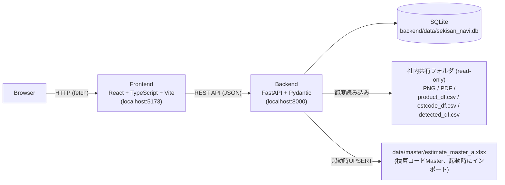

PoCではローカルPCまたは社内LAN上でFrontend/Backendを別プロセスとして起動し、
ブラウザからアクセスする構成とする(要件3)。認証・リバースプロキシ・HTTPS化等の
本番運用向け構成は今回のスコープ外。SQLiteは`detections`/`estimate_master_items`/
`decision_events`/`estimate_confirmations`等の**現在状態・判断履歴・確定snapshot**を
保持し(2章参照)、社内共有フォルダ上のCSV/PNG/PDFは常にread-onlyで都度読み込む
(6章参照)。

### 主要なデータフローの例: BBox作成から判断履歴記録まで

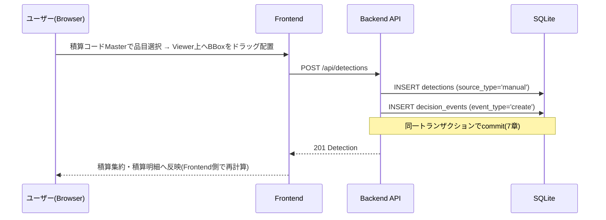

上記はManual BBox作成の例。移動・リサイズ(`PATCH`)・削除(`DELETE`)も同様に
「状態変更 + decision_events記録」を同一トランザクションで行う(16章)。

## 2. レイヤー構成 (Backend)

```
app/
  main.py            FastAPIアプリ定義・起動時マイグレーション/シード
  config.py          パス・CORS・データ参照ルート初期値等の設定値
  domain/
    models.py        ドメインモデル (dataclass)。DBにもAPIにも依存しない。
    rule_engine.py    Detection -> 積算コード候補 のルール変換 (要件7)
  db/
    connection.py     sqlite3接続ラッパー
    migrate.py         マイグレーションランナー
    migrations/*.sql    スキーマ定義 (連番)
    seed.py             ダミーデータ投入
  repositories/       SQLiteの行 <-> domainモデル の変換 (SQLはここに閉じ込める)
    decision_events.py         判断・修正データevent記録 (Issue #4 Phase A-1、16章)
    estimate_confirmations.py  積算確定snapshotの保存 (Issue #4 Phase B-1、17章)
  services/           DB以外の外部境界を扱う層 (Phase 1.5で追加)
    data_source.py      データ参照ルート・製番ディレクトリの安全な解決
    admin_auth.py        管理者パスワード検証
    product_df.py         product_df.csv(盤領域)の読み込み (Phase 1.8、14章)
    estcode_df.py          estcode_df.csv(盤情報)の読み込み (Phase 1.14、18章)
    detected_df.py          detected_df.csv(YOLO検出結果)の読み込み (Phase 1.12、18章)
    estimate_confirmation_builder.py  積算確定snapshotを現在状態から組み立てる
                                       (Issue #4 Phase B-2、17章)
  schemas/            APIの入出力契約 (Pydantic)。domainと形は似るが役割は別。
    estimate_confirmations.py  積算確定snapshot作成APIのレスポンス型 (17章)
  api/routers/        FastAPIルーター。repositories/rule_engine/servicesを呼ぶだけ。
tests/                pytest (domain単体テスト・APIテスト・データ参照サービスの単体テスト)
```

**責務分離の意図**:
- `domain/` はDB・HTTPを知らない。将来ORMやDBを変えてもここは変わらない。
- `repositories/` はSQL文字列を持つ唯一の層。テーブル構造が変わってもAPI層は影響を受けない。
- `schemas/` (API契約) と `domain/models.py` (業務モデル) を分けているのは、
  画面都合でレスポンス形を変えたくなった際にdomain/repositoriesへ波及させないため(要件15)。
  PoC規模では両者はほぼ同型だが、意図的に別モジュールにしている。

## 3. レイヤー構成 (Frontend)

```
src/
  api/client.ts        fetchの薄いラッパー。既定は相対パスでVite devプロキシ経由。
  api/errors.ts         fetch失敗を安全な日本語メッセージへ変換 (describeFetchError)
  types/domain.ts       APIレスポンスに対応する型定義
  pdf/pdfjs.ts           PDF.jsのセットアップ (ワーカー設定を1箇所に集約)
  components/
    ProjectHeader/       案件情報・解析状態ヘッダー + システム設定/製番を開くボタン。
                         「Sekisan Navi」ブランドブロック・右方向グラデーション背景
                         (Issue #9、`ui-spec.md` 2章)
    DrawingNavigator/     図面一覧 (ページ単位・種類別グループ表示)
    DrawingViewer/        中央Viewer
      DrawingCanvas.tsx     PDF.js('pdf')/PNG('png')表示 + zoom/pan/fit。ツールバー
                             ボタンの質感(box-shadow/hover/active)はIssue #9で調整
      DetectionOverlay.tsx  Detection BBoxのオーバーレイ
      PanelOverlay.tsx      盤範囲(Panel Area)のオーバーレイ。Detectionと独立
      ProductPanelOverlay.tsx  product_df由来の盤領域Overlay (Phase 1.8、14章)
      LeaderLineOverlay.tsx    引出線(Leader Line)表示 (Phase 1.11、15章)
    PanelInfo/             盤情報 (estcode_df.csv実データ、Phase 1.14でPanelPropertiesから置換。
                           Issue #6で折りたたみ対応)
    EstimateAggregation/  積算集約 (数量・金額の確認。対象別/総合計の数量集約に対応。
                           「製番合計」金額は赤系(#dc2626)で強調(Issue #9)。
                           `EstimateConfirmationAction.tsx`(積算確定ボタン、
                           Issue #4 Phase B-3、17章)を内包。Issue #6で折りたたみ対応。
                           詳細は`ui-spec.md` 5.5章)
    EstimateDetail/        積算明細 (1 Detection = 1行の根拠追跡。旧EstimateTreeの後継、
                           `ui-spec.md` 5.6章。Issue #6で折りたたみ対応)
    EstimateMasterPicker/ 積算コードMaster検索
    SystemSettings/       管理者向けシステム設定 (データ参照ルート変更) (Phase 1.5)
    ProductSelector/       製番検索・切替 (Phase 1.5で`ProductViewer`として追加、
                           Phase 1.8で製番検索UIへ役割変更・改名)
    Layout/
      PaneSplitter.tsx       左右/上下ペイン境界のResize Handle
      CollapsibleSectionHeading.tsx  右ペイン3領域(盤情報/積算集約/積算明細)の
                                     折りたたみ見出し (共通化。Issue #6)
  domain/                Frontend側の純粋な業務ロジック (Backendを介さない計算)
    estimateAggregationReal.ts  積算集約・積算明細を実データから組み立てる
                                 (対象別/総合計の数量集約、BBox所属判定を含む)
    editHistory.ts               Undo/Redo (create/delete/bboxの3種)
    masterCategoryPresentation.ts 積算コードカテゴリごとの配色定義
  hooks/usePaneWidth.ts   ペイン幅・高さの状態管理+localStorage永続化
                         (`dimension: 'width'|'height'`で両対応)
  App.tsx                各コンポーネントの状態統合・データ取得・レイアウト構成
```

**責務分離の意図**:
- 個々のコンポーネントは「表示」に専念し、業務ロジック(積算ルール等)を持たない(要件20)。
- `PanelProperties` は属性名をハードコードせず、APIが返す `attributes[]` をそのまま描画する(要件12)。
- `EstimateMasterPicker` の表示列は `COLUMNS` 定数配列で定義し、Excel由来の列構成を
  直接コンポーネントへ焼き込まない(要件14)。

## 4. AIとルールの分離 (要件7)

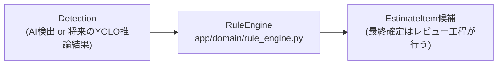

`RuleEngine`は`class_name`等から積算コード候補を導出する層で、業務判断をここに
集約する。

- YOLOのクラス名やbboxを直接画面の積算コードへ変換するコードは書かない。
- `rule_engine.py` は純粋関数として実装し、単体テスト可能にする(`tests/test_rule_engine.py`)。
- PoCでは実推論を行わないため、`rule_engine.py` は「クラス名 -> コード」の
  簡易対応表を持つのみ。将来ルールが複雑化しても、この層の内部だけを差し替えればよい。
- Manual BBox (Phase 1.6) もDetectionの一種 (`source_type='manual'`) として登録する。
  ユーザーが積算コードを直接選んでいるため、Manual BBox自体はRuleEngineを経由しないが、
  「Master Itemへの参照(`master_item_id`)を保持するのみで、EstimateItemへの変換・
  数量/価格の確定は行わない」という点はAI由来のDetectionと同じ扱いとし、
  Detection→EstimateItemの境界自体は崩していない (要件19)。

## 5. データベース / マイグレーション

- SQLiteファイル1つ (`backend/data/sekisan_navi.db`, gitignore対象)。
- `backend/app/db/migrations/*.sql` を連番で管理し、`schema_migrations` テーブルで
  適用済みファイルを記録する自作の軽量マイグレーションランナーを採用 (Alembge等は
  PoC規模ではオーバースペックと判断)。
- アプリ起動時 (`main.py` の `lifespan`) に自動でマイグレーション適用 + ダミーデータ投入。
  本番運用では明示的なコマンド実行に切り替える想定 (未確定)。
- **接続生成は `check_same_thread=False` で行う** (`app/db/connection.py`)。
  FastAPIの同期(`def`)エンドポイント・依存関係は内部でスレッドプール経由で実行され、
  1リクエストの中でも接続生成(依存関係)と接続使用(エンドポイント本体)が異なる
  スレッドに割り当てられる場合があるため。既定設定のままだと実ブラウザからの
  同時多発リクエストで `sqlite3.ProgrammingError` が高確率で発生することを実機確認で
  特定した (`docs/implementation-plan.md` 6章、`tests/test_concurrency.py` 参照)。
  各リクエストが専用の新規接続を都度生成する現在の設計 (`get_connection()`) では、
  この設定でも複数リクエストが同一接続を同時に奪い合うことはなく安全である。

## 6. 元データの安全性 (要件5, 19)

- 元図面PDF・設計データ・共有フォルダ上のファイル (`\\beans-f1\ShareData\estimatic\a_product\output\` 配下)
  は本アプリから read-only として扱う。Backendのコードは一貫して読み取り専用の
  ファイル操作 (`Path.exists`, `os.listdir`, `open`によるストリーミング配信) のみを行い、
  書き込み・削除・移動・リネームに相当するAPI/関数は一切実装していない。
- Phase 1.5で実データ (製番 `A1GV2421`) への接続を実装したが、これはBackendが
  リクエスト時にその場でファイルを読み取って返すのみであり、実ファイルをリポジトリや
  作業領域へコピーする処理は行っていない (表示のためのコピー・キャッシュが必要になった
  場合は `backend/data/` 等の作業領域に限定する方針は維持する。要件19)。
- 実図面・製番データはGitへ一切含めていない。`backend/app/db/seed.py` に実データの
  「数値」(製番名・寸法等) を参考値として記述している箇所はあるが、図面ファイル本体
  (PDF/PNG/DXF等) はコミット対象に含めていない (要件20)。

## 7. データ参照ルート・製番アクセスの安全な解決 (Phase 1.5, 要件8-17)

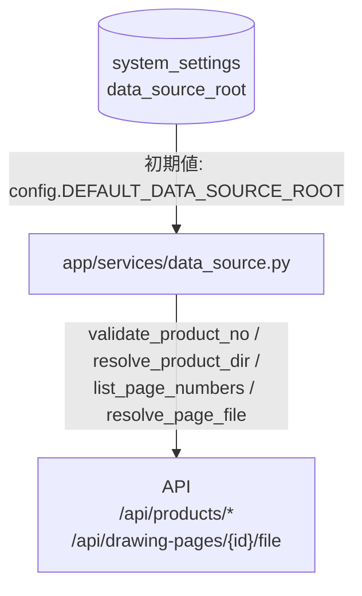

- `validate_product_no()`: 製番文字列を正規表現で検証(英数字4〜20文字)。
- `resolve_product_dir()`: root + product_noからパスを解決し、解決後パスが必ず
  root配下であることを確認(パストラバーサル対策)。CCVサブディレクトリの探索も
  ここで行う(`config.CCV_SUBDIR_CANDIDATES`、5章参照)。
- `list_page_numbers()`: `{page}.pdf`形式のファイルのみpage番号として抽出。
- `resolve_page_file()`: ページ番号からファイルパスを安全に組み立てる。

Frontendは一切UNCパスを組み立てない。常に`product_no`/`page_no`という
「意味のある識別子」のみを送り、パス解決はBackendに閉じている(要件10, 17)。
例外は`DataSourceError`のサブクラスとしてキャッチし、内部のスタックトレースや
詳細を含まない日本語メッセージへ変換してから返す(要件15)。

CCVについて: 実データ調査の結果、「CCV」という名前のディレクトリ・ファイルは
確認できなかった (`docs/data-source.md` 参照・未確認事項)。暫定的に
「CCVサブディレクトリがあれば使う、なければ製番直下を使う」というフォールバック実装とし、
どちらが使われたかを `ccv_resolved` としてAPIレスポンスへ含めている。

## 8. 管理者認証 (Phase 1.5, 要件12)

- データ参照ルートの変更 (`PUT /api/settings/data-source`) および接続確認
  (`POST /api/settings/data-source/test`) は、必ずBackend側 (`app/services/admin_auth.py`)
  で管理者パスワードを検証する。Frontend側のバリデーションには一切依存しない。
- 管理者パスワードは環境変数 `SEKISAN_NAVI_ADMIN_PASSWORD` (または `backend/.env`、
  Git管理対象外) から取得する。未設定の場合は誰であっても常に認証失敗とする
  (fail-closed)。DB・Gitへの平文保存は行わない。
- 通常の製番・図面参照 (`GET /api/products/*`) には管理者パスワードを要求しない
  (要件18)。

## 9. Overlay座標系の設計 (Phase 1.5, 要件4)

**採用した方式**: Detection・PanelArea (盤範囲) の座標は、いずれも
**0.0〜1.0 の正規化座標 (該当ページのPDF原寸=PDF.jsが返す `scale:1` 時のwidth/height
に対する比率)** として保持する。

**採用理由**:
- 「図面表示サイズそのものをBBox座標として保存しない」という要件を、最も単純な形で
  満たせる (ズーム倍率・ウィンドウサイズを一切含まない)。
- Frontend側では `DrawingCanvas` が計算した「content領域のピクセルサイズ
  (= zoom × PDF原寸)」に対して単純に `%` 変換するだけでオーバーレイを配置できるため、
  実装・検証が容易 (`DetectionOverlay`/`PanelOverlay` のテスト参照)。
- 「PDF原寸座標(pt)」も候補として検討したが、正規化座標の方がFrontend側の実装
  (パーセンテージ指定のCSS) と直接対応し、単位変換ミスが起きにくいため採用した。

**この座標系が保証すること**: zoom・pan(スクロール)・ブラウザウィンドウのリサイズは
いずれも「content領域のピクセルサイズ」だけに影響し、正規化座標そのものは変化しない。
そのため上記のどの操作を行ってもBBoxと図面の位置関係はずれない
(`DrawingCanvas.test`相当の目視確認、および`DetectionOverlay.test.tsx`/`PanelOverlay.test.tsx`
で「正規化座標→%変換」の単体テストを実施)。

**保留した設計判断**: 実際のAI検出結果 (CAD実座標系, `detected_df.csv`) を
PDFページ上のピクセル位置へ厳密に変換する式は、切り出しオフセット情報が
共有元データから特定できなかったため確立できていない (`docs/data-source.md` 5章)。
Phase 1.5のDetection/PanelAreaのダミー座標は、実PDFページを目視確認して配置した
近似値である。

## 10. 図面Viewerの技術選定について (Phase 1.5で確定)

**採用: PDF.js (`pdfjs-dist`)、バージョン 6.2.108。**

- 現在のVite (v8) + React (v19) + TypeScript (v6) 構成との相性を確認した:
  `pdfjs-dist` はESM専用ビルド (`build/pdf.mjs`, `build/pdf.worker.min.mjs`) のみを
  提供しており、Viteのネイティブ ESM 解決・`new URL(..., import.meta.url)` による
  ワーカー読み込みパターンと問題なく組み合わせられることを実装・ビルド確認済み
  (`npm run build` が型エラーなく成功)。
- 他候補 (ブラウザネイティブ `<embed>`/`<iframe>` によるPDF表示等) は、BBoxオーバーレイの
  重畳や zoom/pan の連動制御が難しいため採用しなかった。
- `DrawingCanvas` コンポーネントが担う機能: PDFページのcanvasへの描画、zoom in/out、
  Fit to View、ドラッグによるpan、マウスホイールによるカーソル位置基準のzoom。
  高度なCAD Viewer機能 (レイヤー切替、注釈編集等) は実装していない (要件3)。

**Phase 1.8重要仕様訂正**: 実製番モードの中央Viewerは、下記14章の理由により
PDF.js描画ではなく `{page}.png` を直接表示する `mode="png"` へ切り替えた。
`DrawingCanvas` はPDF.js描画自体を削除しておらず、`mode` prop (`'pdf'` 既定 /
`'png'`) で両対応する。zoom/pan/fit/BBox作成・選択・リサイズのロジックは
「コンテンツ原寸(nativeSize) × zoom」の座標系にのみ依存しており、
nativeSizeの取得元がPDFページかPNG画像かを区別しないため、モード追加に伴う
ロジック変更は最小限で済んだ (`clientToNative`/BBox作成関数は無変更。
Fit計算用の関数は2026-09 追加修正で`fitToView`から`applyFit`へ改名し、
`viewMode`ステートマシンの一部となった。詳細は`ui-spec.md`「4. DrawingViewer」の
「Viewer自動Fit」節参照)。

## 11. 将来のAI接続について

- `app/domain/rule_engine.py` の前段に、実YOLO推論を差し込むインターフェースを
  将来追加する想定 (例: `InferenceResult -> Detection` の変換関数)。
- 本Phaseでは実装しない (要件23)。

## 12. Master Importer (Phase 1.7)

積算コードMasterのダミーデータ (`db/seed.py` に直書きしていた21件) を廃止し、
正式なExcel資料 `data/master/estimate_master_a.xlsx` (Sheet2) を単一の参照元とする。

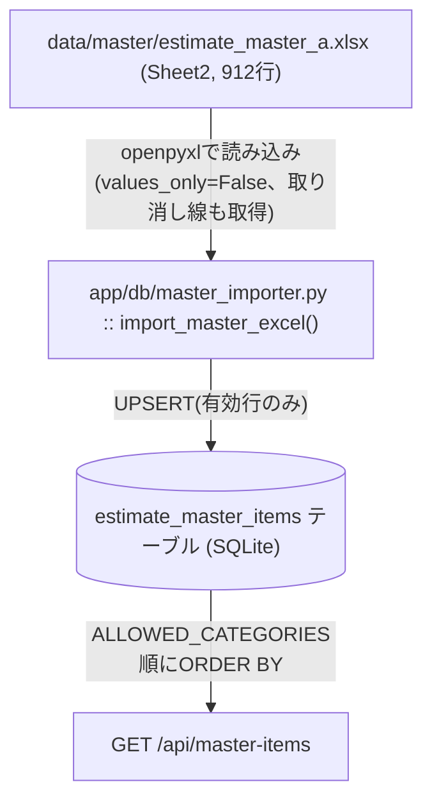

`import_master_excel()`が行う変換・除外処理:

- 列0〜11を`code`/`category`/`model`/`rating`/`total_price_a`/`box_parts_price`/
  `painting_price`/`setup_a`/`sheet_metal_price`/`assembly_price`/
  `inspection_price`/`note`へ機械的にマッピング(Frontend側にExcelの列構成を
  一切露出しない、要件のDB化方針を維持)。
- `code`が空の行はスキップ(`skipped_no_code`)。
- コード or 品名セルに取り消し線(`cell.font.strike`)がある行を除外
  (`excluded_by_strike`)。
- `app/domain/master_categories.ALLOWED_CATEGORIES`(13品名)にない行を除外
  (`excluded_by_category`。品名NULL・文章形式の特殊行もここで一律除外される)。
- `INSERT ... ON CONFLICT(code) DO UPDATE`によるUPSERT(有効行のみ)。
- 今回の条件で無効となった既存Master行の安全な削除同期(下記参照)。

**初期投入・再取込の方式**: `code` を一意キーとしたUPSERTを採用した (要件: 安全な
一意キーを実データから判断すること)。実Excelの実データ調査で `code` に重複がない
ことを確認済み (`tests/test_master_importer.py`)。UPSERTのため `id` は初回投入時の
値のまま変わらない。これにより、Manual Detectionの `master_item_id` (FK) は
再取込後も同じMaster行を指し続ける — 再取込がManual BBoxの参照を壊さないことの
根拠はこの「idを変えないUPSERT」にある。

**起動時の自動実行**: `main.py` の起動時 (`lifespan`) に `seed()` の後で
`import_master_excel()` を呼ぶ。ファイル欠落等で失敗しても `MasterImportError` を
catchしてアプリ自体はそのまま起動する (warningログのみ)。単独実行用に
`python -m app.db.master_importer` のCLIエントリポイントも用意した。

### 使用品名の限定・表示順固定・取り消し線行の除外 (Phase 1.7 追加指示)

実Excel (Sheet2, 912行) には、Sekisan Naviの積算作業では使わない品名や、
社内的に無効化された行 (取り消し線) が混在していることが判明したため、
以下の絞り込みを **Master Importer側** (DB取り込み前) で行う。Frontendで
非表示にするだけの実装にはしていない — 無効行はそもそも `estimate_master_items`
へ入らない。

**使用品名の一覧と表示順** (`app/domain/master_categories.py::ALLOWED_CATEGORIES`):
箱･単独 / 箱･左右 / 箱･中 / 内部ﾊﾟﾈﾙ / 底板 / 盤間の仕切・遮蔽 / 附属品加算価格 /
箱体価格倍率 / ﾊﾟﾈﾙ / OPA用ｱﾝｸﾞﾙ枠 / 金網 / 入力（主回路銅帯） / 銅帯 (13種)。
この順序は業務指定の固定順であり、Excel出現順や五十音順ではない。

**唯一の参照元とすることで二重管理を回避**: この13品名リストはBackend
(`app/domain/master_categories.py`) のみに存在する。
- Master Importer (`master_importer.py`) はこのリストにない `category` の行を
  取り込まない (品名NULL・文章形式の特殊行を含む)。
- `repositories/master.py::list_master_items()` は `ORDER BY CASE category
  WHEN ... THEN <順位> ... END, code` でこのリストの順序通りに行を返す。
- Frontend (`EstimateMasterPicker.tsx`) はこの一覧を一切ハードコードせず、
  APIが返す順序をそのまま「タブの並び順」として使う (`extractCategoryTabs()` は
  出現順で重複除去するだけ)。品名がNULLの行を受け取ることは想定していないため、
  「未分類」タブは廃止した。

**取り消し線の判定** (実Excel書式を確認して実装):
openpyxlを `values_only=False` (セルオブジェクトを取得するモード) で読み込み、
コードセル・品名セルそれぞれの `cell.font.strike` を判定する。文字列の内容や
記号の有無から推測することはしない。コードセル or 品名セルのどちらかが
`strike=True` の行は除外する (`_is_struck()`)。実Excelを調査した結果、
取り消し線が設定されている行は3件 (コード19957/19958/19960。いずれもコード・
品名の両方に設定されており、片方のみのケースは実データには存在しなかった)。

**既存Masterの安全な整理** (`_sync_remove_stale_master_items()`):
再取込のたびに、今回の条件 (13品名限定・取り消し線除外) で無効となった既存の
`estimate_master_items` 行を単純に全削除→再投入するのではなく、以下の判定を行う。
- どのDetectionからも `master_item_id` で参照されていない行 → 削除する
  (`removed_stale`)
- 既存のManual BBox (`detections.master_item_id`) が参照している行 →
  無効化条件に該当していても削除せず、`MasterImportResult.retained_invalid_referenced`
  (id, code のリスト) として呼び出し側 (`main.py`起動ログ) へ報告する。
  ユーザーデータ(Manual BBoxの参照)を今回の仕様変更だけで壊さないための対策。

**実データの投入結果 (2026-08時点で確認)**: Sheet2総行数912のうち、
取り消し線除外3件・対象外品名除外4件 (品名NULL1件・文章形式の特殊行3件) を除いた
**905件**が最終的な取込件数。`category` (品名) 別の内訳は 箱･単独=230 /
箱･左右=230 / 箱･中=230 / 入力（主回路銅帯）=66 / 附属品加算価格=29 /
箱体価格倍率=19 (元21件のうち2件が取り消し線で除外) / 金網=21 / 銅帯=19 /
内部ﾊﾟﾈﾙ=16 / 底板=15 / 盤間の仕切・遮蔽=14 / ﾊﾟﾈﾙ=10 / OPA用ｱﾝｸﾞﾙ枠=6。
詳細は `data-model.md` および `tests/test_master_importer.py` を参照。

## 13. BBox編集 (削除・リサイズ) (Phase 1.7)

### 削除

- `DELETE /api/detections/{id}`: Manual/AIのどちらのDetectionも区別せず削除対象にできる
  (`source_type` による制限を設けない)。存在しないidには404を返す。
- 削除対象のDetectionを参照している `EstimateReference.detection_id` は、削除前に
  `NULL` へ更新してから `detections` 行を削除する
  (`app/repositories/detections.py::delete_detection`)。EstimateItem/EstimateReference
  自体の行は削除しない — Detectionが消えても積算結果側の記録は残し、
  「根拠が失われた」状態として扱う (ダングリング参照は発生しない)。
- **AI Detectionの削除について (暫定)**: ユーザーがAI検出結果を明示的に削除できる
  仕様とした (ユーザー判断の上書きを許可)。ただし将来実YOLO推論を再実行した際、
  同じ検出が再度生成される可能性がある。「削除履歴を記憶して再推論時に除外する」仕組みは
  本Phaseでは実装していない (暫定。要望があれば別Phaseで検討)。

### リサイズ (4隅ハンドル)

- 選択中のDetection (Manual/AI問わず) にのみ4隅 (top-left/top-right/bottom-left/
  bottom-right) のリサイズハンドルを表示する (`DetectionOverlay.tsx`)。
- ドラッグ中はクライアント側のみでライブプレビューし、mouseup時に1回だけ
  `PATCH /api/detections/{id}` を呼び、bboxのみを更新する
  (`DetectionBBoxUpdateIn` — 他フィールドは変更不可)。
  **[2026-09 追加修正11章〜17章]** このプレビュー状態は旧`DetectionOverlay.tsx`の
  ローカル`livePreview` stateから、親の`DrawingViewer.tsx`が保持する
  `previewBBox: {detectionId, rect} | null` stateへ引き上げた (lift up)。
  `DetectionOverlay`は`onPreviewBBoxChange`経由でmousemove毎にこれを更新する
  だけの役割になり、`LeaderLineOverlay`も同じ`previewBBox`を読むことで、
  積算Master Itemに紐づくBBoxの引出線アンカーがmouseup前(ドラッグ中)でも
  リアルタイムに追従できるようになった (詳細は`ui-spec.md`の
  「BBox編集中のリアルタイム追従」参照)。`onPreviewBBoxChange`が渡されない
  呼び出し (既存の単体テスト等) では`DetectionOverlay`内部にフォールバックの
  stateを持ち、controlled/uncontrolledいずれでも動作する。
- **正規化座標変換**: `utils/bbox.ts::resizeRect()` が、Overlay要素の
  `getBoundingClientRect()` を基準にドラッグ中のポインタ座標を0.0〜1.0へ変換し、
  ドラッグされた角と対角固定の角から新しいrectを計算する。この変換はzoom/pan/fit/
  ウィンドウリサイズの状態に一切依存しないため (architecture.md 9章のOverlay座標系を
  そのまま踏襲)、リサイズ後の座標もズーム状態非依存で正しい。
- 最小サイズ (`MIN_BBOX_SIZE = 0.001`。Manual BBox新規作成時のバックエンド下限
  `bbox_w/h >= 0.001` と同じ値) を下回らないようclampし、対角を超えて縮める操作は
  「役割の入れ替え (どちらの角が固定か切り替える)」ではなく最小サイズで停止する。
  0.0〜1.0のページ範囲外への拡大もclampする。
- **AI Detectionのリサイズについて**: 元のYOLOモデル・元図面データは一切変更しない。
  変更されるのはSekisan Navi自身のDBに保存されたDetectionの座標のみであり、
  「ユーザーによる補正値」として扱う (元AI推論結果を上書きするわけではない)。

### Pan / BBox追加モード / BBox編集の競合回避

- BBoxのボタン要素・リサイズハンドルへの `mousedown` は、`DrawingCanvas` の
  Pan開始処理およびManual BBox新規作成処理の**手前**で `e.stopPropagation()` する
  (`DetectionOverlay.tsx::handleCornerMouseDown`)。
- 加えて `DrawingCanvas` 側にも「dragの起点が `button` 要素 (またはその子孫) だった
  場合はPan/BBox作成のいずれも開始しない」というガードを実装しており
  (`(target as HTMLElement).closest('button')` による判定)、リサイズハンドルは
  意図的に「BBoxボタンの兄弟要素の `<button>`」として実装しているため、
  このガードが自然に適用される (無効なHTMLネスト — button内button — を避けつつ、
  既存のPan除外ロジックをそのまま再利用できる)。
- 結果として、積算コードMasterで行を選択中 (`bboxAddMode=true`) であっても、
  既存BBoxのクリック・リサイズハンドルのドラッグ・削除ボタンの操作は
  「新規Manual BBox作成」と誤認識されない。

### 選択状態の解除

- 別のBBoxを選択、別ページへ移動 (`handleSelectPage`)、空白領域クリック
  (`onBackgroundClick`) のいずれでも選択状態を解除する。削除操作も常に選択解除を伴う。
- Deleteキーは `document` レベルの `keydown` リスナーで拾うが、フォーカスが
  `input`/`textarea`/`select`/`contentEditable` 要素にある場合は無視する
  (`App.tsx::isEditableTarget`)。将来的な複数ショートカット対応を見越しつつも、
  今回は専用の「ショートカット管理機構」は作らず、単純な条件分岐に留めている。

## 14. 製番検索・PNGサムネイル・盤領域Overlay (Phase 1.8)

### 製番検索 (要件2/3)

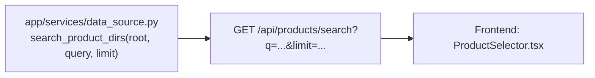

- `search_product_dirs()`: queryは英数字1〜20文字のみ許可(パストラバーサル対策の
  延長)。root直下を1回走査し、大文字小文字を無視した前方一致でフィルタ。
  最大limit件のみ返す(超過分は打ち切り、`truncated`フラグで通知)。
- `GET /api/products/search`は要件3どおりルート直下を無条件全件送信しない。
- `ProductSelector.tsx`はデバウンス付き検索欄(250msデバウンス、2文字未満では
  検索しない)。ユーザーが完全な製番を入力した場合は、候補になくても「開く」
  ボタンから`GET /api/products/{product_no}`(既存の`resolve_product_dir`経由)で
  直接存在確認できる(要件3)。

製番一覧をルート直下から全件取得してFrontendへ渡す実装は行っていない
(`docs/data-source.md` によれば914件超のディレクトリが存在しうるため)。

### 左ペインPNGサムネイル + 盤領域Overlay (要件5-27)

Phase 1.7で実装した「左右ペインリサイズ」の対象である `DrawingNavigator`
(メイン画面左ペイン) を、Phase 1.8でダミーDB非依存の実データ表示へ変更した。

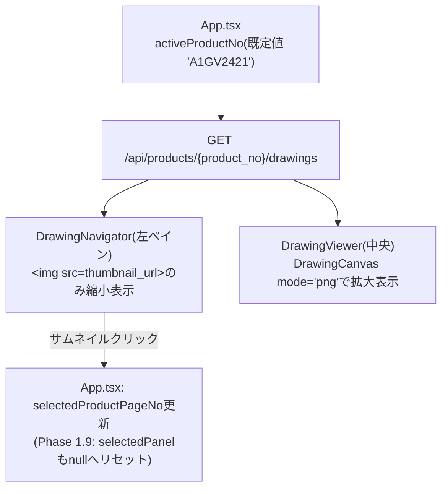

`GET /api/products/{product_no}/drawings`の処理:

- `list_page_numbers()`で実在ページ番号を取得(要件4のパストラバーサル対策を継承)。
- `load_product_df()`で`product_df.csv`を解析し、ページごとに`drawing_type`/
  `drawing_name`/`panels[]`へ整形(要件28: 生データをFrontendへ渡さない)。
- 各ページの`thumbnail_url`(=`{page}.png`への参照)を1つだけ発行する。

`DrawingNavigator`(左ペイン)は`onError`時に「画像なし / P{page_no}」の
フォールバック表示(要件7)、左上に「ページ番号 / BAN_MENNO / BAN_NO」
(複数盤なら全件ラベル。要件10-12)を表示し、盤領域(赤色)Overlayは表示しない
(実画面未反映調査・修正指示 7章)。

`DrawingViewer`(中央Viewer)は同一`thumbnail_url`を使い(PDFではなくPNGを使う
理由は下記「中央Viewerの表示基準」参照)、product_df由来の盤領域Overlay
(`ProductPanelOverlay`)を赤色半透明・全件描画する(要件19/20)。Phase 1.9で
ラベルをBAN_MENNO/BAN_NOのみに簡素化し、クリックで選択できるようにした
(下記「盤選択」参照)。Detection/Manual BBox Overlayも同じ座標系に重畳する。

**盤選択 `selectedPanel` (Phase 1.9)**: 中央Viewerの盤領域クリックによる選択状態を、
Detection/BBoxの選択状態 (`selectedDetectionId`) とは独立に `App.tsx` が保持する。

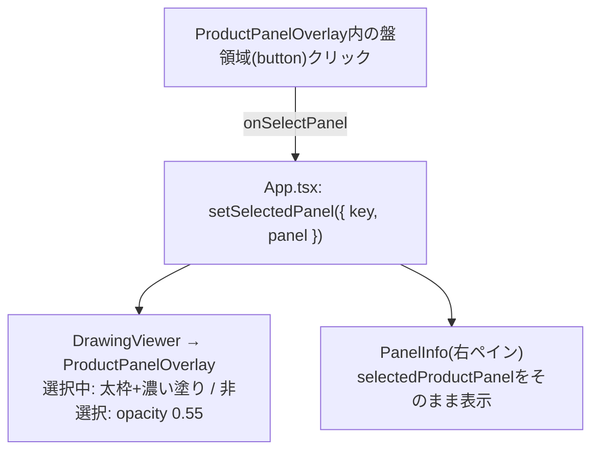

`selectedPanel`を解除する経路: ページ切替 / 製番切替 / 根拠図面ジャンプ /
Viewer空白クリック(Detection選択解除と同じ経路`onDeselectDetection`を共用)。

盤の識別キー (`utils/panel.ts::panelKey`) は `PAGE:BAN_MENNO:BAN_NO:BAN_TYPE:配列
インデックス` の組み合わせで、生配列インデックス単体には依存しない。実データ
(A1GV2421 page16のBAN_NO=5) で同一PAGE/BAN_MENNO/BAN_NOに正面図/背面図/左側面図の
3行が実在することを確認しており、BAN_TYPEを含めた識別が実際に必要であることを
裏付けている。

**中央Viewerの表示基準 (実画面未反映調査・修正指示による訂正)**: 当初Phase 1.8では
中央ViewerをPDF.js表示のまま維持していたが、product_df由来の盤領域Overlayは
`{page}.png` の実ピクセル寸法 (`FRAME_MINI_X/Y`) を正規化の基準にしているため、
PDFとPNGで余白・原点・寸法が異なりうる場合、盤領域Overlayの位置がPDF表示とは
ずれる可能性がある。これを避けるため、**中央Viewerも左ペインと全く同じ
`thumbnail_url` (=`{page}.png`)** を表示するよう訂正した。同一ページについて
左右で異なる画像ソースを使わないことで、Overlay座標系の基準を完全に一致させている。
PDF表示機能・Backend側のPDF配信API (`/api/products/{no}/drawings/{page}/file`) 自体は
削除しておらず、将来の別用途のために残置している (`DrawingCanvas`の`mode="pdf"`)。

**製番切替とダミー積算データの関係 (要件を明確化するためユーザーへ確認済み)**:
DrawingNavigator/DrawingViewerは実製番のPNG/PDFを直接参照するが、
Detection/PanelArea/盤パラメータ/Manual BBox追加は引き続きダミーDB
(`drawing_pages`テーブル、`product_no`+`source_page_no`で紐付け) を経由する。
`App.tsx` は「現在の製番+ページ番号」に一致するダミー行があればそのidで
Detection等を取得し、無ければ単に空表示になる (無理な自動紐付けは行わない)。
これにより、Phase 1.7までの「Detection→RuleEngine→EstimateItem」責務分離や
ダミーデータ構造を一切変更せずに、実データ閲覧機能を追加できた。

### 盤領域の座標変換 (要件14-18)

`app/services/product_df.py` が `product_df.csv` (cp932) を解析し、盤領域ごとに
正規化座標へ変換する。変換式・実データ検算の詳細は `docs/data-source.md` 5.1章、
列構成調査結果は同ファイル参照。要点:

- 基点(左下, mm) = `KITEN_X`/`KITEN_Y`。幅・高さ(mm) = `DETECT_AREA_X`/`DETECT_AREA_Y`
  (実データ検算により確定。指示当初例示された「FRAME_MINI_X/YをFRAME_MINI_X/Yで
  割る」という自己参照式は採用していない — 推測ではなく実データの裏付けがある式のみを
  採用する方針を徹底した)。
- mm→px変換は `SCALE_X`/`SCALE_Y` (列として直接提供、mm/px)。
- px→0.0〜1.0正規化は `FRAME_MINI_X`/`FRAME_MINI_Y` (`{page}.png`のpx原寸。
  実ファイルで実測し一致確認済み)。
- CAD原点(左下)→DOM/PNG原点(左上)のY軸反転を最後に適用する (`1 - y`)。
- `SCALE_X`/`SCALE_Y`が0の行はゼロ除算を避けるため不正データとしてスキップし、
  診断ログへ理由を残す (要件14/32)。
- 1ページに複数のproduct_df行がある場合、**全行**を`panels[]`として保持・描画する
  (先頭1件へ削減しない。要件11/20)。

### サムネイル配信 (要件8/31)

`GET /api/products/{product_no}/drawings/{page_no}/thumbnail` が
`resolve_page_file(ccv_dir, page_no, extension="png")` (Phase 1.5の
`resolve_page_file`をPDF専用からPNG/PDF両対応へ一般化したもの) で安全にパス解決した
`{page_no}.png` をそのまま配信する。page_noは整数パスパラメータのみで、
任意のファイルパスをクエリで受け取る形式にはしていない。共有元へのサムネイル
生成物の書き込みは行わない (既存の読み取り専用ポリシーを継承)。

## 15. BBox/引出線の表示分離・カテゴリ色・状態復元 (Phase 1.11)

### DetectionへのJOIN (category/model) と色の解決経路

`app/repositories/detections.py` は `detections` テーブルを `estimate_master_items`
へ `master_item_id` でLEFT JOINし、`category`/`model`をレスポンスへ含める
(`master_item_category`/`master_item_model`)。これはDetectionへ「色」を
固定値として保存するのではなく、`master_item_id → category → presentation`
という経路を都度たどれるようにするための設計であり (指示書2章)、色そのものは
BackendのAPI応答に一切含まれない。色の実体 (HEX/RGBA値) は
`frontend/src/domain/masterCategoryPresentation.ts` にのみ存在し、Frontend側で
`getCategoryPresentation(category).colors` として解決する。将来カテゴリの配色を
変更しても、既存のDetectionレコードを書き換える必要はない。

`class_name`はManual BBox作成時にMaster Itemのcodeで固定される (Phase 1.6の方針を
継続。要件11) ため、引出線ラベル「コード 型式」の型式部分は`class_name`からは
得られず、上記のJOINで別途取得した`master_item_model`を使う。

**追加修正**: コード部分についても、`class_name`(登録時点のコピー)ではなく
同じくJOINで取得した`master_item_code`(Master Itemの現在の正式なcode)を優先する
よう変更した。JOINに`mi.code AS master_item_code`を追加し (`_COLUMNS`)、
Frontend側 (`LeaderLineOverlay.tsx::buildLabelText`) は
`detection.master_item_code ?? detection.class_name`で組み立てる
(`master_item_code`が取得できない異常系のみ`class_name`へフォールバック)。

### 引出線ラベル位置の独立管理

`detections`テーブルに`leader_label_x`/`leader_label_y`(nullable REAL、
migration `0005_leader_line.sql`)を追加した。BBox本体の`bbox_x/y/w/h`とは
独立したカラムであり、`PATCH /api/detections/{id}`の`update_detection_bbox()`は
`leader_label_x/y`が渡された場合のみSQLの`COALESCE`で更新し、渡されなかった
(None)場合は既存値を保持する。これにより、BBoxのmove/resize保存 (`leader_label_x/y`
省略) がラベル位置を巻き込んで変更してしまうことを防いでいる。

Frontend側 (`LeaderLineOverlay.tsx`) は、BBox右上角のアンカー
(`utils/bbox.ts::topRightCorner`) をBBoxの現在値から都度再計算するため、
BBoxをmove/resizeすると引出線の矢印先端は自動的に追従する。ラベル帯自体の位置は
別途保持されたユーザー操作結果であり、アンカーの再計算とは独立している。
**[2026-09 追加修正]** 当初はmouseup確定後(=`detections`配列の再取得後)にしか
追従しなかったが、`DrawingViewer.tsx`から渡される`previewBBox`
(ドラッグ中の未確定rect。前項「previewBBoxのlift up」参照) が現在のdetectionと
一致する場合はそちらを優先してアンカーを計算するよう変更し、mouseup前
(ドラッグ中)でもリアルタイムに追従するようにした。ラベル帯自体の位置計算
(`resolveLabel`)は意図的に`previewBBox`を見ず、常に確定済みBBoxのみから
計算する (ドラッグ中のラベル位置ジッター防止)。

### 引出線の形状 (追加修正): 1本のpolyline + SVG marker

初回実装では斜線(`<line>`)と水平線相当のCSS下線(HTML要素の`border-bottom`)を
別要素として配置していたため、実画面で「斜線と水平線が離れて見える」「矢印が
一般的なCAD引出線に見えない」という指摘を受けた。`LeaderLineOverlay.tsx`を
以下のように修正した:

- `computeLeaderGeometry(anchor, label, text)`が、アンカー・折れ点(elbow)・
  水平線のもう一方の端(end)の3点を計算する。折れ点とendは、ラベルがアンカーの
  右側にあるか左側にあるかで入れ替わる (`label.x >= anchor.x`の分岐)。
- `pathD(geometry)`が`M end L elbow L anchor`という1つの`<path>`の`d`属性を
  組み立てる。斜線・水平線を別要素にしないため、CSSレイアウトのズレによる
  隙間が原理的に発生しない。
- SVGの`<marker orient="auto">`を`marker-end`として経路の終点(anchor)へ
  取り付ける。`orient="auto"`は経路の進行方向(elbow→anchor)から矢印の向きを
  自動計算するため、Frontend側で角度を個別に計算する必要がない。
  **[2026-09 追加修正1章〜4章]** `markerWidth`/`markerHeight`は`0.018`→`0.010`
  (正規化座標、約56%)へ縮小した。実画面でBBox四隅のResize Handle(10px固定)より
  矢印が大きく見え、図面の文字に重なりやすかったための対応。`markerUnits`は
  引き続き`"userSpaceOnUse"`とし、線の太さ(`strokeWidth`)から矢印サイズの
  チューニングを独立させている。
- ヒットエリア(hover/click用の透明な太い`<path>`)は、見た目の引出線と
  **全く同じ`d`属性**を持つ別の`<path>`として重ねている。座標計算を2箇所に
  重複させず、見た目とヒットエリアが常に一致することを保証する。
- 水平線の長さ(elbow〜endの距離)は、実際のDOM計測ではなく文字数に基づく概算値
  (`estimateLabelWidthFraction`)を使う。ズーム率や実フォントレンダリングへの
  依存を避けるための単純化であり、実際の文字幅と1px単位で一致するとは限らない
  ことを明記しておく。

### BBox表示の条件分岐 (`DetectionOverlay.tsx`)

`master_item_id != null`のDetectionは、`isSelected`(編集中)または
`hoveredDetectionId`と一致する(引出線hover中)場合のみBBox矩形をレンダリングし、
それ以外は`null`を返す (DOM上に一切描画しない)。この判定はコンポーネント内の
早期returnのみで実現しており、AI Detection (`master_item_id === null`) の
描画パスには一切分岐を入れていない (Phase 1.5〜1.10の表示コードパスをそのまま
維持。要件29)。

hoverの状態(`hoveredDetectionId`)は`DrawingViewer.tsx`が保持し、
`LeaderLineOverlay`(hover検知・更新)と`DetectionOverlay`(hover状態を見て
表示可否を決定)の両方へ渡す。Detection/BBoxの選択状態(`selectedDetectionId`、
App.tsxが保持)や盤選択(`selectedPanel`)とは異なる、Viewer内部だけで完結する
一時的なUI状態である。

### BBox内部drag(移動)とリサイズの競合回避

`DetectionOverlay.tsx`は、四隅ハンドルの`mousedown`(`activeResizeRef`)とBBox本体の
`mousedown`(`activeMoveRef`)を別々のrefで管理し、`window`の`mousemove`/`mouseup`
ハンドラ内で「どちらがアクティブか」を見て処理を分岐する。BBox本体の`mousedown`は
`isSelected`(選択中/編集中)の場合のみ移動追跡を開始し (通常/hover表示中は無効)、
クリック(選択)との誤認防止に`MIN_DRAG_PX`(6px)の閾値を設けている
(`DrawingCanvas.tsx`のManual BBox作成時と同じ考え方)。移動時は
`utils/bbox.ts::moveRect()`が幅・高さを維持したままx/yを0.0〜1.0の範囲でclampする。

### Overlayレイヤーの明示的なz-index/pointer-events契約 (指示書16章)

実画面未達 修正指示 (Phase 1.9〜1.10) で判明した「透明な親Overlayがpointer-events
未指定のままクリックを奪ってしまう」不具合の再発を防ぐため、Phase 1.11でも
新規レイヤー(`LeaderLineOverlay`)を同じ設計原則に従わせている: コンテナ自体は
`pointer-events: none`、実際に操作させたい個々の要素(引出線のヒットエリア、
ラベルボタン)側で`pointer-events: auto`を明示的に再指定する。z-indexは
PNG(0) → 盤領域(10) → 引出線(15) → BBox本体(20) → 選択中BBox(30) →
Resize Handle(40) → Tooltip(50) の順に明示し、JSX描画順(コンポーネントの
記述順)に暗黙で依存しない。

### Escキーの状態解除優先順位

`App.tsx`の`keydown`(`Escape`)リスナーは、SystemSettings/ProductSelectorの
モーダルが開いている間は何もせず、開いていなければ
`selectedDetectionId` → `selectedMasterItemId` → `selectedPanel` の順に
最初に見つかった非nullの状態だけを1段階解除する。Deleteキーの既存ガード
(`isEditableTarget`、`input`/`textarea`等の間は無効化)とは異なり、Escは
フォーカス位置に関わらず動作する (指示書3章: 「モード解除」として自然に働かせる)。

### URLによる製番・PAGEの復元

`utils/urlState.ts`の純粋関数 (`parseProductNoFromSearch`/`parsePageNoFromSearch`/
`buildSearchWithProductPage`) がURL queryの読み書きを担当し、`App.tsx`は
`activeProductNo`/`selectedProductPageNo`の初期値をこれらの関数でURLから復元する
(`useState`の遅延初期化)。値の実在確認は行わず、既存の
「取得結果に無ければ先頭ページへフォールバックする」ロジック (Phase 1.8から継続)
がPAGE番号の妥当性を保証する。製番については、`fetchProductDrawings`が失敗した
場合に限り既定製番(`DEFAULT_PRODUCT_NO`)へ1回だけ自動フォールバックする
(`urlFallbackAttempted` refで無限ループを防止)。URLへの書き戻しは
`history.replaceState`で行い、ページ内操作のたびにブラウザ履歴を積み増さない。

### 積算コードMaster領域の高さリサイズ

`hooks/usePaneWidth.ts`に`dimension: 'width' | 'height'`パラメータ(既定`'width'`、
完全後方互換)を追加し、Master領域の高さリサイズにも同じフックを再利用している
(指示書26章: 「左右ペイン幅の既存保存方式があれば統一する」)。`dimension`が
`'height'`の場合、clampの基準を`window.innerWidth`から`window.innerHeight`へ
切り替えるのみで、localStorageへの保存・復元・不正値のフォールバックといった
挙動はすべて共通のまま利用できる。`PaneSplitter`にも`axis: 'x' | 'y'`を追加し、
横方向Resize Handle(既存)と縦方向Resize Handle(Master領域の高さ変更)を
同じコンポーネントで実現している。

## 16. decision_events — 判断・修正データの最小event記録 (Issue #4 Phase A-1)

将来の見積り自動化に向けて、「通常の積算作業を行うだけで判断データが自然に
蓄積される」(`docs/product-vision.md`)ことを目指し、`detections`テーブルへの
create/delete/bbox move・resizeの事実だけをappend-onlyで記録する専用テーブル
`decision_events`を追加した。

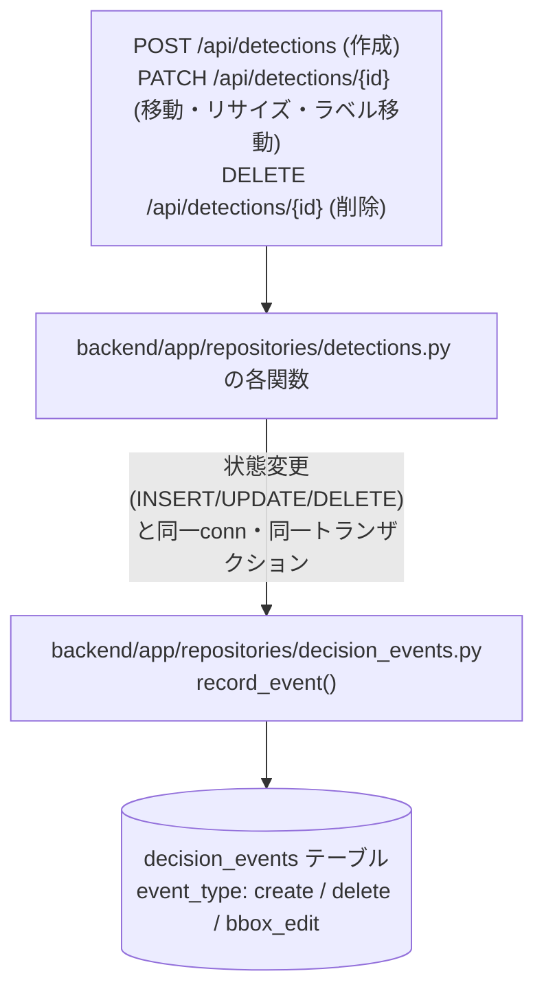

- **current state(`detections`)とは完全に独立**。既存テーブルへのALTERは無い。
- **`detection_id`は意図的にFK制約を持たない**(削除イベント記録直後の本体DELETEが
  FK違反にならないよう、歴史的参照として扱う。`drawing_page_id`/`source_type`/
  `master_item_id`/`before_bbox_*`を非正規化コピーとして持つため、Detectionが
  削除された後もこのテーブル単体で解釈できる)。
- move/resizeは記録時に区別せず`bbox_edit`へ統合する(前後のw/h比較で分析時に
  判別可能)。Undo/Redoは特別扱いせず、通常のAPI呼び出しと同じイベントとして
  記録される。
- **読み出しAPIは無い**(Phase A-2は現時点で不要と判断され未着手。Issue #4の
  コメント履歴参照)。分析・閲覧が必要な場合は現状DBへ直接SQLを実行する。

詳細設計・理由付けは`docs/decision-event-design.md`、schemaの正式な記述は
`docs/data-model.md` 6.5章を参照。

## 17. 積算確定snapshot (Issue #4 Phase B)

Master Excel再インポートで過去の積算結果が事後的に変わってしまう問題
(`docs/decision-data-gap-analysis.md` 7.2章)に対応するため、製番単位で
「その時点の積算結果一式」を丸ごとコピー保存する仕組みを追加した。

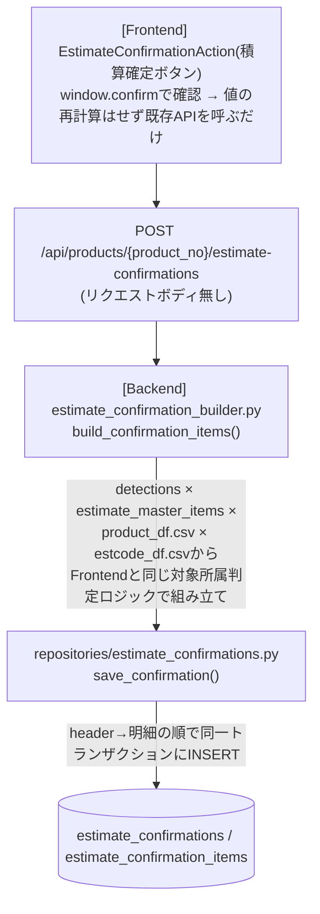

Frontendから計算済みの値を信頼して受け取る方式は採用していない(Backend自身が
現在状態から組み立てて保存する)。

- 保存粒度はDetection単位(積算明細`detailItems`相当)。対象別/総合計の集約結果
  そのものは保存しない(読み出し時に同じロジックで再現する想定)。
- `code`/`category`/`model`/`rating`/`unit_price`/`amount`/対象所属/BBox座標は
  確定時点の値を非正規化コピーする。`estimate_master_items`の再UPSERTや外部CSVの
  変更後も、保存済みの値自体は変化しない。
- `confirmation_id`(明細→header)はFK制約あり(header行が必ず先に存在するため)。
  `detection_id`/`drawing_page_id`はdecision_eventsと同じ理由でFK制約なし。
- **再確定は上書きしない**(append-only。新しい`estimate_confirmations`行を
  都度追加する)。0件確定(積算コードに紐づくDetectionが1件も無い製番の確定)も
  許可する。
- **読み出しAPI・確定履歴の一覧/詳細閲覧UIは無い**。`POST`のレスポンス
  (`EstimateConfirmationOut`)でしか内容を確認できない。

詳細設計は`docs/decision-snapshot-design.md`、API仕様は`docs/api-reference.md`、
schemaは`docs/data-model.md` 6.6章を参照。

### current state / event history / confirmed snapshot の位置付け

`detections`・`decision_events`・`estimate_confirmations`はいずれも似た情報
(BBox・積算コード)を扱うが、責務が異なる3層として意図的に分離している。

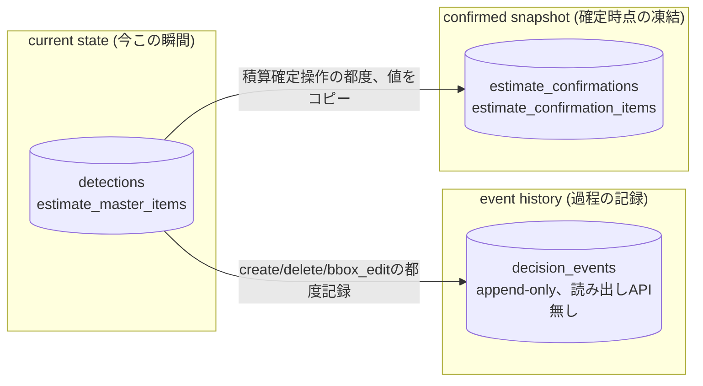

- **current state(`detections`/`estimate_master_items`)**: 「今この瞬間の正しい
  状態」を返す。Master再UPSERTやBBox編集で値は常に最新化される。
- **event history(`decision_events`)**: 「何が起きたか」の過程をappend-onlyで
  記録する。current stateとは独立(2章参照)。
- **confirmed snapshot(`estimate_confirmations`)**: 「確定時点の値」を丸ごと
  凍結保存する。Master再UPSERT後も変化しない(3章参照)。

3層の間に結合キーは設けていない(責務分離を優先。`docs/decision-snapshot-design.md`
6章)。

## 18. Phase 1.12/1.14: detected_df(AI検出プレビュー)・estcode_df(盤情報)

Phase 1.9以降に追加した、都度読み込み・DB非永続化の実データ参照サービスを
簡潔に補足する(詳細schemaは`docs/data-model.md` 8.5章/8.6章)。

- `app/services/detected_df.py`(Phase 1.12): `detected_df.csv`(実行済みYOLO推論の
  出力)を読み込み、`GET /api/products/{no}/drawings/{page}/detected-preview`で
  返す。DBの`detections`テーブルとは完全に独立した別データ源で、今回のPhaseでは
  DBへのコピー・同期を行わない(表示のみの読み取り専用プレビュー、`id`は
  DBのDetection.idとは異なるYOLO_INDEX体系)。
- `app/services/estcode_df.py`(Phase 1.14): `estcode_df.csv`(盤ごとの積算コード
  基本情報)を読み込み、`GET /api/products/{no}/estimate-panels`で返す。
  `PAGE`列を持たない製番単位のデータで、右ペイン「盤情報」(`PanelInfo.tsx`)の
  表示元として`product_df.csv`由来の旧盤パラメータ表示より優先される。

## 19. 右ペイン3領域の折りたたみ・対象Select視認性 (Issue #6)

盤情報・積算集約・積算明細の3領域それぞれの見出しをクリックすることで
折りたたみ/展開できるようにした。実装は`CollapsibleSectionHeading`
(共有コンポーネント、2章参照)を3箇所で再利用する形で行い、開閉状態は
`App.tsx`がcontrolled stateとして保持する(セッション内のみ、永続化しない)。
折りたたみ中の領域は隣接領域へ高さを還元する(`App.tsx`側のwrapper divで
`flex`/`height`を条件分岐)。積算集約の「対象」Selectは、通常状態でも
重要な操作であることが視認できるよう強調している(コバルト系の枠+淡い背景、
Viewer連動中はさらに一段強い強調)。詳細は`docs/ui-spec.md` 1.6章を参照。
