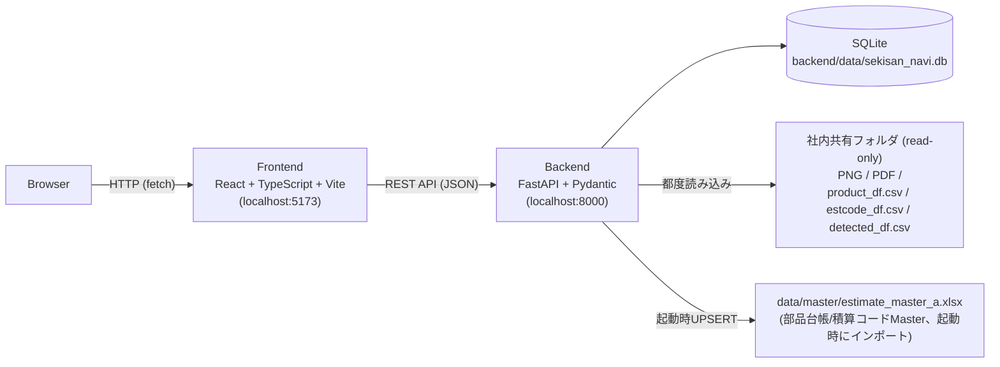
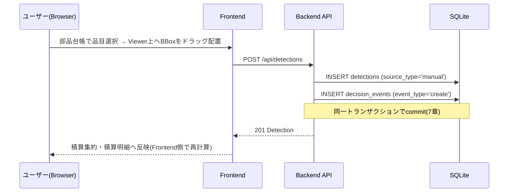
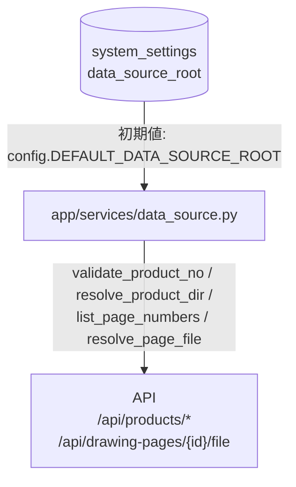
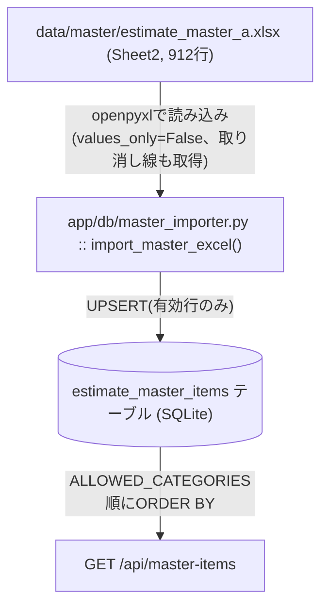
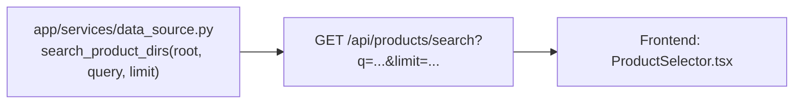
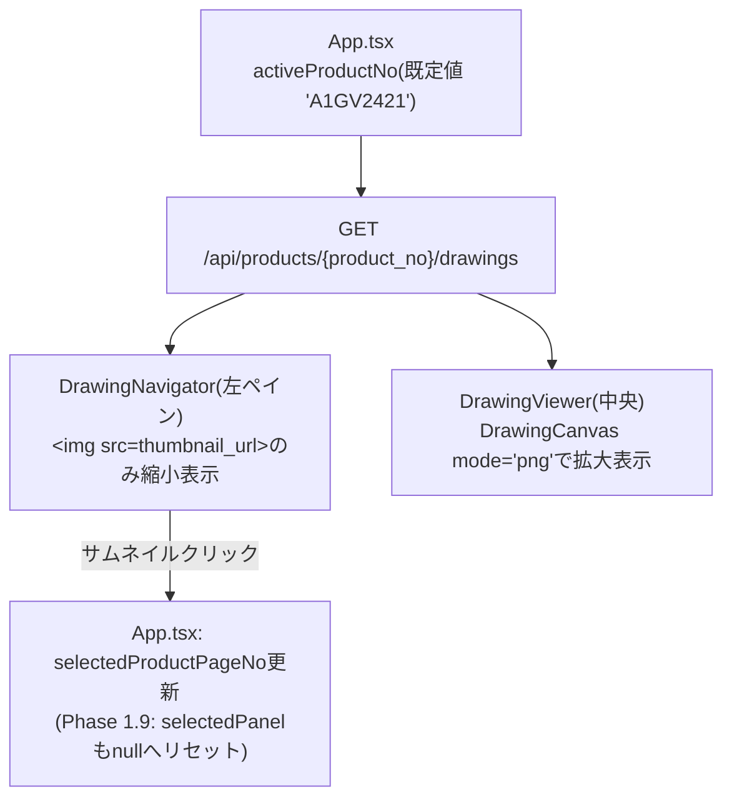
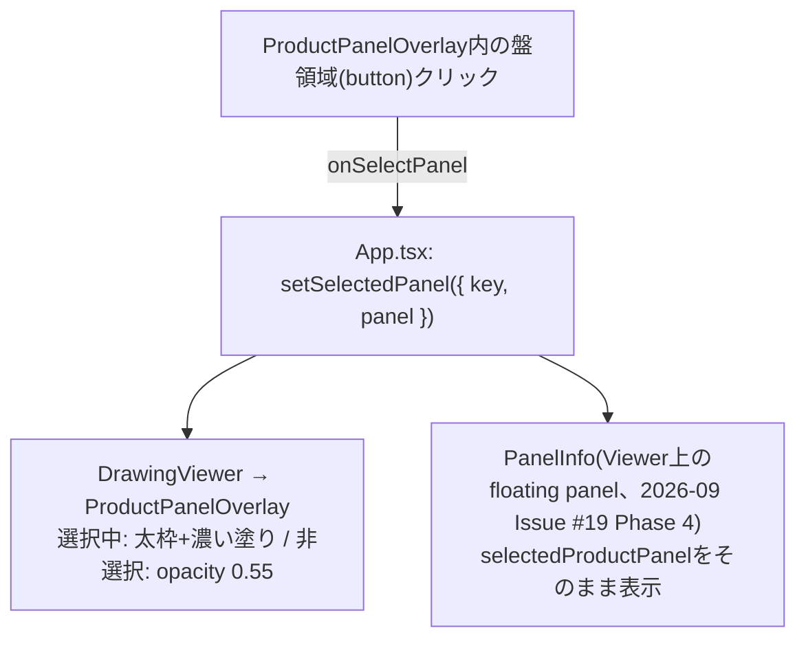
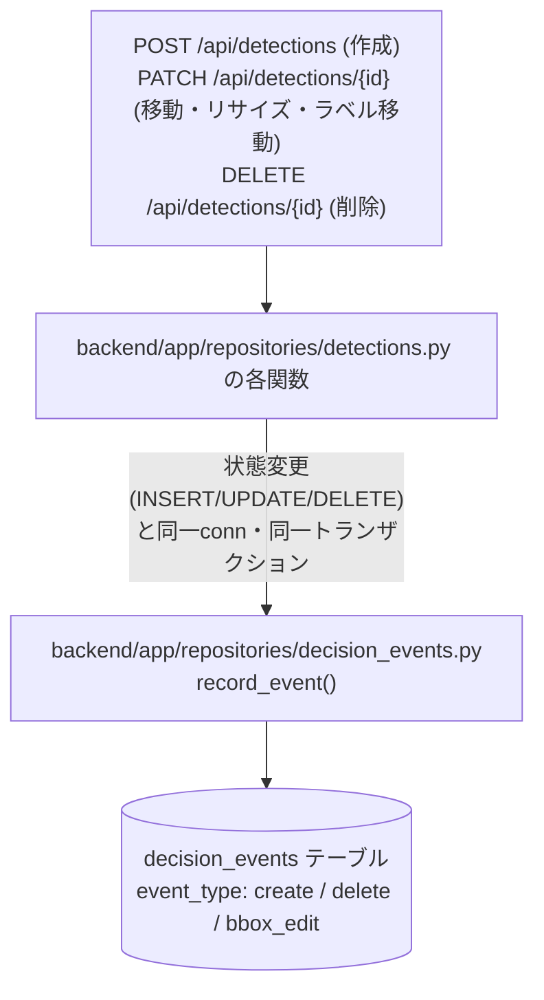
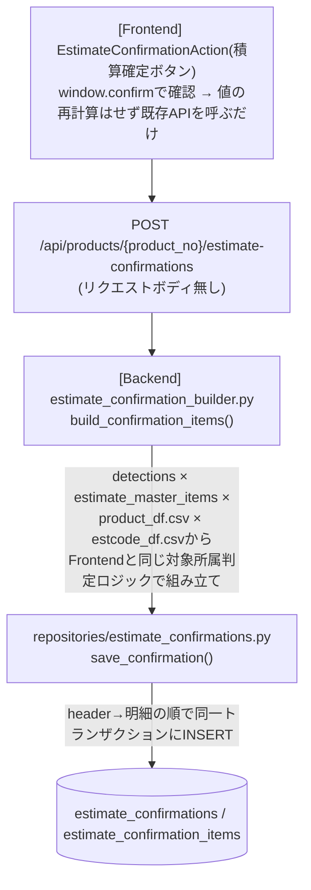
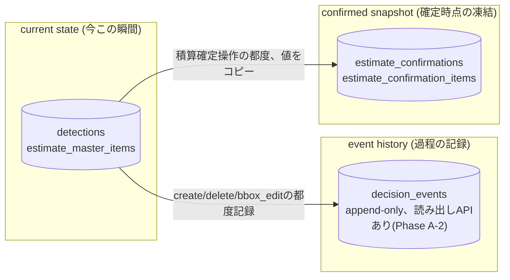

# architecture.md — Sekisan Navi アーキテクチャ

PoC時点でのアーキテクチャ方針(2026-09、Issue #4 Phase B / Issue #6 / Issue #9反映後の
mainを反映)。ここに書かれた技術選定・構成も「変更されうる前提」で書いており、
確定/暫定の区分は `implementation-plan.md` を参照。章立ては初版(Phase 0/1/1.5)
からの追記形式のため、章番号と機能追加時期(Phaseやissue番号)は必ずしも
一致しない。

## 1. 全体像


```mermaid
flowchart LR
    Browser["Browser"]
    Frontend["Frontend<br/>React + TypeScript + Vite<br/>(localhost:5173)"]
    Backend["Backend<br/>FastAPI + Pydantic<br/>(localhost:8000)"]
    SQLite[("SQLite<br/>backend/data/sekisan_navi.db")]
    Share["社内共有フォルダ (read-only)<br/>PNG / PDF /<br/>product_df.csv / estcode_df.csv / detected_df.csv"]
    MasterExcel["data/master/estimate_master_a.xlsx<br/>(部品台帳/積算コードMaster、起動時にインポート)"]

    Browser -- "HTTP (fetch)" --> Frontend
    Frontend -- "REST API (JSON)" --> Backend
    Backend --> SQLite
    Backend -- "都度読み込み" --> Share
    Backend -- "起動時UPSERT" --> MasterExcel
```

PoCではローカルPCまたは社内LAN上でFrontend/Backendを別プロセスとして起動し、
ブラウザからアクセスする構成とする(要件3)。認証・リバースプロキシ・HTTPS化等の
本番運用向け構成は今回のスコープ外。SQLiteは`detections`/`estimate_master_items`/
`decision_events`/`estimate_confirmations`等の**現在状態・判断履歴・確定snapshot**を
保持し(2章参照)、社内共有フォルダ上のCSV/PNG/PDFは常にread-onlyで都度読み込む
(6章参照)。

### 主要なデータフローの例: BBox作成から判断履歴記録まで


```mermaid
sequenceDiagram
    participant U as ユーザー(Browser)
    participant F as Frontend
    participant B as Backend API
    participant D as SQLite

    U->>F: 部品台帳で品目選択 → Viewer上へBBoxをドラッグ配置
    F->>B: POST /api/detections
    B->>D: INSERT detections (source_type='manual')
    B->>D: INSERT decision_events (event_type='create')
    Note over B,D: 同一トランザクションでcommit(7章)
    B-->>F: 201 Detection
    F-->>U: 積算集約・積算明細へ反映(Frontend側で再計算)
```

上記はManual BBox作成の例。移動・リサイズ(`PATCH`)・削除(`DELETE`)も同様に
「状態変更 + decision_events記録」を同一トランザクションで行う(16章)。

## 2. レイヤー構成 (Backend)

```
app/
  main.py            FastAPIアプリ定義・起動時マイグレーション/シード
  config.py          パス・CORS・データ参照ルート初期値等の設定値
  domain/
    models.py        ドメインモデル (dataclass)。DBにもAPIにも依存しない。
    rule_engine.py    Detection -> 積算コード候補 のルール変換 (要件7)
  db/
    connection.py     sqlite3接続ラッパー
    migrate.py         マイグレーションランナー
    migrations/*.sql    スキーマ定義 (連番)
    seed.py             ダミーデータ投入
  repositories/       SQLiteの行 <-> domainモデル の変換 (SQLはここに閉じ込める)
    decision_events.py         判断・修正データevent記録・読み出し (Issue #4 Phase A-1/A-2、16章)
    estimate_confirmations.py  積算確定snapshotの保存・読み出し (Issue #4 Phase B-1/B-4、17章)
  services/           DB以外の外部境界を扱う層 (Phase 1.5で追加)
    data_source.py      データ参照ルート・製番ディレクトリの安全な解決
    admin_auth.py        管理者パスワード検証
    product_df.py         product_df.csv(盤領域)の読み込み (Phase 1.8、14章)
    estcode_df.py          estcode_df.csv(盤情報)の読み込み (Phase 1.14、18章)
    detected_df.py          detected_df.csv(YOLO検出結果)の読み込み (Phase 1.12、18章)
    estimate_confirmation_builder.py  積算確定snapshotを現在状態から組み立てる
                                       (Issue #4 Phase B-2、17章)
  schemas/            APIの入出力契約 (Pydantic)。domainと形は似るが役割は別。
    estimate_confirmations.py  積算確定snapshot作成APIのレスポンス型 (17章)
  api/routers/        FastAPIルーター。repositories/rule_engine/servicesを呼ぶだけ。
tests/                pytest (domain単体テスト・APIテスト・データ参照サービスの単体テスト)
```

**責務分離の意図**:
- `domain/` はDB・HTTPを知らない。将来ORMやDBを変えてもここは変わらない。
- `repositories/` はSQL文字列を持つ唯一の層。テーブル構造が変わってもAPI層は影響を受けない。
- `schemas/` (API契約) と `domain/models.py` (業務モデル) を分けているのは、
  画面都合でレスポンス形を変えたくなった際にdomain/repositoriesへ波及させないため(要件15)。
  PoC規模では両者はほぼ同型だが、意図的に別モジュールにしている。

## 3. レイヤー構成 (Frontend)

```
src/
  api/client.ts        fetchの薄いラッパー。既定は相対パスでVite devプロキシ経由。
  api/errors.ts         fetch失敗を安全な日本語メッセージへ変換 (describeFetchError)
  types/domain.ts       APIレスポンスに対応する型定義
  pdf/pdfjs.ts           PDF.jsのセットアップ (ワーカー設定を1箇所に集約)
  components/
    ProjectHeader/       案件情報・解析状態ヘッダー + システム設定/製番を開くボタン。
                         「Sekisan Navi」ブランドブロック・右方向グラデーション背景
                         (Issue #9、`ui-spec.md` 2章)
    DrawingNavigator/     図面一覧 (ページ単位・種類別グループ表示)
    DrawingViewer/        中央Viewer
      DrawingCanvas.tsx     PDF.js('pdf')/PNG('png')表示 + zoom/pan/fit。ツールバー
                             ボタンの質感(box-shadow/hover/active)はIssue #9で調整
      DetectionOverlay.tsx  Detection BBoxのオーバーレイ
      PanelOverlay.tsx      盤範囲(Panel Area)のオーバーレイ。Detectionと独立
      ProductPanelOverlay.tsx  product_df由来の盤領域Overlay (Phase 1.8、14章)
      LeaderLineOverlay.tsx    引出線(Leader Line)表示 (Phase 1.11、15章)
    PanelInfo/             盤情報 (estcode_df.csv実データ、Phase 1.14でPanelPropertiesから置換。
                           Issue #6で折りたたみ対応。Issue #38でカード型+中点区切りから
                           CSS Gridベースのカラム型1行一覧(面/盤|盤名称|型式|高さ|幅|奥行|接続)へ
                           再設計)
    EstimateAggregation/  積算集約 (数量・金額の確認。対象別/総合計の数量集約に対応。
                           「合計」(旧「製番合計」、Issue #36で短縮)金額は
                           赤系(#dc2626)で強調(Issue #9)。
                           `EstimateConfirmationAction.tsx`(確定ボタン、
                           Issue #4 Phase B-3、17章)を内包。Issue #6で折りたたみ対応。
                           Issue #36でタイトル直下〜表ヘッダーを1行compact化
                           (31章)。詳細は`ui-spec.md` 5.5章)
    EstimateDetail/        積算明細 (1 Detection = 1行の根拠追跡。旧EstimateTreeの後継、
                           `ui-spec.md` 5.6章。Issue #6で折りたたみ対応)
    EstimateMasterPicker/ 部品台帳検索(旧称: 積算コードMaster検索)
    ViewerGuide/           Viewer内「操作ガイド」floating panel、要点のみの
                           クイックリファレンス(Issue #31、28章参照)
    SystemSettings/       管理者向けシステム設定 (データ参照ルート変更) (Phase 1.5)
    ProductSelector/       製番検索・切替 (Phase 1.5で`ProductViewer`として追加、
                           Phase 1.8で製番検索UIへ役割変更・改名)
    Layout/
      PaneSplitter.tsx       左ペイン(図面一覧)幅のResize Handle。右ペイン・
                             部品台帳下段常設時代に使っていた右ペイン幅/
                             Master高さ用のResize Handleは、右ペイン廃止・
                             floating panel化(Issue #19 Phase 4、22〜23章)に
                             伴い廃止済み
      FloatingPanel.tsx      盤情報・積算集約・積算明細・部品台帳・操作ガイドの
                             5種共通のfloating panelシェル(Issue #19 Phase 2/4で
                             積算集約・積算明細→盤情報の順にfloating panel化、
                             追加修正で部品台帳、Issue #31で操作ガイドも統合。
                             20〜23章・28章、Issue #25で右端カスケード初期配置・
                             縦anchor復元ロジックを追加。Issue #34でkind別識別色
                             のCSS変数(`:root`定義)・最前面panel共有状態
                             (`frontKind`、`useSyncExternalStore`)を追加、29章。
                             ui-spec.md 1.7/1.8/1.9章参照)。表示中のみ描画する
                             シェルで、drag移動・resize・最前面化を自前実装する
      PanelVisibilityToggles.tsx  5panelの表示ON/OFFトグル(旧
                             `FloatingPanelToggleBar.tsx`を置き換え。23章・28章、
                             Issue #34でkind別theme化・29章参照)
  domain/                Frontend側の純粋な業務ロジック (Backendを介さない計算)
    estimateAggregationReal.ts  積算集約・積算明細を実データから組み立てる
                                 (対象別/総合計の数量集約、BBox所属判定を含む)
    editHistory.ts               Undo/Redo (create/delete/bboxの3種)
    masterCategoryPresentation.ts 積算コードカテゴリごとの配色定義
  hooks/usePaneWidth.ts   ペイン幅・高さの状態管理+localStorage永続化
                         (`dimension: 'width'|'height'`で両対応)
  App.tsx                各コンポーネントの状態統合・データ取得・レイアウト構成
```

**責務分離の意図**:
- 個々のコンポーネントは「表示」に専念し、業務ロジック(積算ルール等)を持たない(要件20)。
- `PanelProperties` は属性名をハードコードせず、APIが返す `attributes[]` をそのまま描画する(要件12)。
- `EstimateMasterPicker` の表示列は `COLUMNS` 定数配列で定義し、Excel由来の列構成を
  直接コンポーネントへ焼き込まない(要件14)。

## 4. AIとルールの分離 (要件7)


```mermaid
flowchart LR
    Detection["Detection<br/>(AI検出 or 将来のYOLO推論結果)"]
    RuleEngine["RuleEngine<br/>app/domain/rule_engine.py"]
    EstimateItem["EstimateItem候補<br/>(最終確定はレビュー工程が行う)"]

    Detection --> RuleEngine
    RuleEngine --> EstimateItem
```

`RuleEngine`は`class_name`等から積算コード候補を導出する層で、業務判断をここに
集約する。

- YOLOのクラス名やbboxを直接画面の積算コードへ変換するコードは書かない。
- `rule_engine.py` は純粋関数として実装し、単体テスト可能にする(`tests/test_rule_engine.py`)。
- PoCでは実推論を行わないため、`rule_engine.py` は「クラス名 -> コード」の
  簡易対応表を持つのみ。将来ルールが複雑化しても、この層の内部だけを差し替えればよい。
- Manual BBox (Phase 1.6) もDetectionの一種 (`source_type='manual'`) として登録する。
  ユーザーが積算コードを直接選んでいるため、Manual BBox自体はRuleEngineを経由しないが、
  「Master Itemへの参照(`master_item_id`)を保持するのみで、EstimateItemへの変換・
  数量/価格の確定は行わない」という点はAI由来のDetectionと同じ扱いとし、
  Detection→EstimateItemの境界自体は崩していない (要件19)。

## 5. データベース / マイグレーション

- SQLiteファイル1つ (`backend/data/sekisan_navi.db`, gitignore対象)。
- `backend/app/db/migrations/*.sql` を連番で管理し、`schema_migrations` テーブルで
  適用済みファイルを記録する自作の軽量マイグレーションランナーを採用 (Alembge等は
  PoC規模ではオーバースペックと判断)。
- アプリ起動時 (`main.py` の `lifespan`) に自動でマイグレーション適用 + ダミーデータ投入。
  本番運用では明示的なコマンド実行に切り替える想定 (未確定)。
- **接続生成は `check_same_thread=False` で行う** (`app/db/connection.py`)。
  FastAPIの同期(`def`)エンドポイント・依存関係は内部でスレッドプール経由で実行され、
  1リクエストの中でも接続生成(依存関係)と接続使用(エンドポイント本体)が異なる
  スレッドに割り当てられる場合があるため。既定設定のままだと実ブラウザからの
  同時多発リクエストで `sqlite3.ProgrammingError` が高確率で発生することを実機確認で
  特定した (`docs/implementation-plan.md` 6章、`tests/test_concurrency.py` 参照)。
  各リクエストが専用の新規接続を都度生成する現在の設計 (`get_connection()`) では、
  この設定でも複数リクエストが同一接続を同時に奪い合うことはなく安全である。

## 6. 元データの安全性 (要件5, 19)

- 元図面PDF・設計データ・共有フォルダ上のファイル (`\\beans-f1\ShareData\estimatic\a_product\output\` 配下)
  は本アプリから read-only として扱う。Backendのコードは一貫して読み取り専用の
  ファイル操作 (`Path.exists`, `os.listdir`, `open`によるストリーミング配信) のみを行い、
  書き込み・削除・移動・リネームに相当するAPI/関数は一切実装していない。
- Phase 1.5で実データ (製番 `A1GV2421`) への接続を実装したが、これはBackendが
  リクエスト時にその場でファイルを読み取って返すのみであり、実ファイルをリポジトリや
  作業領域へコピーする処理は行っていない (表示のためのコピー・キャッシュが必要になった
  場合は `backend/data/` 等の作業領域に限定する方針は維持する。要件19)。
- 実図面・製番データはGitへ一切含めていない。`backend/app/db/seed.py` に実データの
  「数値」(製番名・寸法等) を参考値として記述している箇所はあるが、図面ファイル本体
  (PDF/PNG/DXF等) はコミット対象に含めていない (要件20)。

## 7. データ参照ルート・製番アクセスの安全な解決 (Phase 1.5, 要件8-17)


```mermaid
flowchart TD
    Settings[("system_settings<br/>data_source_root")]
    DS["app/services/data_source.py"]
    API["API<br/>/api/products/*<br/>/api/drawing-pages/{id}/file"]

    Settings -->|"初期値: config.DEFAULT_DATA_SOURCE_ROOT"| DS
    DS -->|"validate_product_no / resolve_product_dir /<br/>list_page_numbers / resolve_page_file"| API
```

- `validate_product_no()`: 製番文字列を正規表現で検証(英数字4〜20文字)。
- `resolve_product_dir()`: root + product_noからパスを解決し、解決後パスが必ず
  root配下であることを確認(パストラバーサル対策)。CCVサブディレクトリの探索も
  ここで行う(`config.CCV_SUBDIR_CANDIDATES`、5章参照)。
- `list_page_numbers()`: `{page}.pdf`形式のファイルのみpage番号として抽出。
- `resolve_page_file()`: ページ番号からファイルパスを安全に組み立てる。

Frontendは一切UNCパスを組み立てない。常に`product_no`/`page_no`という
「意味のある識別子」のみを送り、パス解決はBackendに閉じている(要件10, 17)。
例外は`DataSourceError`のサブクラスとしてキャッチし、内部のスタックトレースや
詳細を含まない日本語メッセージへ変換してから返す(要件15)。

CCVについて: 実データ調査の結果、「CCV」という名前のディレクトリ・ファイルは
確認できなかった (`docs/data-source.md` 参照・未確認事項)。暫定的に
「CCVサブディレクトリがあれば使う、なければ製番直下を使う」というフォールバック実装とし、
どちらが使われたかを `ccv_resolved` としてAPIレスポンスへ含めている。

## 8. 管理者認証 (Phase 1.5, 要件12)

- データ参照ルートの変更 (`PUT /api/settings/data-source`) および接続確認
  (`POST /api/settings/data-source/test`) は、必ずBackend側 (`app/services/admin_auth.py`)
  で管理者パスワードを検証する。Frontend側のバリデーションには一切依存しない。
- 管理者パスワードは環境変数 `SEKISAN_NAVI_ADMIN_PASSWORD` (または `backend/.env`、
  Git管理対象外) から取得する。未設定の場合は誰であっても常に認証失敗とする
  (fail-closed)。DB・Gitへの平文保存は行わない。
- 通常の製番・図面参照 (`GET /api/products/*`) には管理者パスワードを要求しない
  (要件18)。

## 9. Overlay座標系の設計 (Phase 1.5, 要件4)

**採用した方式**: Detection・PanelArea (盤範囲) の座標は、いずれも
**0.0〜1.0 の正規化座標 (該当ページのPDF原寸=PDF.jsが返す `scale:1` 時のwidth/height
に対する比率)** として保持する。

**採用理由**:
- 「図面表示サイズそのものをBBox座標として保存しない」という要件を、最も単純な形で
  満たせる (ズーム倍率・ウィンドウサイズを一切含まない)。
- Frontend側では `DrawingCanvas` が計算した「content領域のピクセルサイズ
  (= zoom × PDF原寸)」に対して単純に `%` 変換するだけでオーバーレイを配置できるため、
  実装・検証が容易 (`DetectionOverlay`/`PanelOverlay` のテスト参照)。
- 「PDF原寸座標(pt)」も候補として検討したが、正規化座標の方がFrontend側の実装
  (パーセンテージ指定のCSS) と直接対応し、単位変換ミスが起きにくいため採用した。

**この座標系が保証すること**: zoom・pan(スクロール)・ブラウザウィンドウのリサイズは
いずれも「content領域のピクセルサイズ」だけに影響し、正規化座標そのものは変化しない。
そのため上記のどの操作を行ってもBBoxと図面の位置関係はずれない
(`DrawingCanvas.test`相当の目視確認、および`DetectionOverlay.test.tsx`/`PanelOverlay.test.tsx`
で「正規化座標→%変換」の単体テストを実施)。

**保留した設計判断**: 実際のAI検出結果 (CAD実座標系, `detected_df.csv`) を
PDFページ上のピクセル位置へ厳密に変換する式は、切り出しオフセット情報が
共有元データから特定できなかったため確立できていない (`docs/data-source.md` 5章)。
Phase 1.5のDetection/PanelAreaのダミー座標は、実PDFページを目視確認して配置した
近似値である。

## 10. 図面Viewerの技術選定について (Phase 1.5で確定)

**採用: PDF.js (`pdfjs-dist`)、バージョン 6.2.108。**

- 現在のVite (v8) + React (v19) + TypeScript (v6) 構成との相性を確認した:
  `pdfjs-dist` はESM専用ビルド (`build/pdf.mjs`, `build/pdf.worker.min.mjs`) のみを
  提供しており、Viteのネイティブ ESM 解決・`new URL(..., import.meta.url)` による
  ワーカー読み込みパターンと問題なく組み合わせられることを実装・ビルド確認済み
  (`npm run build` が型エラーなく成功)。
- 他候補 (ブラウザネイティブ `<embed>`/`<iframe>` によるPDF表示等) は、BBoxオーバーレイの
  重畳や zoom/pan の連動制御が難しいため採用しなかった。
- `DrawingCanvas` コンポーネントが担う機能: PDFページのcanvasへの描画、zoom in/out、
  Fit to View、ドラッグによるpan、マウスホイールによるカーソル位置基準のzoom。
  高度なCAD Viewer機能 (レイヤー切替、注釈編集等) は実装していない (要件3)。

**Phase 1.8重要仕様訂正**: 実製番モードの中央Viewerは、下記14章の理由により
PDF.js描画ではなく `{page}.png` を直接表示する `mode="png"` へ切り替えた。
`DrawingCanvas` はPDF.js描画自体を削除しておらず、`mode` prop (`'pdf'` 既定 /
`'png'`) で両対応する。zoom/pan/fit/BBox作成・選択・リサイズのロジックは
「コンテンツ原寸(nativeSize) × zoom」の座標系にのみ依存しており、
nativeSizeの取得元がPDFページかPNG画像かを区別しないため、モード追加に伴う
ロジック変更は最小限で済んだ (`clientToNative`/BBox作成関数は無変更。
Fit計算用の関数は2026-09 追加修正で`fitToView`から`applyFit`へ改名し、
`viewMode`ステートマシンの一部となった。詳細は`ui-spec.md`「4. DrawingViewer」の
「Viewer自動Fit」節参照)。

## 11. 将来のAI接続について

- `app/domain/rule_engine.py` の前段に、実YOLO推論を差し込むインターフェースを
  将来追加する想定 (例: `InferenceResult -> Detection` の変換関数)。
- 本Phaseでは実装しない (要件23)。

## 12. Master Importer (Phase 1.7)

積算コードMasterのダミーデータ (`db/seed.py` に直書きしていた21件) を廃止し、
正式なExcel資料 `data/master/estimate_master_a.xlsx` (Sheet2) を単一の参照元とする。


```mermaid
flowchart TD
    Excel["data/master/estimate_master_a.xlsx (Sheet2, 912行)"]
    Importer["app/db/master_importer.py :: import_master_excel()"]
    Table[("estimate_master_items テーブル (SQLite)")]
    API["GET /api/master-items"]

    Excel -->|"openpyxlで読み込み<br/>(values_only=False、取り消し線も取得)"| Importer
    Importer -->|"UPSERT(有効行のみ)"| Table
    Table -->|"ALLOWED_CATEGORIES順にORDER BY"| API
```

`import_master_excel()`が行う変換・除外処理:

- 列0〜11を`code`/`category`/`model`/`rating`/`total_price_a`/`box_parts_price`/
  `painting_price`/`setup_a`/`sheet_metal_price`/`assembly_price`/
  `inspection_price`/`note`へ機械的にマッピング(Frontend側にExcelの列構成を
  一切露出しない、要件のDB化方針を維持)。
- `code`が空の行はスキップ(`skipped_no_code`)。
- コード or 品名セルに取り消し線(`cell.font.strike`)がある行を除外
  (`excluded_by_strike`)。
- `app/domain/master_categories.ALLOWED_CATEGORIES`(13品名)にない行を除外
  (`excluded_by_category`。品名NULL・文章形式の特殊行もここで一律除外される)。
- `INSERT ... ON CONFLICT(code) DO UPDATE`によるUPSERT(有効行のみ)。
- 今回の条件で無効となった既存Master行の安全な削除同期(下記参照)。

**初期投入・再取込の方式**: `code` を一意キーとしたUPSERTを採用した (要件: 安全な
一意キーを実データから判断すること)。実Excelの実データ調査で `code` に重複がない
ことを確認済み (`tests/test_master_importer.py`)。UPSERTのため `id` は初回投入時の
値のまま変わらない。これにより、Manual Detectionの `master_item_id` (FK) は
再取込後も同じMaster行を指し続ける — 再取込がManual BBoxの参照を壊さないことの
根拠はこの「idを変えないUPSERT」にある。

**起動時の自動実行**: `main.py` の起動時 (`lifespan`) に `seed()` の後で
`import_master_excel()` を呼ぶ。ファイル欠落等で失敗しても `MasterImportError` を
catchしてアプリ自体はそのまま起動する (warningログのみ)。単独実行用に
`python -m app.db.master_importer` のCLIエントリポイントも用意した。

### 使用品名の限定・表示順固定・取り消し線行の除外 (Phase 1.7 追加指示)

実Excel (Sheet2, 912行) には、Sekisan Naviの積算作業では使わない品名や、
社内的に無効化された行 (取り消し線) が混在していることが判明したため、
以下の絞り込みを **Master Importer側** (DB取り込み前) で行う。Frontendで
非表示にするだけの実装にはしていない — 無効行はそもそも `estimate_master_items`
へ入らない。

**使用品名の一覧と表示順** (`app/domain/master_categories.py::ALLOWED_CATEGORIES`):
箱･単独 / 箱･左右 / 箱･中 / 内部ﾊﾟﾈﾙ / 底板 / 盤間の仕切・遮蔽 / 附属品加算価格 /
箱体価格倍率 / ﾊﾟﾈﾙ / OPA用ｱﾝｸﾞﾙ枠 / 金網 / 入力（主回路銅帯） / 銅帯 (13種)。
この順序は業務指定の固定順であり、Excel出現順や五十音順ではない。

**唯一の参照元とすることで二重管理を回避**: この13品名リストはBackend
(`app/domain/master_categories.py`) のみに存在する。
- Master Importer (`master_importer.py`) はこのリストにない `category` の行を
  取り込まない (品名NULL・文章形式の特殊行を含む)。
- `repositories/master.py::list_master_items()` は `ORDER BY CASE category
  WHEN ... THEN <順位> ... END, code` でこのリストの順序通りに行を返す。
- Frontend (`EstimateMasterPicker.tsx`) はこの一覧を一切ハードコードせず、
  APIが返す順序をそのまま「タブの並び順」として使う (`extractCategoryTabs()` は
  出現順で重複除去するだけ)。品名がNULLの行を受け取ることは想定していないため、
  「未分類」タブは廃止した。

**取り消し線の判定** (実Excel書式を確認して実装):
openpyxlを `values_only=False` (セルオブジェクトを取得するモード) で読み込み、
コードセル・品名セルそれぞれの `cell.font.strike` を判定する。文字列の内容や
記号の有無から推測することはしない。コードセル or 品名セルのどちらかが
`strike=True` の行は除外する (`_is_struck()`)。実Excelを調査した結果、
取り消し線が設定されている行は3件 (コード19957/19958/19960。いずれもコード・
品名の両方に設定されており、片方のみのケースは実データには存在しなかった)。

**既存Masterの安全な整理** (`_sync_remove_stale_master_items()`):
再取込のたびに、今回の条件 (13品名限定・取り消し線除外) で無効となった既存の
`estimate_master_items` 行を単純に全削除→再投入するのではなく、以下の判定を行う。
- どのDetectionからも `master_item_id` で参照されていない行 → 削除する
  (`removed_stale`)
- 既存のManual BBox (`detections.master_item_id`) が参照している行 →
  無効化条件に該当していても削除せず、`MasterImportResult.retained_invalid_referenced`
  (id, code のリスト) として呼び出し側 (`main.py`起動ログ) へ報告する。
  ユーザーデータ(Manual BBoxの参照)を今回の仕様変更だけで壊さないための対策。

**実データの投入結果 (2026-08時点で確認)**: Sheet2総行数912のうち、
取り消し線除外3件・対象外品名除外4件 (品名NULL1件・文章形式の特殊行3件) を除いた
**905件**が最終的な取込件数。`category` (品名) 別の内訳は 箱･単独=230 /
箱･左右=230 / 箱･中=230 / 入力（主回路銅帯）=66 / 附属品加算価格=29 /
箱体価格倍率=19 (元21件のうち2件が取り消し線で除外) / 金網=21 / 銅帯=19 /
内部ﾊﾟﾈﾙ=16 / 底板=15 / 盤間の仕切・遮蔽=14 / ﾊﾟﾈﾙ=10 / OPA用ｱﾝｸﾞﾙ枠=6。
詳細は `data-model.md` および `tests/test_master_importer.py` を参照。

## 13. BBox編集 (削除・リサイズ) (Phase 1.7)

### 削除

- `DELETE /api/detections/{id}`: Manual/AIのどちらのDetectionも区別せず削除対象にできる
  (`source_type` による制限を設けない)。存在しないidには404を返す。
- 削除対象のDetectionを参照している `EstimateReference.detection_id` は、削除前に
  `NULL` へ更新してから `detections` 行を削除する
  (`app/repositories/detections.py::delete_detection`)。EstimateItem/EstimateReference
  自体の行は削除しない — Detectionが消えても積算結果側の記録は残し、
  「根拠が失われた」状態として扱う (ダングリング参照は発生しない)。
- **AI Detectionの削除について (暫定)**: ユーザーがAI検出結果を明示的に削除できる
  仕様とした (ユーザー判断の上書きを許可)。ただし将来実YOLO推論を再実行した際、
  同じ検出が再度生成される可能性がある。「削除履歴を記憶して再推論時に除外する」仕組みは
  本Phaseでは実装していない (暫定。要望があれば別Phaseで検討)。

### リサイズ (4隅ハンドル)

- 選択中のDetection (Manual/AI問わず) にのみ4隅 (top-left/top-right/bottom-left/
  bottom-right) のリサイズハンドルを表示する (`DetectionOverlay.tsx`)。
- ドラッグ中はクライアント側のみでライブプレビューし、mouseup時に1回だけ
  `PATCH /api/detections/{id}` を呼び、bboxのみを更新する
  (`DetectionBBoxUpdateIn` — 他フィールドは変更不可)。
  **[2026-09 追加修正11章〜17章]** このプレビュー状態は旧`DetectionOverlay.tsx`の
  ローカル`livePreview` stateから、親の`DrawingViewer.tsx`が保持する
  `previewBBox: {detectionId, rect} | null` stateへ引き上げた (lift up)。
  `DetectionOverlay`は`onPreviewBBoxChange`経由でmousemove毎にこれを更新する
  だけの役割になり、`LeaderLineOverlay`も同じ`previewBBox`を読むことで、
  積算Master Itemに紐づくBBoxの引出線アンカーがmouseup前(ドラッグ中)でも
  リアルタイムに追従できるようになった (詳細は`ui-spec.md`の
  「BBox編集中のリアルタイム追従」参照)。`onPreviewBBoxChange`が渡されない
  呼び出し (既存の単体テスト等) では`DetectionOverlay`内部にフォールバックの
  stateを持ち、controlled/uncontrolledいずれでも動作する。
- **正規化座標変換**: `utils/bbox.ts::resizeRect()` が、Overlay要素の
  `getBoundingClientRect()` を基準にドラッグ中のポインタ座標を0.0〜1.0へ変換し、
  ドラッグされた角と対角固定の角から新しいrectを計算する。この変換はzoom/pan/fit/
  ウィンドウリサイズの状態に一切依存しないため (architecture.md 9章のOverlay座標系を
  そのまま踏襲)、リサイズ後の座標もズーム状態非依存で正しい。
- 最小サイズ (`MIN_BBOX_SIZE = 0.001`。Manual BBox新規作成時のバックエンド下限
  `bbox_w/h >= 0.001` と同じ値) を下回らないようclampし、対角を超えて縮める操作は
  「役割の入れ替え (どちらの角が固定か切り替える)」ではなく最小サイズで停止する。
  0.0〜1.0のページ範囲外への拡大もclampする。
- **AI Detectionのリサイズについて**: 元のYOLOモデル・元図面データは一切変更しない。
  変更されるのはSekisan Navi自身のDBに保存されたDetectionの座標のみであり、
  「ユーザーによる補正値」として扱う (元AI推論結果を上書きするわけではない)。

### Pan / BBox追加モード / BBox編集の競合回避

- BBoxのボタン要素・リサイズハンドルへの `mousedown` は、`DrawingCanvas` の
  Manual BBox新規作成処理の**手前**で `e.stopPropagation()` する
  (`DetectionOverlay.tsx::handleCornerMouseDown`)。**[2026-09 Issue #25で
  仕様変更]** 中ボタン(`e.button === 1`)の場合はこの`stopPropagation()`より
  前に処理を抜けるガード(`if (e.button !== 0) return`)を追加した。BBox本体側
  (`handleBboxMouseDown`)・引出線ラベル側(`LeaderLineOverlay.tsx::
  handleLabelMouseDown`)も同様に`e.button !== 0`で中ボタンPressを無視する。
  これにより中ボタンPressはstopPropagationされずDrawingCanvas側のPan
  ハンドラへ素通しされ、「対象がBBox/盤overlay/引出線ラベルの上であっても
  中ボタンは常にPan専用として扱う」という要件を満たす(下記「中ボタンPanと
  他操作の排他制御」参照)。
- 加えて `DrawingCanvas` 側にも「dragの起点が `button` 要素 (またはその子孫) だった
  場合はPan/BBox作成のいずれも開始しない」というガードを実装しており
  (`(target as HTMLElement).closest('button')` による判定)、リサイズハンドルは
  意図的に「BBoxボタンの兄弟要素の `<button>`」として実装しているため、
  このガードが自然に適用される (無効なHTMLネスト — button内button — を避けつつ、
  既存のPan除外ロジックをそのまま再利用できる)。**この`closest('button')`
  ガードは左ボタン(`e.button === 0`)経路のみに適用され、中ボタンには適用しない**
  (中ボタンは対象がbuttonであっても常にPanを開始する)。
- 結果として、部品台帳(旧称: 積算コードMaster)で行を選択中
  (`bboxAddMode=true`) であっても、既存BBoxのクリック・リサイズハンドルの
  ドラッグ・削除ボタンの操作は「新規Manual BBox作成」と誤認識されない。

### 中ボタンPanと他操作の排他制御・中ボタンダブルクリックFit (2026-09 Issue #25)

- **Panのトリガーを左ドラッグから中ボタンdragへ変更した** (`DrawingCanvas.tsx::
  handleMouseDown`)。中ボタンPressは`preventDefault`/`stopPropagation`のうえ
  即座にPanRefへ記録し即座にPanを開始する。左ドラッグはPanせず、背景クリック
  (選択解除)判定のためだけに開始位置を記録する(`clickCandidateRef`)。
- 中ボタンPanは対象を問わない(BBox本体/リサイズハンドル/盤overlay
  (`ProductPanelOverlay`)/引出線ラベルのいずれの上で押しても、それらの
  mousedownハンドラは前掲の`e.button !== 0`ガードで無視して素通しするため、
  選択・追加・移動・リサイズ・ラベルdragは一切発火しない)。
- **中ボタンダブルクリックでFit**: ブラウザ標準の`dblclick`には依存せず、
  中ボタンのmousedown/mouseup自体のbutton・時間間隔(400ms以内)・移動量
  (`MIN_DRAG_PX`未満)で自前判定する。既存の`handleFitClick`(ツールバーの
  Fitボタンと同じ関数)をそのまま呼び出し、Fitロジックの二重実装はしていない。
  実際にPan(移動あり)した直後はダブルクリック候補をリセットするため、通常の
  中ボタンPan自体はダブルクリック判定によって壊れない。
- テストは`DrawingCanvas.test.tsx`(中ボタンPan/左drag非Pan/ダブルクリック
  Fit系)、`DetectionOverlay.test.tsx`・`LeaderLineOverlay.test.tsx`(中ボタン
  mousedownが選択/移動/リサイズ/ラベルdragを発火させないこと)に追加した。
  詳細は`docs/ui-spec.md`の「Pan操作の中ボタン化・中ボタンダブルクリックFit」
  節を参照。

### 選択状態の解除

- 別のBBoxを選択、別ページへ移動 (`handleSelectPage`)、空白領域クリック
  (`onBackgroundClick`) のいずれでも選択状態を解除する。削除操作も常に選択解除を伴う。
- Deleteキーは `document` レベルの `keydown` リスナーで拾うが、フォーカスが
  `input`/`textarea`/`select`/`contentEditable` 要素にある場合は無視する
  (`App.tsx::isEditableTarget`)。将来的な複数ショートカット対応を見越しつつも、
  今回は専用の「ショートカット管理機構」は作らず、単純な条件分岐に留めている。

## 14. 製番検索・PNGサムネイル・盤領域Overlay (Phase 1.8)

### 製番検索 (要件2/3)


```mermaid
flowchart LR
    Svc["app/services/data_source.py<br/>search_product_dirs(root, query, limit)"]
    API["GET /api/products/search?q=...&limit=..."]
    UI["Frontend: ProductSelector.tsx"]

    Svc --> API --> UI
```

- `search_product_dirs()`: queryは英数字1〜20文字のみ許可(パストラバーサル対策の
  延長)。root直下を1回走査し、大文字小文字を無視した前方一致でフィルタ。
  最大limit件のみ返す(超過分は打ち切り、`truncated`フラグで通知)。
- `GET /api/products/search`は要件3どおりルート直下を無条件全件送信しない。
- `ProductSelector.tsx`はデバウンス付き検索欄(250msデバウンス、2文字未満では
  検索しない)。ユーザーが完全な製番を入力した場合は、候補になくても「開く」
  ボタンから`GET /api/products/{product_no}`(既存の`resolve_product_dir`経由)で
  直接存在確認できる(要件3)。

製番一覧をルート直下から全件取得してFrontendへ渡す実装は行っていない
(`docs/data-source.md` によれば914件超のディレクトリが存在しうるため)。

### 左ペインPNGサムネイル + 盤領域Overlay (要件5-27)

Phase 1.7で実装した「左右ペインリサイズ」の対象である `DrawingNavigator`
(メイン画面左ペイン) を、Phase 1.8でダミーDB非依存の実データ表示へ変更した。


```mermaid
flowchart TD
    App["App.tsx<br/>activeProductNo(既定値 'A1GV2421')"]
    API["GET /api/products/{product_no}/drawings"]
    Nav["DrawingNavigator(左ペイン)<br/>&lt;img src=thumbnail_url&gt;のみ縮小表示"]
    Viewer["DrawingViewer(中央)<br/>DrawingCanvas mode='png'で拡大表示"]
    App2["App.tsx: selectedProductPageNo更新<br/>(Phase 1.9: selectedPanelもnullへリセット)"]

    App --> API
    API --> Nav
    API --> Viewer
    Nav -- "サムネイルクリック" --> App2
```

`GET /api/products/{product_no}/drawings`の処理:

- `list_page_numbers()`で実在ページ番号を取得(要件4のパストラバーサル対策を継承)。
- `load_product_df()`で`product_df.csv`を解析し、ページごとに`drawing_type`/
  `drawing_name`/`panels[]`へ整形(要件28: 生データをFrontendへ渡さない)。
- 各ページの`thumbnail_url`(=`{page}.png`への参照)を1つだけ発行する。

`DrawingNavigator`(左ペイン)は`onError`時に「画像なし / P{page_no}」の
フォールバック表示(要件7)、左上に「ページ番号 / BAN_MENNO / BAN_NO」
(複数盤なら全件ラベル。要件10-12)を表示し、盤領域(赤色)Overlayは表示しない
(実画面未反映調査・修正指示 7章)。

`DrawingViewer`(中央Viewer)は同一`thumbnail_url`を使い(PDFではなくPNGを使う
理由は下記「中央Viewerの表示基準」参照)、product_df由来の盤領域Overlay
(`ProductPanelOverlay`)を赤色半透明・全件描画する(要件19/20)。Phase 1.9で
ラベルをBAN_MENNO/BAN_NOのみに簡素化し、クリックで選択できるようにした
(下記「盤選択」参照)。Detection/Manual BBox Overlayも同じ座標系に重畳する。

**盤選択 `selectedPanel` (Phase 1.9)**: 中央Viewerの盤領域クリックによる選択状態を、
Detection/BBoxの選択状態 (`selectedDetectionId`) とは独立に `App.tsx` が保持する。


```mermaid
flowchart TD
    Click["ProductPanelOverlay内の盤領域(button)クリック"]
    State["App.tsx: setSelectedPanel({ key, panel })"]
    Overlay["DrawingViewer → ProductPanelOverlay<br/>選択中: 太枠+濃い塗り / 非選択: opacity 0.55"]
    Info["PanelInfo(Viewer上のfloating panel、2026-09 Issue #19 Phase 4)<br/>selectedProductPanelをそのまま表示"]

    Click -->|onSelectPanel| State
    State --> Overlay
    State --> Info
```

`selectedPanel`を解除する経路: ページ切替 / 製番切替 / 根拠図面ジャンプ /
Viewer空白クリック(Detection選択解除と同じ経路`onDeselectDetection`を共用)。

盤の識別キー (`utils/panel.ts::panelKey`) は `PAGE:BAN_MENNO:BAN_NO:BAN_TYPE:配列
インデックス` の組み合わせで、生配列インデックス単体には依存しない。実データ
(A1GV2421 page16のBAN_NO=5) で同一PAGE/BAN_MENNO/BAN_NOに正面図/背面図/左側面図の
3行が実在することを確認しており、BAN_TYPEを含めた識別が実際に必要であることを
裏付けている。

**中央Viewerの表示基準 (実画面未反映調査・修正指示による訂正)**: 当初Phase 1.8では
中央ViewerをPDF.js表示のまま維持していたが、product_df由来の盤領域Overlayは
`{page}.png` の実ピクセル寸法 (`FRAME_MINI_X/Y`) を正規化の基準にしているため、
PDFとPNGで余白・原点・寸法が異なりうる場合、盤領域Overlayの位置がPDF表示とは
ずれる可能性がある。これを避けるため、**中央Viewerも左ペインと全く同じ
`thumbnail_url` (=`{page}.png`)** を表示するよう訂正した。同一ページについて
左右で異なる画像ソースを使わないことで、Overlay座標系の基準を完全に一致させている。
PDF表示機能・Backend側のPDF配信API (`/api/products/{no}/drawings/{page}/file`) 自体は
削除しておらず、将来の別用途のために残置している (`DrawingCanvas`の`mode="pdf"`)。

**製番切替とダミー積算データの関係 (要件を明確化するためユーザーへ確認済み)**:
DrawingNavigator/DrawingViewerは実製番のPNG/PDFを直接参照するが、
Detection/PanelArea/盤パラメータ/Manual BBox追加は引き続きダミーDB
(`drawing_pages`テーブル、`product_no`+`source_page_no`で紐付け) を経由する。
`App.tsx` は「現在の製番+ページ番号」に一致するダミー行があればそのidで
Detection等を取得し、無ければ単に空表示になる (無理な自動紐付けは行わない)。
これにより、Phase 1.7までの「Detection→RuleEngine→EstimateItem」責務分離や
ダミーデータ構造を一切変更せずに、実データ閲覧機能を追加できた。

### 盤領域の座標変換 (要件14-18)

`app/services/product_df.py` が `product_df.csv` (cp932) を解析し、盤領域ごとに
正規化座標へ変換する。変換式・実データ検算の詳細は `docs/data-source.md` 5.1章、
列構成調査結果は同ファイル参照。要点:

- 基点(左下, mm) = `KITEN_X`/`KITEN_Y`。幅・高さ(mm) = `DETECT_AREA_X`/`DETECT_AREA_Y`
  (実データ検算により確定。指示当初例示された「FRAME_MINI_X/YをFRAME_MINI_X/Yで
  割る」という自己参照式は採用していない — 推測ではなく実データの裏付けがある式のみを
  採用する方針を徹底した)。
- mm→px変換は `SCALE_X`/`SCALE_Y` (列として直接提供、mm/px)。
- px→0.0〜1.0正規化は `FRAME_MINI_X`/`FRAME_MINI_Y` (`{page}.png`のpx原寸。
  実ファイルで実測し一致確認済み)。
- CAD原点(左下)→DOM/PNG原点(左上)のY軸反転を最後に適用する (`1 - y`)。
- `SCALE_X`/`SCALE_Y`が0の行はゼロ除算を避けるため不正データとしてスキップし、
  診断ログへ理由を残す (要件14/32)。
- 1ページに複数のproduct_df行がある場合、**全行**を`panels[]`として保持・描画する
  (先頭1件へ削減しない。要件11/20)。

### サムネイル配信 (要件8/31)

`GET /api/products/{product_no}/drawings/{page_no}/thumbnail` が
`resolve_page_file(ccv_dir, page_no, extension="png")` (Phase 1.5の
`resolve_page_file`をPDF専用からPNG/PDF両対応へ一般化したもの) で安全にパス解決した
`{page_no}.png` をそのまま配信する。page_noは整数パスパラメータのみで、
任意のファイルパスをクエリで受け取る形式にはしていない。共有元へのサムネイル
生成物の書き込みは行わない (既存の読み取り専用ポリシーを継承)。

## 15. BBox/引出線の表示分離・カテゴリ色・状態復元 (Phase 1.11)

### DetectionへのJOIN (category/model) と色の解決経路

`app/repositories/detections.py` は `detections` テーブルを `estimate_master_items`
へ `master_item_id` でLEFT JOINし、`category`/`model`をレスポンスへ含める
(`master_item_category`/`master_item_model`)。これはDetectionへ「色」を
固定値として保存するのではなく、`master_item_id → category → presentation`
という経路を都度たどれるようにするための設計であり (指示書2章)、色そのものは
BackendのAPI応答に一切含まれない。色の実体 (HEX/RGBA値) は
`frontend/src/domain/masterCategoryPresentation.ts` にのみ存在し、Frontend側で
`getCategoryPresentation(category).colors` として解決する。将来カテゴリの配色を
変更しても、既存のDetectionレコードを書き換える必要はない。

`class_name`はManual BBox作成時にMaster Itemのcodeで固定される (Phase 1.6の方針を
継続。要件11) ため、引出線ラベル「コード 型式」の型式部分は`class_name`からは
得られず、上記のJOINで別途取得した`master_item_model`を使う。

**追加修正**: コード部分についても、`class_name`(登録時点のコピー)ではなく
同じくJOINで取得した`master_item_code`(Master Itemの現在の正式なcode)を優先する
よう変更した。JOINに`mi.code AS master_item_code`を追加し (`_COLUMNS`)、
Frontend側 (`LeaderLineOverlay.tsx::buildLabelText`) は
`detection.master_item_code ?? detection.class_name`で組み立てる
(`master_item_code`が取得できない異常系のみ`class_name`へフォールバック)。

### 引出線ラベル位置の独立管理

`detections`テーブルに`leader_label_x`/`leader_label_y`(nullable REAL、
migration `0005_leader_line.sql`)を追加した。BBox本体の`bbox_x/y/w/h`とは
独立したカラムであり、`PATCH /api/detections/{id}`の`update_detection_bbox()`は
`leader_label_x/y`が渡された場合のみSQLの`COALESCE`で更新し、渡されなかった
(None)場合は既存値を保持する。これにより、BBoxのmove/resize保存 (`leader_label_x/y`
省略) がラベル位置を巻き込んで変更してしまうことを防いでいる。

Frontend側 (`LeaderLineOverlay.tsx`) は、BBox側接続点(アンカー)を
BBoxの現在値から都度再計算するため、BBoxをmove/resizeすると引出線の矢印先端は
自動的に追従する。ラベル帯自体の位置は別途保持されたユーザー操作結果であり、
アンカーの再計算とは独立している。
**[2026-09 追加修正]** 当初はmouseup確定後(=`detections`配列の再取得後)にしか
追従しなかったが、`DrawingViewer.tsx`から渡される`previewBBox`
(ドラッグ中の未確定rect。前項「previewBBoxのlift up」参照) が現在のdetectionと
一致する場合はそちらを優先してアンカーを計算するよう変更し、mouseup前
(ドラッグ中)でもリアルタイムに追従するようにした。ラベル帯自体の位置計算
(`resolveLabel`)は意図的に`previewBBox`を見ず、常に確定済みBBoxのみから
計算する (ドラッグ中のラベル位置ジッター防止)。
**[2026-09 Issue #25で仕様変更]** 以前はアンカーが常に`utils/bbox.ts::
topRightCorner`(BBox右上角)固定だったが、ラベルの代表位置(中央X)がBBox
中心Xより左にある場合のみ`topLeftCorner`(BBox左上角)へ切り替える
`resolveAnchor(rect, label, labelWidthFraction)`へ変更した。それ以外
(等しい場合を含む)は従来どおり`topRightCorner`のまま。判定に使う`rect`/
`label`はいずれも上記のリアルタイム追従(`previewBBox`/`dragPreview`)を
反映済みの値のため、BBox move/resize中・ラベルdrag中でも、この接続点の
切り替え自体がmouseupを待たずにリアルタイムに反映される。ラベル自体の
初期配置・BBox追従の計算(`computeInitialLabelPosition`/`shiftLabelWithBBox`/
`resolveLabel`)は本変更の対象外で、常に`topRightCorner`基準のまま。
詳細は`docs/ui-spec.md`の「BBox側接続点(anchor)の決定」節を参照。

### 引出線の形状 (追加修正): 1本のpolyline + SVG marker

初回実装では斜線(`<line>`)と水平線相当のCSS下線(HTML要素の`border-bottom`)を
別要素として配置していたため、実画面で「斜線と水平線が離れて見える」「矢印が
一般的なCAD引出線に見えない」という指摘を受けた。`LeaderLineOverlay.tsx`を
以下のように修正した:

- `computeLeaderGeometry(anchor, label, text)`が、アンカー・折れ点(elbow)・
  水平線のもう一方の端(end)の3点を計算する。折れ点とendは、ラベルがアンカーの
  右側にあるか左側にあるかで入れ替わる (`label.x >= anchor.x`の分岐)。
- `pathD(geometry)`が`M end L elbow L anchor`という1つの`<path>`の`d`属性を
  組み立てる。斜線・水平線を別要素にしないため、CSSレイアウトのズレによる
  隙間が原理的に発生しない。
- SVGの`<marker orient="auto">`を`marker-end`として経路の終点(anchor)へ
  取り付ける。`orient="auto"`は経路の進行方向(elbow→anchor)から矢印の向きを
  自動計算するため、Frontend側で角度を個別に計算する必要がない。
  **[2026-09 追加修正1章〜4章]** `markerWidth`/`markerHeight`は`0.018`→`0.010`
  (正規化座標、約56%)へ縮小した。実画面でBBox四隅のResize Handle(10px固定)より
  矢印が大きく見え、図面の文字に重なりやすかったための対応。`markerUnits`は
  引き続き`"userSpaceOnUse"`とし、線の太さ(`strokeWidth`)から矢印サイズの
  チューニングを独立させている。
- ヒットエリア(hover/click用の透明な太い`<path>`)は、見た目の引出線と
  **全く同じ`d`属性**を持つ別の`<path>`として重ねている。座標計算を2箇所に
  重複させず、見た目とヒットエリアが常に一致することを保証する。
- 水平線の長さ(elbow〜endの距離)は、実際のDOM計測ではなく文字数に基づく概算値
  (`estimateLabelWidthFraction`)を使う。ズーム率や実フォントレンダリングへの
  依存を避けるための単純化であり、実際の文字幅と1px単位で一致するとは限らない
  ことを明記しておく。

### BBox表示の条件分岐 (`DetectionOverlay.tsx`)

`master_item_id != null`のDetectionは、`isSelected`(編集中)または
`hoveredDetectionId`と一致する(引出線hover中)場合のみBBox矩形をレンダリングし、
それ以外は`null`を返す (DOM上に一切描画しない)。この判定はコンポーネント内の
早期returnのみで実現しており、AI Detection (`master_item_id === null`) の
描画パスには一切分岐を入れていない (Phase 1.5〜1.10の表示コードパスをそのまま
維持。要件29)。

hoverの状態(`hoveredDetectionId`)は`DrawingViewer.tsx`が保持し、
`LeaderLineOverlay`(hover検知・更新)と`DetectionOverlay`(hover状態を見て
表示可否を決定)の両方へ渡す。Detection/BBoxの選択状態(`selectedDetectionId`、
App.tsxが保持)や盤選択(`selectedPanel`)とは異なる、Viewer内部だけで完結する
一時的なUI状態である。

### BBox内部drag(移動)とリサイズの競合回避

`DetectionOverlay.tsx`は、四隅ハンドルの`mousedown`(`activeResizeRef`)とBBox本体の
`mousedown`(`activeMoveRef`)を別々のrefで管理し、`window`の`mousemove`/`mouseup`
ハンドラ内で「どちらがアクティブか」を見て処理を分岐する。BBox本体の`mousedown`は
`isSelected`(選択中/編集中)の場合のみ移動追跡を開始し (通常/hover表示中は無効)、
クリック(選択)との誤認防止に`MIN_DRAG_PX`(6px)の閾値を設けている
(`DrawingCanvas.tsx`のManual BBox作成時と同じ考え方)。移動時は
`utils/bbox.ts::moveRect()`が幅・高さを維持したままx/yを0.0〜1.0の範囲でclampする。

### Overlayレイヤーの明示的なz-index/pointer-events契約 (指示書16章)

実画面未達 修正指示 (Phase 1.9〜1.10) で判明した「透明な親Overlayがpointer-events
未指定のままクリックを奪ってしまう」不具合の再発を防ぐため、Phase 1.11でも
新規レイヤー(`LeaderLineOverlay`)を同じ設計原則に従わせている: コンテナ自体は
`pointer-events: none`、実際に操作させたい個々の要素(引出線のヒットエリア、
ラベルボタン)側で`pointer-events: auto`を明示的に再指定する。z-indexは
PNG(0) → 盤領域(10) → 引出線(15) → BBox本体(20) → 選択中BBox(30) →
Resize Handle(40) → Tooltip(50) の順に明示し、JSX描画順(コンポーネントの
記述順)に暗黙で依存しない。

**[2026-09 Issue #19 Phase 2で追加]** この契約はいずれも`DrawingViewer`
内部(正確には`DrawingCanvas`の`position: relative`な`.drawing-canvas__viewport`
が作るスタッキングコンテキスト内)の話であり、Viewerの**外側**に乗る
floating panel(積算集約・積算明細、20章参照)はこの契約とは別のレイヤーとして
扱う。floating panelはViewerを内包する`app-workspace__viewer-wrap`基準の
`position: absolute`で、Overlay契約の最大値(Tooltip: 50)より確実に前面へ出る
z-index(floating panel: 100、トグルバー: 110)を使うが、この契約の0〜50の
並び自体は変更していない。

### Escキーの状態解除優先順位

`App.tsx`の`keydown`(`Escape`)リスナーは、SystemSettings/ProductSelectorの
モーダルが開いている間は何もせず、開いていなければ
`selectedDetectionId` → `selectedMasterItemId` → `selectedPanel` の順に
最初に見つかった非nullの状態だけを1段階解除する。Deleteキーの既存ガード
(`isEditableTarget`、`input`/`textarea`等の間は無効化)とは異なり、Escは
フォーカス位置に関わらず動作する (指示書3章: 「モード解除」として自然に働かせる)。

### URLによる製番・PAGEの復元

`utils/urlState.ts`の純粋関数 (`parseProductNoFromSearch`/`parsePageNoFromSearch`/
`buildSearchWithProductPage`) がURL queryの読み書きを担当し、`App.tsx`は
`activeProductNo`/`selectedProductPageNo`の初期値をこれらの関数でURLから復元する
(`useState`の遅延初期化)。値の実在確認は行わず、既存の
「取得結果に無ければ先頭ページへフォールバックする」ロジック (Phase 1.8から継続)
がPAGE番号の妥当性を保証する。製番については、`fetchProductDrawings`が失敗した
場合に限り既定製番(`DEFAULT_PRODUCT_NO`)へ1回だけ自動フォールバックする
(`urlFallbackAttempted` refで無限ループを防止)。URLへの書き戻しは
`history.replaceState`で行い、ページ内操作のたびにブラウザ履歴を積み増さない。

### 積算コードMaster領域の高さリサイズ

`hooks/usePaneWidth.ts`に`dimension: 'width' | 'height'`パラメータ(既定`'width'`、
完全後方互換)を追加し、Master領域の高さリサイズにも同じフックを再利用している
(指示書26章: 「左右ペイン幅の既存保存方式があれば統一する」)。`dimension`が
`'height'`の場合、clampの基準を`window.innerWidth`から`window.innerHeight`へ
切り替えるのみで、localStorageへの保存・復元・不正値のフォールバックといった
挙動はすべて共通のまま利用できる。`PaneSplitter`にも`axis: 'x' | 'y'`を追加し、
横方向Resize Handle(既存)と縦方向Resize Handle(Master領域の高さ変更)を
同じコンポーネントで実現している。

**[2026-09 Issue #34 追加修正]** 引出線の太さ・矢印head・ヒットエリアを
Zoom非依存のscreen-space基準へ補正した。この章のSVG正規化座標の設計自体は
変更していない(太さ/大きさの計算式のみの変更)。詳細は30章、
`docs/ui-spec.md`の「引出線 (Leader Line)」節参照。

## 16. decision_events — 判断・修正データの最小event記録 (Issue #4 Phase A-1/A-2)

将来の見積り自動化に向けて、「通常の積算作業を行うだけで判断データが自然に
蓄積される」(`docs/product-vision.md`)ことを目指し、`detections`テーブルへの
create/delete/bbox move・resizeの事実だけをappend-onlyで記録する専用テーブル
`decision_events`を追加した。


```mermaid
flowchart TD
    API["POST /api/detections (作成)<br/>PATCH /api/detections/{id} (移動・リサイズ・ラベル移動)<br/>DELETE /api/detections/{id} (削除)"]
    Repo["backend/app/repositories/detections.py の各関数"]
    Record["backend/app/repositories/decision_events.py<br/>record_event()"]
    Table[("decision_events テーブル<br/>event_type: create / delete / bbox_edit")]

    API --> Repo
    Repo -->|"状態変更(INSERT/UPDATE/DELETE)と同一conn・同一トランザクション"| Record
    Record --> Table
```

- **current state(`detections`)とは完全に独立**。既存テーブルへのALTERは無い。
- **`detection_id`は意図的にFK制約を持たない**(削除イベント記録直後の本体DELETEが
  FK違反にならないよう、歴史的参照として扱う。`drawing_page_id`/`source_type`/
  `master_item_id`/`before_bbox_*`を非正規化コピーとして持つため、Detectionが
  削除された後もこのテーブル単体で解釈できる)。
- move/resizeは記録時に区別せず`bbox_edit`へ統合する(前後のw/h比較で分析時に
  判別可能)。Undo/Redoは特別扱いせず、通常のAPI呼び出しと同じイベントとして
  記録される。
- **読み出しAPI・最小閲覧UIをIssue #4 Phase A-2で追加した**。
  `GET /api/products/{product_no}/decision-events`(発生順(古い順)で
  製番単位のdecision_eventsを返す。`drawing_page_id`から`drawing_pages.
  product_no`をJOINで解決)、およびFrontend側の「操作履歴を見る」ボタン
  (`DecisionEventHistory.tsx`。積算集約パネル内ではなく、Undo/Redoボタンの
  隣の編集ツールバーに配置)。いずれも読み出し専用で、保存済みの値を
  そのまま返す/表示するのみで、現在の`detections`/`estimate_master_items`
  から補完・再計算しない。

詳細設計・理由付けは`docs/decision-event-design.md`、schemaの正式な記述は
`docs/data-model.md` 6.5章、API仕様は`docs/api-reference.md`を参照。

## 17. 積算確定snapshot (Issue #4 Phase B)

Master Excel再インポートで過去の積算結果が事後的に変わってしまう問題
(`docs/decision-data-gap-analysis.md` 7.2章)に対応するため、製番単位で
「その時点の積算結果一式」を丸ごとコピー保存する仕組みを追加した。


```mermaid
flowchart TD
    Btn["[Frontend] EstimateConfirmationAction(積算確定ボタン)<br/>window.confirmで確認 → 値の再計算はせず既存APIを呼ぶだけ"]
    API["POST /api/products/{product_no}/estimate-confirmations<br/>(リクエストボディ無し)"]
    Builder["[Backend] estimate_confirmation_builder.py<br/>build_confirmation_items()"]
    Save["repositories/estimate_confirmations.py<br/>save_confirmation()"]
    Table[("estimate_confirmations / estimate_confirmation_items")]

    Btn --> API --> Builder
    Builder -->|"detections × estimate_master_items ×<br/>product_df.csv × estcode_df.csvから<br/>Frontendと同じ対象所属判定ロジックで組み立て"| Save
    Save -->|"header→明細の順で同一トランザクションにINSERT"| Table
```

Frontendから計算済みの値を信頼して受け取る方式は採用していない(Backend自身が
現在状態から組み立てて保存する)。

- 保存粒度はDetection単位(積算明細`detailItems`相当)。対象別/総合計の集約結果
  そのものは保存しない(読み出し時に同じロジックで再現する想定)。
- `code`/`category`/`model`/`rating`/`unit_price`/`amount`/対象所属/BBox座標は
  確定時点の値を非正規化コピーする。`estimate_master_items`の再UPSERTや外部CSVの
  変更後も、保存済みの値自体は変化しない。
- `confirmation_id`(明細→header)はFK制約あり(header行が必ず先に存在するため)。
  `detection_id`/`drawing_page_id`はdecision_eventsと同じ理由でFK制約なし。
- **再確定は上書きしない**(append-only。新しい`estimate_confirmations`行を
  都度追加する)。0件確定(積算コードに紐づくDetectionが1件も無い製番の確定)も
  許可する。
- **読み出しAPI・確定履歴の閲覧UIをIssue #4 Phase B-4で追加した**。
  `GET /api/products/{product_no}/estimate-confirmations`(過去snapshot一覧、
  新しい順、明細は含まない)と`GET .../estimate-confirmations/{confirmation_id}`
  (確定1件の詳細、明細一式)の2エンドポイント、およびFrontend側の
  「履歴」ボタン(旧「確定履歴を見る」、Issue #36で短縮。
  `EstimateConfirmationHistory.tsx`、確定ボタンの隣に配置)。いずれも
  保存済みの値をそのまま返す/表示するのみで、現在の
  `estimate_master_items`やCSVから再計算しない。`confirmation_id`が別製番に
  属する場合は404とし、他製番のconfirmationを横断的に閲覧できないようにしている。

詳細設計は`docs/decision-snapshot-design.md`、API仕様は`docs/api-reference.md`、
schemaは`docs/data-model.md` 6.6章を参照。

### current state / event history / confirmed snapshot の位置付け

`detections`・`decision_events`・`estimate_confirmations`はいずれも似た情報
(BBox・積算コード)を扱うが、責務が異なる3層として意図的に分離している。


```mermaid
flowchart LR
    subgraph Current["current state (今この瞬間)"]
        Detections[("detections<br/>estimate_master_items")]
    end
    subgraph History["event history (過程の記録)"]
        Events[("decision_events<br/>append-only、読み出しAPIあり(Phase A-2)")]
    end
    subgraph Snapshot["confirmed snapshot (確定時点の凍結)"]
        Confirmations[("estimate_confirmations<br/>estimate_confirmation_items")]
    end

    Detections -- "create/delete/bbox_editの都度記録" --> Events
    Detections -- "積算確定操作の都度、値をコピー" --> Confirmations
```

- **current state(`detections`/`estimate_master_items`)**: 「今この瞬間の正しい
  状態」を返す。Master再UPSERTやBBox編集で値は常に最新化される。
- **event history(`decision_events`)**: 「何が起きたか」の過程をappend-onlyで
  記録する。current stateとは独立(2章参照)。
- **confirmed snapshot(`estimate_confirmations`)**: 「確定時点の値」を丸ごと
  凍結保存する。Master再UPSERT後も変化しない(3章参照)。

3層の間に結合キーは設けていない(責務分離を優先。`docs/decision-snapshot-design.md`
6章)。

### 分析read model (Issue #17 Phase C-1)

Phase C-0の棚卸し(Issue #17)を受け、上記3層のデータを**保存済みのまま**
event_type別・Detection単位・確定snapshot突合の形に集計するread-onlyの
分析エンドポイント群(`GET /api/products/{product_no}/decision-analysis/*`、
`app/repositories/decision_analysis.py`)を追加した。

- **新規テーブル・カラムは追加していない**。上記3層(current state/event
  history/confirmed snapshot)への書き込み処理(BBox編集・Undo/Redo・
  積算確定)も一切変更していない。
- event historyとconfirmed snapshotの突合(`.../decision-analysis/confirmations`)
  は、両テーブルが共に持つ生の`detection_id`列をそのまま結合キーとして使う
  (追加の結合キーを新設したわけではない。3層設計自体は変更していない)。
  ただしUndo/Redoによる`detection_id`の分断(AUTOINCREMENTでの再採番)は
  そのまま突合の限界として残る(分断前後は別のDetectionとして扱われる)。
- `decision_events.occurred_at`と`estimate_confirmations.confirmed_at`は
  いずれも秒精度のため、「確定時点以前」の判定(`occurred_at <= confirmed_at`)
  には同一秒での前後不定というギャップが残る。
- move/resizeの区別、Undo/Redoの識別はいずれも行わない(元データがそれを
  区別していないため。`event_type`は`decision_events`の値をそのまま使う)。

詳細は`docs/api-reference.md`を参照。

## 18. Phase 1.12/1.14: detected_df(AI検出プレビュー)・estcode_df(盤情報)

Phase 1.9以降に追加した、都度読み込み・DB非永続化の実データ参照サービスを
簡潔に補足する(詳細schemaは`docs/data-model.md` 8.5章/8.6章)。

- `app/services/detected_df.py`(Phase 1.12): `detected_df.csv`(実行済みYOLO推論の
  出力)を読み込み、`GET /api/products/{no}/drawings/{page}/detected-preview`で
  返す。DBの`detections`テーブルとは完全に独立した別データ源で、今回のPhaseでは
  DBへのコピー・同期を行わない(表示のみの読み取り専用プレビュー、`id`は
  DBのDetection.idとは異なるYOLO_INDEX体系)。
- `app/services/estcode_df.py`(Phase 1.14): `estcode_df.csv`(盤ごとの積算コード
  基本情報)を読み込み、`GET /api/products/{no}/estimate-panels`で返す。
  `PAGE`列を持たない製番単位のデータで、盤情報floating panel(`PanelInfo.tsx`、
  2026-09 Issue #19 Phase 4で右ペインからViewer上へ移動、22章参照)の
  表示元として`product_df.csv`由来の旧盤パラメータ表示より優先される。

## 19. 盤情報・積算集約・積算明細の折りたたみ・対象Select視認性 (Issue #6)

盤情報・積算集約・積算明細の3領域それぞれの見出しをクリックすることで
折りたたみ/展開できるようにした。実装は`CollapsibleSectionHeading`
(共有コンポーネント、2章参照)を3箇所で再利用する形で行い、開閉状態は
`App.tsx`がcontrolled stateとして保持する(セッション内のみ、永続化しない)。
折りたたみ中の領域は高さを縮める(`App.tsx`/`FloatingPanel.tsx`側のwrapper
divで`flex`/`height`を条件分岐)。積算集約の「対象」Selectは、通常状態でも
重要な操作であることが視認できるよう強調している(コバルト系の枠+淡い背景、
Viewer連動中はさらに一段強い強調)。詳細は`docs/ui-spec.md` 1.6章を参照。

**[2026-09 Issue #19 Phase 2/4で構成変更、追加修正で機能自体を廃止]**
実装当時は盤情報・積算集約・積算明細が右ペイン内で隣接領域として高さを
分け合っていたため「隣接領域へ高さを還元する」設計だったが、Phase 2で積算集約・
積算明細が、Phase 4で盤情報もViewer上のfloating panelへ移動した後は、3領域とも
隣接領域と高さを分け合わない独立した折りたたみになった(右ペイン自体も
Phase 4で廃止済み。20章/22章参照)。**さらに追加修正で、この折りたたみ機能
自体を完全に廃止した**(`CollapsibleSectionHeading`は他に利用箇所が無かった
ため削除済み。表示/非表示は`PanelVisibilityToggles`のON/OFFのみで行う。
23章参照)。本章の「折りたたみ/展開できるようにした」という記述は
**現行mainにはもはや当てはまらない**(歴史的経緯としてのみ残す)。

## 20. 積算集約・積算明細のfloating panel化 (Issue #19 Phase 2)

作業者打合せで確認した要望(図面Viewerをなるべく大きく見たい)を受け、
右ペイン常設だった積算集約(`EstimateAggregation`)・積算明細
(`EstimateDetail`)を、図面Viewer上へ重ねて表示するfloating panelへ変更した。
右ペインは盤情報(`PanelInfo`)のみになった。詳細な仕様は`docs/ui-spec.md`
1.7章を参照。実装上のポイントのみ記す:

- **新規component**: `components/Layout/FloatingPanel.tsx`(表示中のみ描画する
  シェル、`visible`/`position`/`collapsed`をprops化)と
  `components/Layout/FloatingPanelToggleBar.tsx`(Viewer右上のON/OFFトグル
  ボタン2つ)を追加した。`EstimateAggregation`/`EstimateDetail`自体のprops・
  内部ロジックは変更していない(既存componentを極力再利用する方針)。
- **配置基準**: `App.tsx`側で`DrawingViewer`を`app-workspace__viewer-wrap`
  (`position: relative`)という新しいコンテナで包み、floating panel/トグル
  バーをこのコンテナ基準の`position: absolute`で配置する。`DrawingViewer`
  自体・その内部のOverlay z-index/pointer-events契約(15章)は変更していない
  (15章末尾の追記も参照)。
- **表示状態**: floating panelの表示/非表示(`estimateAggregationFloatingVisible`/
  `estimateDetailFloatingVisible`、初期値true)は`App.tsx`のuseStateのみで、
  localStorageへは永続化しない(Issue #19 Phase 2の対象外)。各panel内部の
  折りたたみ(Issue #6の既存`collapsed` state)はそのまま独立して機能する。
- **右ペインの簡素化**: 右ペインが盤情報のみになったことに伴い、旧来の
  「盤情報↔積算集約」高さsplitter・`app-workspace__right-lower`/
  `estimate-aggregation-wrap`/`estimate-detail-wrap`のCSS/DOM構造は削除した。
  右ペイン幅のリサイズ(`PaneSplitter`)自体は変更していない。

**[2026-09 Issue #19 Phase 4で訂正]** 上記はPhase 2時点の記述。Phase 4で
盤情報もfloating panel化し、**右ペイン自体を廃止**したため、「右ペインは
盤情報のみになった」「右ペイン幅のリサイズ自体は変更していない」は現行mainには
もはや当てはまらない。また`FloatingPanelToggleBar.tsx`は
`components/Layout/PanelVisibilityToggles.tsx`へ置き換えられ、Viewer右上の
独立したfloating toggle barではなく編集ツールバーの右端へ移動した。詳細は
22章を参照。

**[2026-09 Issue #19 追加修正で訂正]** 「各panel内部の折りたたみ(Issue #6の
既存`collapsed` state)はそのまま独立して機能する」は現行mainにはもはや
当てはまらない。この追加修正で折りたたみ機能自体を完全に廃止し、`FloatingPanel`
の`collapsed` propも削除した。詳細は23章を参照。

## 21. 積算資料PDF Help (Issue #19 Phase 3)

作業者打合せで出た「積算資料PDFをHelpとして軽量に参照したい」という要望
(Phase 1調査 D章)を受け、積算作業中に画面から離れず参照できるHelp機能を
追加した。積算コードMasterを置き換えるものではなく、あくまで参考資料。

- **Backend**: `app/api/routers/help_pdf.py`(新規router)が、固定パス
  (`app.config.HELP_PDF_PATH`、`data/help/estimate-help.pdf`、gitignore対象・
  各自配置)からread-onlyで配信する。既存の図面PDF配信(`drawings.py`/
  `products.py`)と同じ`FileResponse`パターンを踏襲するが、製番・ページ番号の
  ようなリクエスト由来のパス要素は一切無く、常に1つの固定ファイルのみを
  対象とする(任意パスをURLから指定できる設計にしない)。存在確認専用の
  軽量エンドポイント(`/estimate-pdf/status`)を分け、Frontend側がファイル
  本体を要求する前に配置状況だけを確認できるようにしている。パス自体は
  FastAPIの依存関数(`get_help_pdf_path`)経由で取得しており、テストでは
  `app.dependency_overrides`で一時ファイルへ差し替える(実業務資料はテストで
  一切使わない)。
- **Frontend**: `components/HelpPdf/HelpPdfModal.tsx`が、`SystemSettings`と
  同じbackdrop+中央パネルのmodalパターンを踏襲する。PDF表示自体は独自
  viewer/PDF.jsを使わず`<iframe>`でブラウザ標準のPDF表示に委譲する。modalを
  開いた時点でまず`status`のみを呼び、配置されている場合のみ`<iframe src>`へ
  実ファイルURLを設定する(lazy loading。未配置・modal未表示の間はPDF本体を
  一切要求しない)。呼び出しボタンは`ProjectHeader`の既存操作群(「製番を開く」
  「システム設定」)と同じ並びに追加した。
- **Escape優先順位**: `SystemSettings`/`ProductSelector`と同様、
  `HelpPdfModal`自身もEscキーでは閉じない設計にした(×ボタン/背景クリックの
  みで閉じる)。既存のEscape優先順位チェーン(15章近辺のkeydown effect、
  BBox選択→Master選択→盤選択の順に1段階ずつ解除)のガード条件へ
  `isHelpOpen`を追加しただけで、チェーン自体のロジックは変更していない。
- **作業状態の非破壊**: `HelpPdfModal`は開閉のON/OFF以外、`App.tsx`側の
  製番・図面ページ・積算対象・BBox選択等のstateには一切触れない
  (`SystemSettings`と同じ設計)。
- **未確認事項**: 大容量PDF配信のRange Request対応等、高度な配信最適化は
  今回実装していない(`docs/known-limitations.md`参照)。

## 22. 盤情報のfloating panel化・右ペイン廃止・表示トグルの移動・glassmorphism (Issue #19 Phase 4)

作業者レビュー方針を踏まえた追加UI修正。盤情報(`PanelInfo`)もfloating panel化し、
右ペイン自体を廃止した。floating panelの表示トグルはViewer上の独立した
floating toggle barから、編集ツールバー(Undo/Redoと同じ行)の右端へ移動した。
floating panel自体の見た目もglassmorphism(半透明+ぼかし)へ変更した。
詳細な仕様は`docs/ui-spec.md` 1.7章を参照。実装上のポイントのみ記す:

- **盤情報のfloating panel化**: `App.tsx`側で`PanelInfo`を、既存の
  `components/Layout/FloatingPanel.tsx`(`position="panelInfo"`を追加)で
  包む形に変更した。`PanelInfo`自体のprops・内部ロジック(盤クリック連動・
  estcode_df表示等)は変更していない。表示/非表示state
  (`panelInfoFloatingVisible`、初期値true)は積算集約・積算明細と同じ設計
  (セッション内のみ、localStorage永続化なし)。
- **右ペインの廃止**: 盤情報がfloating panel化されたことで右ペインの存在意義が
  無くなったため、`app-workspace__right`/`app-workspace__panel-info-wrap`の
  CSS/DOM構造、右ペイン幅の状態(`rightPaneWidth`)・resize用`PaneSplitter`・
  `RIGHT_PANE_*`定数・`sekisan-navi:right-pane-width`のlocalStorageキーを
  いずれも削除した。`.app-workspace`は`.app-workspace__main`のみを子に持つ
  (`display:flex`の単一アイテム)。左ペイン(`DrawingNavigator`)・
  `EstimateMasterPicker`の配置・実装は変更していない。
- **表示トグルの移動**: `components/Layout/FloatingPanelToggleBar.tsx`
  (Viewer右上の独立したfloating toggle bar、z-index:110)を削除し、
  `components/Layout/PanelVisibilityToggles.tsx`(通常のflexアイテムとして
  `app-layout__edit-toolbar`内に置く、絶対配置なし)へ置き換えた。ボタンの
  表示順は「盤情報」「積算集約」「積算明細」の固定順。ツールバー内で
  `margin-left: auto`により右寄せし、Undo/Redo/操作履歴ボタンとの間に
  `border-left`区切り線を入れて視覚的に区別している。
- **既定配置の見直し**: floating toggle barがViewerの外(編集ツールバー)へ
  移動したことで、floating panel自身がViewer上部の専有領域を気にする必要が
  無くなった。盤情報はViewer左上寄り、積算集約はViewer右上寄り、積算明細は
  Viewer右下寄りに配置し、いずれも`DrawingCanvas`自身のtoolbar(図面名+Zoom/
  Fit/BBox削除)の下(`top: 3rem`)をクリアする(`components/Layout/FloatingPanel.css`)。
  実ブラウザ確認(1600px/1280px/1024px幅)では3panelの既定配置が重ならないことを
  確認した(狭いウィンドウでの自動衝突回避は実装していない)。**[2026-09 Issue #25
  で仕様変更]** この3panel対角配置(+部品台帳追加後の4panel対角配置、27章参照)は、
  Issue #25で「4panelとも右端に寄せ、表示順に応じて縦にオフセットして積み重ねる」
  右端カスケード配置へ置き換えられており、現行mainにはもはや当てはまらない
  (詳細は`docs/ui-spec.md`の「既定配置(初期表示のみ)」節を参照)。
- **glassmorphism**: `.floating-panel`のbackgroundを`rgba(255, 255, 255, 0.6)`+
  `backdrop-filter: blur(14px) saturate(160%)`(`-webkit-backdrop-filter`も
  併記)へ変更した。`@supports not ((backdrop-filter: blur(1px)) or
  (-webkit-backdrop-filter: blur(1px)))`で、非対応環境向けに不透明度を上げた
  fallback(`rgba(255, 255, 255, 0.94)`)を用意している。`PanelInfo`/
  `EstimateAggregation`/`EstimateDetail`内部の見出し・表ヘッダ等が持つ既存の
  背景色(`#eff6ff`/`#f1f5f9`等、不透明に近い)は変更していないため、表・文字の
  可読性は維持される。
- **PDF Help標準配置場所の確認**: `HELP_PDF_PATH`(`data/help/estimate-help.pdf`、
  Issue #19 Phase 3で導入)を、この追加指示により正式な標準配置場所として
  再確認した。実装・値ともに変更していない(21章参照)。

**[2026-09 Issue #19 追加修正で訂正]** 上記「既定配置の見直し」に記載した
`top: 3rem`等のCSS固定位置(`components/Layout/FloatingPanel.css`の
`.floating-panel--panelInfo`等)は、追加修正でドラッグ移動・リサイズに対応した
ことに伴い、**初期表示時のみ使う既定値をJS側(`FloatingPanel.tsx`の
`defaultRectFor`)で計算する方式へ変更した**(CSS側に固定の位置ルールはもはや
無い)。位置・大きさ自体は`App.tsx`側のstateへ持ち上げてある。詳細は23章を参照。

## 23. floating panelのドラッグ移動・リサイズ、折りたたみ機能の廃止 (Issue #19 追加修正)

作業者が図面上の邪魔にならない位置・大きさへfloating panel(盤情報・積算集約・
積算明細)を自由に調整できるようにする追加修正。詳細な仕様は`docs/ui-spec.md`
1.6章/1.7章を参照。実装上のポイントのみ記す:

- **折りたたみ機能の廃止**: `PanelInfo`/`EstimateAggregation`/`EstimateDetail`
  それぞれから`collapsed`/`onToggleCollapsed` propsと`CollapsibleSectionHeading`
  の利用を削除し、見出しをプレーンな`<h2>`(`panel-info__heading`等、既存の
  className・見た目はそのまま)に置き換えた。`CollapsibleSectionHeading.tsx`/
  `.css`は他に利用箇所が無かったため削除した(削除前にgrepで利用箇所を確認済み)。
  表示/非表示は`PanelVisibilityToggles`のON/OFFのみで行う。
- **ドラッグ移動**: `FloatingPanel.tsx`は自身のルート要素へ`onPointerDown`を
  event delegationとして仕込み、`e.target.closest('h2')`が見つかった場合のみ
  ドラッグを開始する。各component自身が描画する見出し`<h2>`をそのまま
  ドラッグハンドルとして再利用しており、`FloatingPanel`側は見出しのDOM構造
  そのものを知らない(component間の結合を増やさない)。表・Select・button等は
  `<h2>`の外側にあるため、それらの操作は誤ってドラッグを開始しない。
  `Element.setPointerCapture`はjsdom(テスト環境)が未実装のため
  `?.()`(オプショナル呼び出し)で存在確認してから呼ぶ(実ブラウザでは
  通常通り動作する)。
- **リサイズ**: 右下角の専用ハンドル(`.floating-panel__resize-handle`)のみに
  対応する。最小サイズ(幅260px・高さ180px)、コンテナ
  (`app-workspace__viewer-wrap`)の幅・高さを超えないサイズ上限をそれぞれ
  `clampSize`で適用する。
- **範囲のクランプ・追従**: `containerRef`(`viewerWrapRef`、`App.tsx`が
  `.app-workspace__viewer-wrap`へ設定)を基準に、位置は`clampPosition`で
  常にコンテナ範囲内に収める。`ResizeObserver`でコンテナ自身のサイズ変化も
  検知し、既存panelの位置・大きさを再クランプする(ウィンドウリサイズ後も
  見出しが操作可能な範囲に残る)。
  - **実装上の注意 (Reactのcommit順序)**: 初期配置の計測は当初
    `useLayoutEffect`で実装していたが、`containerRef`は`FloatingPanel`から見て
    「親」(`App.tsx`側の`.app-workspace__viewer-wrap`)が持つrefであり、
    Reactのcommit順序(子のlayout effectは親自身のref付与より先に走る)により
    初回マウント時に`containerRef.current`が常にnullのままになり、floating
    panelが一切描画されない不具合が実際に発生した。`useEffect`(passive)へ
    変更することで、ツリー全体のref付与・layout effectが完了した後に発火する
    ようになり解消した。
- **前面化(z-index)**: `FloatingPanel.tsx`モジュールスコープの単調増加カウンタ
  (`zCounter`)を3つのpanelインスタンスで共有し、pointerdown時
  (`onPointerDownCapture`、bubbling途中のstopPropagationの影響を受けない)に
  そのpanelのz-indexを引き上げる。
- **位置・大きさの永続化(セッション内)**: `rect`は`FloatingPanel`自身のuseState
  ではなく、`App.tsx`側のstate(`panelInfoRect`/`aggregationRect`/`detailRect`、
  型は`FloatingPanel.tsx`がexportする`FloatingPanelRect`)として持ち上げてある。
  表示ON/OFFで`FloatingPanel`がunmount/remountされても値は消えない(指示:
  「ユーザーが移動/リサイズした後は、そのセッション中は状態を保持する」)。
  localStorageへの永続化は今回の対象外。
- **既存ロジックへの非干渉**: `EstimateMasterPicker`・`DrawingNavigator`・
  BBox所属判定・Undo/Redoロジック・積算ロジック・`decision_events`・
  `estimate_confirmations`・Phase C・PDF Help Backendのいずれも変更していない。

## 24. 表示切替ボタンの文言・配色/表カラム幅最適化/floating panel枠線強化 (Issue #19 追加UI修正)

23章に続く、PR #22への追加UI修正。詳細な仕様は`docs/ui-spec.md`
1.7章(表示トグル・枠線)、5章/5.5章/5.6章(カラム幅)を参照。実装上のポイント
のみ記す:

- **ボタン文言の固定化**: `PanelVisibilityToggles.tsx`のボタン表示文字を、
  ON/OFFで出し分けていた「盤情報を隠す/盤情報を表示」形式から、常に固定
  ラベル(「盤情報」「積算集約」「積算明細」)へ変更した。旧文言は`title`
  属性(hoverツールチップ)としてのみ残している。ON/OFF自体は`aria-pressed`と
  配色で表現する(アクセシビリティツリー上のname自体は変わらないため、
  `App.test.tsx`側の`getByRole('button', { name: ... })`によるテストは
  ON/OFF問わず同じ要素を指すよう簡略化できた)。
- **配色とCSS詳細度の罠**: 表示切替3ボタンにUndo/Redo等とは異なる専用配色
  (violet系、`PanelVisibilityToggles.css`)を与えたところ、実ブラウザ確認で
  「OFF時の背景色・hover時の背景色が意図した値にならない」不具合が見つかった。
  原因は、この3ボタンが`.app-layout__edit-toolbar`の内側に配置される
  `<button>`であるため、ツールバー側の汎用ルール
  `.app-layout__edit-toolbar button`(詳細度`(0,1,1)`: class+element)や
  `.app-layout__edit-toolbar button:hover:not(:disabled)`(詳細度`(0,3,1)`)が、
  コンポーネント自身の単一classセレクタ(`.panel-visibility-toggles__button`
  単体では詳細度`(0,1,0)`〜hover込みでも`(0,2,0)`)を**詳細度の比較で
  上回ってしまい**、意図した専用配色を静かに上書きしていたこと。
  `App.css`側のツールバー汎用ルールに`:not(.panel-visibility-toggles__button)`
  を追加し、表示切替3ボタンを明示的に除外することで解決した(このボタン自身の
  font-size/padding/border-radius/cursor等は元々`PanelVisibilityToggles.css`側
  で自己完結して指定済みのため、除外による見た目のサイズ変化は無い)。
  **教訓**: 特定コンポーネント配下に置かれるだけの`<button>`へ専用スタイルを
  与える場合、親コンテナ側の汎用ルールの詳細度を必ず確認すること
  (class+elementの組み合わせは単一classより詳細度が高い)。
- **floating panelの枠線強化**: `FloatingPanel.css`の`.floating-panel`の
  `border`を、半透明白(`rgba(255, 255, 255, 0.55)`、明るい図面上でほぼ不可視)
  から寒色系(`rgba(51, 65, 85, 0.45)`、slate系)へ変更し、内側にごく薄い
  白のハイライト(`inset box-shadow`)を追加した。ドラッグ/リサイズ中
  (`.floating-panel--interacting`)はさらに一段濃くする。3panelとも
  `.floating-panel`の共通ルールのみで実現しており、component側で個別に
  上書きしていない。
- **表カラム幅の再配分**: `EstimateAggregation.css`/`EstimateDetail.css`/
  `PanelInfo.css`(フォールバック属性表)それぞれで、文字数の少ない列
  (コード・数量・面/盤・図面・状態)の`width`を縮小し、長い文字列列
  (内容・品名・型式・定格)へ優先配分した。特に`EstimateDetail.css`は
  従来`table-layout`を指定しておらず(既定の`auto`)、`width`指定が
  実質「弱いヒント」に留まっていた点を新たに`table-layout: fixed`へ変更し、
  積算集約表と同じ「列幅指定が確定値として機能する」状態に揃えた
  (実ブラウザでヘッダの`scrollHeight`/`clientHeight`が一致すること、
  `scrollWidth`が`clientWidth`を超えないことを1024/1280/1600px幅で確認済み)。
  短い列には`white-space: nowrap`を追加している。この一覧は既存方針として
  文字を途中で切らない(省略記号を使わない)ため、長い列は
  `overflow-wrap: break-word`による折り返しのみで対応する。
- **既存ロジックへの非干渉**: 23章と同様、BBox所属判定・Undo/Redoロジック・
  積算ロジック・`decision_events`・`estimate_confirmations`・Phase C・
  PDF Help Backendのいずれも変更していない。

## 25. 積算明細テーブルの列幅配分の再調整 (Issue #19 追加修正)

24章で導入した積算明細(`EstimateDetail`)の列幅配分(品名20%・型式20%・
定格19%等)について、実データ(製番A1GV2421 P23、積算コード44253
「入力（主回路銅帯）」)の定格「3Φ 50kVA 200V級　公共建築 (225A)」が実際には
**定格列自体**で2行へ折り返してしまう不具合が実ブラウザ確認で見つかり、
その修正を行った。

- **原因**: 実ブラウザで`getComputedStyle`とダミー`<span>`による実測を行った
  ところ、この定格文字列の描画に約211px必要だったのに対し、旧配分では
  定格列に約133px(19%×700px)しか割り当てられておらず、大幅に不足していた。
- **列幅の再配分**: 定格列を最優先の可変長列とし19%→31%へ大幅に引き上げ、
  品名(20%→19%)・型式(20%→17%)は実データの最長級の値が1行に収まる幅+
  若干の余裕を残しつつ縮小、面/盤・コード・図面・状態・編集順はさらに縮小
  した(詳細は`docs/ui-spec.md` 5.6章)。table全体の`min-width`も700→730px
  へわずかに引き上げたが、**floating panel自体の既定幅(360px)は変更して
  いない**(パネルを広げることでの解決は指示で明示的に避けるべきとされて
  いたため)。
- **検証方法上の教訓**: 当初、行内の特定の`<td>`が折り返しているかを
  `td.scrollHeight`/`td.clientHeight`で確認しようとしたが、**同じ`<tr>`内の
  すべての`<td>`はscrollHeightとして同一の値(そのrow全体の高さ)を返す**ため、
  「どのセルが折り返しているか」を個別に切り分ける用途には使えないことが
  判明した。最終的に、同じ表内の「通常行(1行で収まっている行)の高さ」と
  「対象行の高さ」を比較する方法(一致すれば1行表示、より大きければ複数行に
  なっている)で検証した。また、`Range.getClientRects()`によるY座標の重複排除
  で行数を数える方法も試したが、`white-space: nowrap`が指定された単一文字の
  セル(状態列の記号等、本来1行のはず)でも誤って複数行と判定されることが
  あり、この方法はcell内部の要素構造(button/span等)によって信頼性が変わる
  ため採用しなかった。実データの文字列を直接DOM上から取得して測定する
  (JS側で手入力し直さない)ことも、全角スペース等の表記揺れによる測定誤差を
  避けるうえで重要だった。
- **既存ロジックへの非干渉**: 24章と同様、BBox所属判定・Undo/Redoロジック・
  積算ロジック・`decision_events`・`estimate_confirmations`・Phase C・
  PDF Help Backend・sort機能・図面リンク・hover強調のいずれも変更していない
  (実ブラウザで回帰が無いことを確認済み)。

## 26. 積算コードMasterのfloating panel化・前面化ルール拡張・最小高さ縮小・積算集約上部の再配置 (Issue #19 追加修正)

24〜25章に続く、PR #22への追加修正。詳細な仕様は`docs/ui-spec.md` 1.7章
(floating panel全般)・5.5章(積算集約上部再配置)・7章(積算コードMaster)を
参照。実装上のポイントのみ記す:

- **積算コードMasterのfloating panel化**: `App.tsx`のMainArea下段に
  `PaneSplitter`+`EstimateMasterPicker`(inline style `height`指定)として
  常設していた構造を廃止し、他3panelと同じ`<FloatingPanel kind="master">`
  で包む形へ変更した。`usePaneWidth`による高さ手動リサイズ+
  `sekisan-navi:master-pane-height`localStorageキーも併せて削除した。
  `EstimateMasterPicker`自体の業務ロジック・選択状態・BBox追加モードとの
  連携コードは一切変更していない(`height` propは後方互換のため残しているが
  App.tsxからは渡さない。CSS側で`height: 100%`にして`floating-panel__body`
  からflexで受け取る)。
- **ツール系panelとしての配色区別**: `FloatingPanel.tsx`の
  `FloatingPanelKind`に`'master'`を追加し、`.floating-panel--master`へ
  上端3px太のslate系(`#334155`)アクセントバーを追加した。
  `EstimateMasterPicker.css`側は`.master-picker__toolbar`(見出し+検索欄+
  件数)を白背景から濃色(slate)の帯へ変更している。`PanelVisibilityToggles`
  にも4つ目のボタン(`--tool`修飾classでslate系配色)を区切り線
  (`.panel-visibility-toggles__divider`)を挟んで追加した。いずれも
  既存のMasterカテゴリ色(`--cat-tab-*`)・選択行の意味色(コバルトブルー)は
  変更していない。
- **前面化条件の拡張**: 従来は`onPointerDownCapture={bringToFront}`
  (キャプチャフェーズ、本体クリック・ドラッグ開始・リサイズ開始をこれ1つで
  カバー)のみだったが、「表示ONボタンを押したときも最前面へ」という要件を
  満たすため、`visible`の変化を検知する`useEffect(() => { if (visible)
  bringToFront() }, [visible])`を追加した。`FloatingPanel`自身は
  `visible=false`の間もunmountされず(内部で`return null`するだけ)、
  React stateのzIndexはそのまま保持され続けるため、この検知が無いと
  「表示ONにしても以前のz-indexのまま(他panelより背面)」という不具合になる
  (実ブラウザ確認で発覚)。
- **kind別min-height**: 従来の全kind共通`MIN_HEIGHT`(180px)を
  `MIN_HEIGHT_BY_KIND`(`Record<FloatingPanelKind, number>`)へ変更し、
  `clampSize`/`defaultRectFor`双方がkindを受け取って参照する形にした。
  値は実ブラウザ確認のうえ決定(盤情報120/積算明細150/積算コードMaster150/
  積算集約160)。
- **`.floating-panel__body`のoverflow修正**: 各panelを最小高さまで縮めると、
  中の`flex-shrink:0`な固定領域(見出し・確定操作群・合計金額等)自体が
  panelの高さを超える場合がある。従来`overflow: hidden`だったため、その
  場合は固定領域の下側が単純に見えなくなり操作不能になっていた
  (積算集約で実際に発生を確認)。`overflow-y: auto`(横は`hidden`のまま)へ
  変更し、panel全体を縦スクロールして到達できるようにした。
- **`EstimateConfirmationHistory`のmodal portal化(CSS stacking contextの罠)**:
  このmodalは`EstimateAggregation`(floating panel化されたcomponent)の中で
  開くため、対策なしでは`.floating-panel`(`position: absolute`+動的
  z-index)が作るstacking contextの内側に閉じ込められる。z-indexは
  「どれだけ大きくしても祖先の`.floating-panel`単位でしか比較されない」ため、
  他のfloating panelの方が現在z-indexが高い場合はそちらの後ろへ回り込んで
  しまう(実ブラウザ確認で発覚。表示ONにした瞬間の前面化を追加した結果、
  すべてのpanelが初期状態で既にz-index:100を超えるようになり、旧来
  z-index:100だった各modalのbackdropが常に露呈する状態になっていた)。
  `EstimateConfirmationHistory.tsx`を`ReactDOM.createPortal(..., document.body)`
  でdocument.body直下へ描画するよう変更し、floating panelのstacking
  contextから完全に抜け出させた。あわせてProductSelector/SystemSettings/
  HelpPdfModal/EstimateConfirmationHistoryの各backdrop z-indexを100→1000へ
  引き上げた(HelpPdfModal等はApp.tsxのトップレベルJSXに直接置かれておりportal
  化は不要だが、floating panelのz-indexカウンタが100から単調増加し続ける
  以上、数値そのものも余裕を持って引き上げておく必要がある)。
  **教訓**: `position: fixed`の要素は、祖先に`position:absolute`等+
  z-index指定の要素(stacking contextを作る要素)があると、その祖先の
  中に押し込められる。floating panel等「動的にz-indexが変わる要素」の
  内側でmodalを開く設計にする場合は、`createPortal`で確実に外へ出すか、
  そもそもmodalをfloating panelの外側(App.tsxのトップレベル)で管理する
  設計にすることを検討する。
  テスト側もこの変更に合わせ、`EstimateConfirmationHistory.test.tsx`の
  backdrop取得を`render()`の`container`(コンポーネント自身のDOM位置)から
  `document.body`基準へ変更した。
- **既存ロジックへの非干渉**: 前章までと同様、BBox所属判定・Undo/Redoロジック・
  積算ロジック・`decision_events`・`estimate_confirmations`・Phase C・
  PDF Help Backend・sort機能・図面リンク・hover強調・Master選択→BBox追加
  モード連携のいずれも変更していない(実ブラウザで回帰が無いことを確認済み)。

## 27. 部品台帳への再設計(旧称: 積算コードMaster)・floating panel初期幅のkind別調整 (Issue #19 追加修正)

26章に続く、PR #22への追加修正。詳細な仕様は`docs/ui-spec.md` 7章
(部品台帳への再設計)・1.7章(floating panelの既定幅)を参照。実装上の
ポイントのみ記す:

- **UI名称の変更**: `EstimateMasterPicker`のfloating panelタイトル
  (`<h2>`)・`PanelVisibilityToggles`の表示切替ボタンを「積算コードMaster」
  から**「部品台帳」**へ変更した。あわせて、ユーザーに見える他の文言
  (`App.tsx`のMaster取得失敗エラーメッセージ、`DrawingCanvas.tsx`の
  BBox追加モードバッジの`title`、`EstimateAggregation.tsx`の単価注記、
  `EstimateConfirmationAction.tsx`の積算確定確認ダイアログ)も同様に
  統一した。component名(`EstimateMasterPicker`)・CSSクラス名
  (`master-picker__*`)・domain名(`estimate_master_items`等)・
  `FloatingPanelKind`の`'master'`は変更していない(指示1章「大規模
  リファクタリングは行わない」)。
- **検索欄の廃止・カテゴリ選択listへの変更**: `EstimateMasterPicker.tsx`の
  `query`/`setQuery` state・検索用`<input>`・デバウンス付き再取得effectを
  削除し、`fetchMasterItems({ category })`のみを呼ぶ単純なeffectへ変更した。
  カテゴリタブ(`role="tab"`のbutton群)は単一の`<select>`へ置き換えたが、
  `activeCategory` state・`extractCategoryTabs`・
  `getCategoryPresentation`/`toCssVars`(カテゴリごとの配色)はそのまま
  再利用しており、見た目の実装だけを差し替えている。選択中カテゴリの
  配色は、旧「選択中タブ」用の`--cat-tab-active-bg`/`--cat-tab-active-fg`を
  そのままselect自身の背景/文字色として注入し、「現在選択中カテゴリが
  明確に分かる」ようにした。
- **表示カラムを3列(コード/型式/定格)へ限定**: `COLUMNS`定数配列から
  総合価格A以降の7列を削除しただけで、`fetchMasterItems`が返すデータ・
  `EstimateMasterItem`型・`onSelectItem`で渡す`itemId`経由のMaster item
  全体参照はいずれも変更していない(Manual BBox追加時に必要な全項目は
  `App.tsx`側の`masterItemById`から従来通り参照される)。テーブルは
  `table-layout: fixed`とし、コード24%・型式34%・定格42%へ配分した
  (積算明細・積算集約と同じ「短い列を詰め、長い列へ優先配分」方針)。
  数値列(旧: 総合価格A等)が無くなったため、`formatCell`の`numeric`引数・
  `.master-picker__cell--numeric`(旧: 詳細度の罠の教訓を含むCSS)は
  削除した。
- **floating panel初期幅のkind別調整**: 全kind共通360pxだった
  `DEFAULT_WIDTH`を`DEFAULT_WIDTH_BY_KIND`(panelInfo/aggregation=360、
  detail=440、master=300)へ変更した。実ブラウザで各panelの内容
  (盤情報のカード・積算集約の5列表・積算明細の8列表・部品台帳の3列表)を
  確認し、以下の方針で決定した。
  - detail: 表自体のmin-width(730px)には広げず、360px→440pxへ拡大して
    以前より多くの列が横スクロール無しで見えるようにした。
  - master: 検索欄廃止+3列化により、旧480pxでは全列に大きな余白が
    残ることを実測で確認したため、300pxへ大幅に縮小した。
  - 1024px幅では積算明細(440px)・部品台帳(300px)がともに画面下段
    (bottom基準)で左右に分かれる既定配置のため、両者の合計幅+左右
    マージンがViewerコンテナ幅(1024px幅で実測798px)に収まるかを
    実ブラウザで確認し、重なりが無いことを確認した。
- **実ブラウザ確認で判明した検証手法上の限界**: Manual BBox追加そのもの
  (Viewer上でのドラッグによる新規BBox描画)をPlaywrightの合成マウス
  イベントで再現しようと試みたが、複数の開始位置・タイミングを試しても
  新規BBoxが作成されなかった。一方で、部品台帳の行クリックによる
  「BBox追加モード」への遷移(行の`--selected`クラス付与・
  `.drawing-canvas__mode-badge`「✎ BBox追加モード」表示)は実ブラウザで
  確認できており、この部分の連携(今回変更した部分)は問題なく機能して
  いる。実際のBBox新規作成コールバック(`handleCreateManualBBox`)自体は
  今回変更しておらず、この経路は`App.test.tsx`の既存自動テスト
  (「積算コードMaster行選択 → Manual BBox追加モード」describe、
  `fireEvent`ベースでコールバックを直接検証する既存の確立された手法)で
  引き続き検証されている。実ブラウザでの生ドラッグ再現ができなかったのは
  検証スクリプト側(Playwrightの合成マウスイベントとcanvas/PDF描画面との
  相性)の制約であり、製品側の回帰ではないと判断した。
- **既存ロジックへの非干渉**: 26章までと同様、BBox所属判定・Undo/Redoロジック・
  積算ロジック・`decision_events`・`estimate_confirmations`・Phase C・
  PDF Help Backend・前面化ルール・drag/resize・最小高さ・glassmorphism/枠線の
  いずれも変更していない(実ブラウザ・自動テストの両方で回帰が無いことを
  確認済み)。

## 28. 社内LAN共有起動とViewer内「操作ガイド」の追加 (Issue #31)

作業者評価(Issue #30)実施の準備として、(a) 社内LAN上の他端末から画面を
確認できる導線の明文化、(b) Viewer内でマウス操作・floating panelの役割を
その場で確認できる簡易なクイックリファレンスの追加、の2点に対応した。
詳細な調査結果はIssue #31本文・コメント参照。

- **社内LAN共有はdocsの明文化のみ**: `frontend/vite.config.ts`の
  `server.host = true`は本Issue着手前から既に設定済みで、追加のコード変更は
  不要と判明した(Vite開発サーバー標準の`Network:`表示がそのまま社内LAN共有の
  導線になる)。実機(Windows)で`npm run dev`を実行し、`Local:`に加えて
  ネットワークアダプタの数だけ`Network:`行が表示されること、複数アダプタ
  (物理LAN・WSL仮想アダプタ等)がある場合はどのURLが実際にLAN到達可能かの
  判断が必要になることを確認した。`README.md`「社内LAN上の他端末から画面を
  確認する」・`docs/configuration.md`「社内LAN共有」・
  `docs/known-limitations.md`「認証・actor」へ反映した(認証未実装のため、
  URLへ到達できる端末は誰でも同じ権限でアクセスできる点を明記)。
- **新規component**: `components/ViewerGuide/ViewerGuide.tsx`
  (+`ViewerGuide.css`)。props無し・内部stateも無い単純な表示専用component。
  詳細な内容・技術仕様は`docs/ui-spec.md` 1.8章参照。
- **`FloatingPanelKind`の拡張**: 既存の4種(`'panelInfo' | 'aggregation' |
  'detail' | 'master'`)へ`'guide'`を追加した。`MIN_HEIGHT_BY_KIND`/
  `HEIGHT_FRACTION_BY_KIND`/`DEFAULT_WIDTH_BY_KIND`(いずれも
  `Record<FloatingPanelKind, number>`のため、TypeScriptのコンパイルエラーに
  よって全kind分の値追加が強制される)へ`guide`用の値を追加した。
- **初期配置のみの最小差分**: `FloatingPanel.tsx`の`computeInitialRect`の
  `left`計算1行のみ`kind === 'guide'`で分岐させ、Viewer左上(`SIDE_MARGIN`)に
  配置する。`top`・confirmed anchorによる復元・`ResizeObserver`によるresize
  追従・`clampPosition`/`clampSize`は既存4panelと完全に共通のロジックを
  そのまま使う(kindを区別する変更は一切していない)。既存4panelの
  右端カスケード用`stackIndex`計算(`visibleKinds.indexOf(kind)`)は、
  `App.tsx`が操作ガイド自身の`FloatingPanel`インスタンスへ渡す
  `visibleKinds`から`'guide'`を意図的に除外することで、常に`-1`
  (→`Math.max(0, -1) = 0`)に解決されるようにし、既存4panelの段数計算と
  完全に独立させている。
- **表示トグルの追加**: `PanelVisibilityToggles.tsx`の一覧先頭に、区切り線を
  挟んで「操作ガイド」ボタンを追加した(既定OFF)。配色は既存のviolet系
  (情報系3panel)・slate系(部品台帳)のいずれとも異なるニュートラルな
  グレー系(`.panel-visibility-toggles__button--guide`)にした。
  `SystemSettings.tsx`の透過度スライダー説明文言も、対象panelの列挙へ
  「操作ガイド」を追加する形で更新した(透過度自体のロジックは
  `.floating-panel`基底クラスへのCSS変数注入のみで元から汎用的なため、
  ロジック変更は無い)。
- **`App.tsx`への統合**: `viewerGuideVisible`(既定`false`)・
  `viewerGuideRect`のstateを追加し、`PanelVisibilityToggles`へトグル用の
  props、`<FloatingPanel kind="guide">`インスタンスを既存4panelと並べて
  追加しただけで、既存4panelのstate・props・レンダリング順序は変更していない。
- **テスト**: `App.test.tsx`へ新規describe
  `'App: Viewer内「操作ガイド」floating panel (Issue #31)'`(既定非表示・
  表示トグル・左上配置(既存4panelのカスケードとは独立)・既存4panelの
  積み重ねが乱れないこと・resize追従・drag/resize・前面化、計7件)を追加し、
  `components/ViewerGuide/ViewerGuide.test.tsx`(新規、クイックリファレンスの
  主要文言が表示されることを検証)を追加した。既存の表示切替ボタン一覧を
  検証する既存テスト(操作ガイドボタン追加に伴うボタン数・`aria-pressed`
  初期値の変化)も追従修正した。Frontend全体で666件(32ファイル)が
  成功することを確認済み。

## 29. FloatingPanelのkind別識別色・最前面panel強調 (Issue #34)

5panel(盤情報/積算集約/積算明細/部品台帳/操作ガイド)の表示切替ボタン・
タイトルバー・外枠を、panelごとの識別色で統一した。あわせて、現在最前面
(z-index最大)のpanelを外枠・shadowで一段強調するようにした。詳細な色一覧・
設計判断は`docs/ui-spec.md` 1.9章参照。実装上のポイントのみ記す:

- **色の定義は`FloatingPanel.css`の`:root`ブロック1箇所に集約**:
  `--panel-theme-<kind>-accent`/`-accent-strong`/`-bg`/`-fg`(5kind×4個=
  20個のcustom property)。他のファイル(各panelのheading CSS、
  `PanelVisibilityToggles.css`)はハードコード値を一切持たない。
  - `.floating-panel--<kind>`(`FloatingPanel.css`)が、kindごとに`:root`の
    値を汎用名(`--panel-accent`等)へ割り当て、`.floating-panel`自身
    (外枠)とchildren(各panelのheading)はCSS変数の継承経由でこの汎用名を
    参照する(各component自身のheading CSS、例: `PanelInfo.css`の
    `.panel-info__heading`は`var(--panel-accent-fg)`等のみを参照し、
    色の値は持たない)。
  - `PanelVisibilityToggles.css`(別DOMツリーのため継承が届かない)のみ、
    `:root`の`--panel-theme-<kind>-*`を直接参照する。以前3panel
    (盤情報/積算集約/積算明細)が共有していたviolet系の基底配色クラスは
    廃止し、5kind分の個別modifier class
    (`--panelInfo`/`--aggregation`/`--detail`/`--tool`/`--guide`)へ分離した。
  - 既存の`--accent-section`(`src/index.css`、`DrawingNavigator`とも共有)は
    floating panel専用ではないため、今回のtheme化には使わなかった
    (使うと図面一覧の見出し色にも影響してしまうため)。
- **外枠**: `.floating-panel`共通ルールの`border`を`1px`→`2px`へ太くし、色を
  固定値から`var(--panel-accent, ...)`へ変更した。border-radius・
  glassmorphism(backdrop-filter・inset box-shadowのハイライト)は無変更。
- **最前面panelの共有状態(`frontKind`)は`FloatingPanel.tsx`内で完結**:
  Phase 1調査で提示した案A(既存の`zCounter`と同じモジュールスコープ変数
  パターン)を採用した。`bringToFront()`(既存、pointerdownキャプチャ・
  表示ON検知の両方から呼ばれる)が呼ばれるたびにモジュールスコープの
  `frontKind`を更新し、購読者へ通知する。各`FloatingPanel`インスタンスは
  React 19標準の`useSyncExternalStore`でこれを購読し、自分の`kind`と一致
  する場合のみ`floating-panel--front` classを付与する。**`App.tsx`側の
  state・`FloatingPanel`の`Props`型はいずれも変更していない**(5箇所の
  `<FloatingPanel kind="...">`呼び出しも無変更)。
- **`floating-panel--front`と`floating-panel--interacting`の優先順位**:
  CSS側で`.floating-panel--front`より後に`.floating-panel--interacting`を
  定義することで(単一classセレクタ同士は詳細度が同じで後勝ち)、両方の
  classが同時に付いた場合は常にinteracting側(achromaticな強い強調)が
  優先されるようにした。「interacting > front > normal」の順で見た目が
  強くなる(drag/resize開始は必ず`bringToFront()`も伴うため、実際には
  frontとinteractingは同時に付くことが多い)。
- **既存透過度(`--floating-panel-bg-alpha`)とは完全に独立**: 新設した
  `--panel-accent*`はこの変数を参照・上書きしておらず、`SystemSettings`の
  透過度スライダーを最小/最大にしても、タイトルバー・外枠の識別色は
  変わらない(実ブラウザで確認済み)。
- **既存ロジックへの非干渉**: drag/resize/clamp/anchor/reflow/右端カスケード
  初期配置・guide左上配置・既存の前面化トリガー(pointerdownキャプチャ・
  表示ON検知)はいずれも変更していない(既存の関連テストが無修正のまま
  通ることを確認済み)。
- **テスト**: `App.test.tsx`へ新規describe`'App: FloatingPanelのkind別
  theme・最前面強調 (Issue #34)'`(トグル5個の個別theme class・headingの
  kind別`--panel-accent-bg`・透過度変数との独立性・front classが常に1つ
  だけ付与される・front classがクリックで移動する・表示OFF→ONでの
  再front化・resize開始でのfront化・front+interactingの共存、計7件)を
  追加した。既存の「3panel/masterで枠線色が同一であること」を前提にした
  テスト3件(`floating panelの枠線強化`描画block・
  `積算コードMasterのfloating panel化`describe block内2件)は、標準
  プロパティ経由のvar()がjsdomで解決できない制約(`docs/coding-
  conventions.md`「テスト」節)を踏まえ、custom property自体を
  `getComputedStyle(el).getPropertyValue('--panel-accent')`で直接読む、
  またはCSSクラス名の付与状況で検証する形へ更新した。Frontend全体で
  677件(32ファイル)が成功することを確認済み。実ブラウザ(Playwright、
  1024px/1600px)で5panel同時表示時の色の判別性・front強調・drag中の
  interacting優先・透過度スライダー独立性・console/pageエラー無しを
  確認済み。

## 30. Viewer拡大時の積算シンボル(引出線)表示補正 (Issue #34 追加修正)

Viewerを大きく拡大した際、引出線が極端に太く・矢印headが過大に見える一方、
ラベル文字は相対的に小さく見える縮尺バランス崩れを修正した。詳細な設計判断・
数値根拠は`docs/ui-spec.md`「引出線 (Leader Line)」節の同項目参照。実装上の
ポイントのみ記す:

- **原因**: `LeaderLineOverlay`のSVGは正規化座標(`viewBox="0 0 1 1"`)を使い、
  `preserveAspectRatio="none"`で`.drawing-canvas__content`の実表示px幅
  (`DrawingCanvas.tsx`の`contentWidth = zoom * nativeSize.width`。CSSの
  `transform: scale()`ではなく実pxとして直接変更する実装)いっぱいに
  引き伸ばされる。以前は`strokeWidth`/`markerWidth`を固定の正規化値
  (`0.0018`/`0.01`)で指定していたため、画面上のpx幅が
  `正規化値 × コンテナ実表示px幅(= zoom × nativeSize.width)`となり、Zoomに
  ほぼ比例して太く/大きくなっていた(実測: 太さ0.0018はFit(約50%)で約1.9px・
  100%で約3.6px・200%で約8.9px・400%で約14pxまで増大)。一方、ラベル文字列
  (`.leader-line-overlay__label`、HTML要素・`font-size: 1rem`)はこの正規化
  座標系の外にありルートfont-sizeにのみ連動するため、元々Zoom非依存だった
  (変更不要。「文字が相対的に小さく見える」のは線・矢印側が肥大化していた
  ためと判明)。
- **修正方針**: 水平線の長さ計算(`computeLabelWidthFraction`、追加修正
  第3ラウンド)が既に使っている「目標px ÷ 現在のコンテナ実表示px幅
  (`containerWidthPx`)」という変換パターンを、線幅・矢印head・(不可視の)
  ヒットエリアにも適用した(`computeScreenSpaceFraction`、
  `LeaderLineOverlay.tsx`新規)。`containerWidthPx`はzoom変更のたびに
  既存のResizeObserverで再計測されるため、追加のイベント購読は不要
  (既存の再計算トリガーをそのまま再利用する最小差分)。
  - `LEADER_LINE_STROKE_TARGET_PX`(1.8px)・`LEADER_ARROW_TARGET_PX`(10px)・
    `LEADER_HIT_AREA_TARGET_PX`(10px)はいずれも実ブラウザでのFit(約50%)
    時点の見た目を基準値とした。矢印headのサイズは既存方針どおり線幅の
    チューニングから独立させている(`markerUnits="userSpaceOnUse"`は変更なし)。
  - `containerWidthPx<=0`(`overlayRef`未マウント等)の場合は、旧来の固定
    正規化値へフォールバックする(`computeLabelWidthFraction`と同じ既存の
    防御パターン)。
  - 理論上の異常系(コンテナ幅が極端に小さい)向けに、正規化値の上限
    (`MAX_NORMALIZED_FRACTION`=0.05)を設けた。
- **既存ロジックへの非干渉**: endpoint(BBox右上/左上切替、Issue #25)ルール・
  ラベルdrag追従・BBox move/resizeのリアルタイム追従(`previewBBox`)・
  Pan/Fit/Zoom追従のいずれのロジックも変更していない(太さ/大きさの計算式
  のみの変更)。
- **テスト**: `LeaderLineOverlay.test.tsx`へ新規describe`'引出線太さ・矢印
  head・ヒットエリアのscreen-space補正 (Issue #34 追加修正)'`(5件: コンテナ幅
  が2倍になると正規化値が半分になり画面上pxは一定に保たれる、Fit〜400%相当の
  レンジで画面上pxが一定、containerWidthPx=0時は旧来のフォールバック値を使う、
  極端に小さいコンテナ幅でのクランプ、太さ補正の前後でendpoint座標が
  変化しない)を追加した。`MockResizeObserver.trigger()`によるstate更新は
  `vi.waitFor`で実際の再レンダー反映を待ってから読み取る、既存の「水平線長の
  自動計算」describe blockと同じパターンを踏襲している。Frontend全体で
  682件(32ファイル)が成功することを確認済み。
- **実ブラウザ確認(Playwright)**: Fit・50%・100%・200%・400%相当のいずれでも
  stroke=1.80px・marker=10.00px・ヒットエリア=10.00px・ラベルfont-size=15px
  で一定であることを実測確認した。ラベルdrag追従・console/pageエラー無しも
  確認済み。実データを含むスクリーンショットはローカル確認のみに使用し、
  Issue/PR/リポジトリのいずれにも掲載していない。

## 31. 積算集約panel上部の1行コンパクト化 (Issue #36)

タイトルバー直下から積算明細カラムヘッダーまでの領域が2段構成(確定操作群の
行+合計/件数/対象selectの行)になっており、縦方向の表示領域を圧迫していた
問題を修正した。詳細な設計判断・実測値は`docs/ui-spec.md` 5.5章「1行
compact化」参照。実装上のポイントのみ記す:

- **2段だった直接原因**: `.estimate-aggregation__confirmation-row`(製番+確定+
  履歴)と`.estimate-aggregation__summary-row`(合計+件数+対象select)という
  2つの独立したflex-wrap行が縦に並んでいたこと。特に`<select>`が
  `max-width`未指定のため、選択肢の中で最も長い文字列(長い盤名称等)に
  引きずられて閉じた表示幅が広がる(実測288px)ことが、summary-row単体でも
  折り返す主要因だった。
- **1つのcompact rowへ統合**: `EstimateAggregation.tsx`で両行を
  `estimate-aggregation__compact-row`という1つのflex containerへ統合した。
  `EstimateConfirmationAction`/`EstimateConfirmationHistory`はそれぞれ
  独立したcomponentのまま(統合していない)だが、`EstimateConfirmationAction`
  は独立した箱(border/background付きの`<div>`)をルートにするのをやめ、
  `<Fragment>`をルートにすることで、その子要素(製番ラベル・確定button)が
  compact rowの直接のflex子要素になるようにした。DOM宣言順と視覚上の
  並び順が異なる箇所はCSSの`order`で解決している(コンポーネント境界を
  変えない最小差分)。
- **文言短縮**: `製番 {製番} の積算確定`→`製番 {製番}`、`製番合計`→`合計`
  (個別対象の`○○ 小計`は維持)、`積算コード{N}件`→`{N}件`、
  `積算確定する`→`確定`、`確定履歴を見る`→`履歴`。
- **対象selectの幅制御**: `max-width: 82px`+`text-overflow: ellipsis`を
  追加(実ブラウザ実測で「総合計」が省略されずに収まる最小限の値)。
  `value`/`onChange`/Viewer連動のロジック・`<option>`一覧自体は無変更。
- **accessibility**: 可視ラベルは短い単語(`確定`/`履歴`)のまま、補足説明は
  `title`属性(`title="積算確定する"`/`title="確定履歴を見る"`)で行う。
  `title`は可視テキストが存在する要素のaccessible nameを上書きしないため、
  既存の`getByRole('button', { name: '確定' })`のようなテストと矛盾しない
  (`aria-label`で長い文言へ戻す方式は採用していない)。
- **panel既定幅の調整**: 積算集約の`DEFAULT_WIDTH_BY_KIND`を480px→500pxへ
  微調整した(他panelの既定幅は変更していない)。文言短縮・select幅制御・
  gap/padding引き締めをすべて行った上でも、実測ベースでは480pxにわずかに
  足りなかったため(`FloatingPanel.tsx`)。
- **狭幅時**: `flex-wrap: wrap`を維持し、`MIN_WIDTH`(260px)まで縮めても
  実ブラウザ確認で2段以内に収まることを確認済み(横スクロールは前提にしない)。
- **既存ロジックへの非干渉**: 対象selectの`value`/`onChange`/Viewer連動、
  確定/履歴の disabled・確定中・成功・失敗ロジック、確定履歴modalの
  portal描画、既存のFloatingPanel theme(Issue #34、purple系)・前面強調・
  glassmorphism・共通透過度はいずれも変更していない。
- **テスト**: 既存の`EstimateConfirmationAction.test.tsx`(9箇所)・
  `EstimateConfirmationHistory.test.tsx`(9箇所)・`App.test.tsx`(1箇所)・
  `EstimateAggregation.test.tsx`(2箇所、部分一致衝突回避のため`within()`で
  grand-total要素へ絞り込み)の文言依存テストを更新した。新規テスト
  (compact rowの構造・件数/製番ラベルの短縮文言・対象selectの横並び/
  max-width・`title`属性・aggregation既定幅500px、計8件超)を追加した。
  Frontend全体で690件(32ファイル)が成功することを確認済み。
- **実ブラウザ確認(Playwright)**: 1024px/1600pxいずれもpanel既定幅500pxで
  6要素(製番/合計/件数/対象select/確定/履歴)が1行に収まることを、各要素の
  実座標(left/right)が重ならず単調増加することで確認した(高さの異なる
  要素が`align-items:center`で縦中央揃えになるため、要素ごとの`top`座標の
  微差だけでは「行が分かれているか」を正しく判定できないことが分かり、
  座標の重なり判定へ検証方法を改めた)。260px付近まで手動でresizeしても
  2段以内に収まること、対象selectで長い盤名称を選んでも機能連動
  (Viewerフォーカス表示)が壊れないこと、合計金額の赤系強調・
  FloatingPanel purple theme・glassmorphismが維持されていること、
  console/pageエラー0件を確認済み。実データを含むスクリーンショットは
  ローカル確認のみに使用し、Issue/PR/リポジトリのいずれにも掲載していない。

## 32. 盤情報panelのカラム型1行一覧への再設計 (Issue #38)

カード型+中点区切り(`.panel-info__card`/`.panel-info__card-row`)は1盤あたりの
縦占有が大きく、Viewer作業領域を圧迫していたため、原則1盤=1行のカラム型一覧
(面/盤|盤名称|型式|高さ|幅|奥行|接続)へ再設計した。詳細な設計判断・実測値は
`docs/ui-spec.md` 5章、Issue #38 Phase 1/Phase 2報告コメント参照。実装上の
ポイントのみ記す:

- **`<table><tr>`化せずCSS Gridを選択**: 各盤の行を`<table><tr>`ではなく、
  既存の`<button>`(1盤=1行)自身を`display: grid`のコンテナにする方式にした。
  `<table><tr>`にすると行全体のクリック可能性・キーボード操作性を
  `role="button" tabIndex=0`+keydownで再実装する必要が生じるため、既存の
  native `<button>`のキーボード操作性・`aria-pressed`をそのまま活かせる
  この方式を採用した(Issue #38 Phase 1調査コメントで比較検討済み)。
  `role="row"`/`role="columnheader"`/`role="cell"`は付与しているが、
  `<button>`自身の暗黙のrole(button)は上書きしていない
  (`aria-pressed`との組み合わせがARIA的に無効になることを避けるため)。
- **7列常時描画**: 値が無い項目もセルごと省略せず必ず`-`を描画する
  (`PanelInfo.tsx::buildRowCells`)。旧カード型は「値が無ければspanごと
  省略する」設計だったため、これを検証していた既存test(`PanelInfo.test.tsx`)
  は新設計と正面から矛盾し、書き換えが必須だった。
- **列幅は実測ベース**: 均等幅を禁止し、Playwrightで実際のCSS/フォント
  (`Yu Gothic UI`、ルートfont-size 15px)による自然幅を実測して各列の
  `grid-template-columns`を決定した。指示書が示した初期値(面/盤44px・
  盤名称minmax(130px,2fr)・型式70px・高さ90px・幅42px・奥行44px・接続
  minmax(72px,1fr))をそのまま使うと、既定幅480pxで内容の合計がpanel幅を
  上回り、`overflow-x: hidden`により接続列等が無音でクリップされることを
  実測で確認したため、各数値列を実測済みの自然幅+小さな余白まで詰め、
  浮いた分を盤名称・接続のminmax下限へ回した最終値(面/盤38px・盤名称
  minmax(70px,2fr)・型式60px・高さ86px・幅34px・奥行36px・接続
  minmax(40px,1fr))を採用した。「2300 / 2000」が高さ列で1行に収まることを
  最優先し、高さ列は他の数値列より広めに確保している。
- **panel既定幅/最小幅の調整**: `DEFAULT_WIDTH_BY_KIND.panelInfo`を
  300→480pxへ拡大した。また、`MIN_WIDTH`が全kind共通の単一値(260px)
  だったのを`MIN_WIDTH_BY_KIND`へ変更し(`MIN_HEIGHT_BY_KIND`と同じ考え方)、
  `panelInfo`のみ434pxとした(他4panelは260pxのまま)。この値は
  Playwrightで1px刻みに幅を変えながら「`.panel-info__row`のscrollWidthが
  clientWidthを超えない(クリップが発生しない)」最小幅を特定し(境界は
  ちょうど430px)、環境間のフォントレンダリング差を吸収する安全マージン
  として+4pxしたもの。
- **高さ表示ルール**: `PanelPreview.ban_h1`(正面)/`ban_h2`(背面)を優先し、
  両方欠損時のみ`EstimatePanelInfo.ban_h`をfallbackにする
  (`PanelInfo.tsx::formatHeight`)。正面なし・背面のみ存在するケース
  (Phase 1調査時点で実データでの有無は未確認)は、単に背面値を表示すると
  正面値と誤認されるため、`- / 2000`のように正面側へ明示的に`-`を残す
  表示にした。`ban_h1`=正面/`ban_h2`=背面という意味付け自体は、
  product_df.csv側のデータ定義として確認できた事実ではなく、UI仕様上の
  前提であることを実装コメント・`docs/data-source.md`双方に明記した。
- **幅/奥行のfallback順序が反転**: 旧カード型は寸法(H/W/D)をすべて
  `EstimatePanelInfo`(estcode_df.csv)のみから表示していたが、今回
  `PanelPreview`(product_df.csv)側へのfallbackを新設した
  (`EstimatePanelInfo.ban_w/ban_d`優先、無ければ`PanelPreview.ban_w/ban_d`)。
- **旧fallback表示は変更していない**: product_df盤が0件の場合の旧来Panel
  属性table(`panel-info__table`)は今回の対象外(回帰確認のみ実施)。
- **既存ロジックへの非干渉**: `buildPanelCards`(矢視のグループ化)・
  `onSelectPanel`・Viewer連動・FloatingPanel theme(Issue #34、blue系)・
  前面強調・glassmorphismはいずれも変更していない。
- **テスト**: `PanelInfo.test.tsx`を新設計へ全面的に書き換えた(32件)。
  `App.test.tsx`の寸法結合文字列(`H 2300 : W 900 : D 2200`)を検証していた
  1箇所を個別セル検証へ更新した。Frontend全体で699件(32ファイル)が
  成功することを確認済み。
- **実ブラウザ確認(Playwright)**: 実製番(A1GV2421)で1024px/1600pxいずれも
  panel既定幅480pxで7列が横スクロール無しに収まること、高さ列(`2300`表記)
  がクリップされないこと、盤名称/接続のみellipsisが働き型式/高さ/幅/奥行は
  nowrapのままであること、選択行が薄いblue背景+左accentで識別できること、
  resize handleでpanelInfoの最小幅(434px)までドラッグしても横スクロールが
  発生しないこと、5panel theme/前面強調/glassmorphismが維持されていること、
  console/pageエラー0件を確認済み。実データを含むスクリーンショットは
  ローカル確認のみに使用し、Issue/PR/リポジトリのいずれにも掲載していない。

## 33. 積算ルールエンジンとEstimateResultの正本化 (Issue #40 Phase 2〜5)

Phase 2〜4で新設した積算ルールエンジン基盤(設計データ→ルール評価→
`EstimateResult`)を、Phase 5で「積算結果の唯一の正本」へ格上げした。それまで
併存していた「旧`detections.master_item_id`直結のManual/AI BBox」と「新
`EstimateResult`(evidence_type_key経由の図面情報+ルール評価)」の2系統を、
Backend側の互換レイヤで統合し、Frontend側のUIも`EstimateResult`単一のデータ
源から描画するよう切り替えた。テーブル定義・列の詳細は`data-model.md` 6.7章
参照。本節はレイヤー構成・処理フローを中心に記す。

### 全体構成

```
[Detection] --(evidence_type_key経由)--> [rule evaluator]      \
                                          (estimate_rule_evaluator.py)  >-- [estimate_result_pipeline.py] --> [replace_results_for_product] --> estimate_results
[Detection] --(master_item_id直結、旧方式)--> [legacy adapter]  /       (build_all_candidates: 新旧マージ+
                                          (legacy_detection_adapter.py)  新旧コード衝突→needs_review付与)
```

- **評価器(`app/services/estimate_rule_evaluator.py`、Phase 2〜3、Phase 6-E/
  6-Fで拡張)**: 図面情報panel(Phase 3)経由で作られた`evidence_type_key`付き
  Detection、および`product_df`/`estcode_df`由来の設計データを根拠に、
  `estimate_rule_masters`の成立条件を評価し`EstimateResultCandidate`を
  組み立てる。
  - 判定条件(`StandardCondition`)の設計データ比較演算子は、Phase 6-Eで
    `starts_with`/`in`を追加した(`==`/`!=`/`>=`/`<=`/`>`/`<`に加え、前方
    一致・複数候補値のいずれかを表現できる)。Phase 6-Fでは
    `design_data_any_of`(ANDグループのリスト、いずれか1グループが成立すれば
    よいOR表現)を追加し、「`model starts_with "IS"` **または**
    `model starts_with "OS"`」のような資料どおりの条件を1つの
    `StandardCondition`で表現できるようになった(`design_data_conditions`
    (常時AND)と`design_data_any_of`(OR)を組み合わせられる。OR結合は
    「ANDグループのOR」という1段のみで、それ以上のネストは持たない)。
    既存DBに保存済みの旧JSON(`design_data_any_of`キーを持たない)はそのまま
    「OR制約なし」としてパースされ、後方互換性を壊さない
    (`app/repositories/estimate_rule_masters.py::_parse_condition`/
    `_serialize_condition`)。
  - 判定根拠の記録(`EvidenceRef.design_data_ref`、Phase 6-B)も、OR条件を
    使ったルールでは「どのOR枝が成立したか(`matched`)・実際値」を含む
    `any_of`配列をJSONへ追加する(OR条件を使わないルールは従来通り
    `any_of`キー無し)。確定時のsnapshot
    (`estimate_confirmation_result_evidence.design_data_ref`)はこの文字列を
    そのままコピーするだけの既存設計のため、確定後もOR条件の説明可能性が
    保たれる(Phase 6-F検証で確認済み)。Frontend側
    (`frontend/src/domain/drawingEvidencePresentation.ts::
    formatDesignDataAnyOfGroups`)もOR各枝を「○/×」付きの日本語行へ整形する。
  - 判定範囲(`JudgmentScope`)は、Phase 2の`PANEL`/`DESIGN_DATA`に加え
    Phase 6-Eで`DRAWING`(1図面ページ単位)/`PRODUCT`(製番全体単位)を
    追加したが、いずれも「図面情報の存在判定のみ」(`design_data_conditions`
    を持たないルール)に限定したサポートであり、`POSITION`/`RANGE`
    (BBox同士の相対位置判定)は引き続き未実装(`app/domain/geometry.py`に
    純粋なgeometry predicateのみ用意し、Phase 6-E/6-F時点では実ルールへ未接続
    だった)。
  - **位置関係条件(`evidence_relations`、Phase 6-G新設)**: 2種類の図面情報
    (evidence_type_key)間に要求する相対位置関係を`StandardCondition`で表現
    できる汎用基盤。`EvidenceRelation(left_type, relation, right_type,
    tolerance)`のリストとして持ち、`relation`は`PositionRelation`
    (`above`/`below`/`left_of`/`right_of`/`overlaps`、`app/domain/geometry.py`
    のpredicateへそのまま対応)の明示列挙値のみ(文字列evalやSQL動的生成は
    一切行わない)。複数BBoxが存在する場合の組合せ戦略は`match_mode`
    (`MatchMode`)で指定し、Phase 6-Gで実際に評価器が対応するのは
    `ANY_PAIR`(全組合せのうち1組でも関係が成立すれば良い)のみ
    (`EVERY_PAIR`/`ONE_TO_ONE`/`NEAREST_PAIR`は列挙のみで未実装、業務的な
    ペアリング規則が資料から確認できないため推測実装しない)。
    `judgment_scope=PANEL`のルールのみサポートし(1盤内の評価グループに
    限定)、`DESIGN_DATA`/`DRAWING`/`PRODUCT`との組合せは未対応。
    `relation=overlaps`は`tolerance=0.0`のみサポート(`app/domain/geometry.
    overlaps`がtolerance引数を持たないため、`tolerance!=0`を許すと評価時に
    silent ignoreされてしまう。PR #51レビュー指摘対応で`is_standard_rule_
    supported`が明示的にunsupportedとする。`above`/`below`/`left_of`/
    `right_of`は引き続き任意のtoleranceに対応)。`EvidenceRelation.tolerance`
    はNaN/±Infinityを`math.isfinite`で拒否する(DSL/JSON境界)。
    `is_standard_rule_supported`/`_rule_shape_supported`がこの制約も含めて
    判定する(単一の真実源)。**特定コードの業務ルール
    (「18323はCHがVCTの上にあれば成立」等)はこの汎用基盤へもまだ接続して
    いない**(資料から確定できる業務ルールが無い限り、候補マニフェストへ
    実際の関係を投入しない方針)。
  - `app/services/estcode_df.py`が読み込む追加19列(`ADDITIONAL_PANEL_FIELDS`)
    は`DesignDataContext`まで到達し、`StandardCondition`から参照可能だが、
    業務的な意味づけ(どの積算コードに対応するか等)は未確定のまま。
  - 対応状況の一覧(`QuantityMethod`/`JudgmentScope`/`CalcType`それぞれ
    完全実装/部分実装/enumのみ)は`docs/rule-engine-support.md`参照。
  - **AI class alias mapping基盤(`backend/tools/ai_class_alias.py`、
    Phase 6-G新設)**: 候補マニフェストの`ai_class_keys`から
    `ai_class -> evidence_type_key`のmappingを構築し、複数AI class
    (`roof_fan`/`roof_fan_l`/`roof_fan_r`等)を1つの図面情報へ正規化
    できるかを検証する、純粋なmapping/fixture変換ユーティリティ。
    本番DBへの書き込み・`class_name`列の変更は一切行わない
    (raw AI classは失わない方針)。本番運用で使う正式なmapping保存方式・
    適用タイミングは未確定のまま(同モジュールのdocstring参照)。
  - **本番投入候補マニフェスト(Phase 6-F新設、Phase 6-Gでschema拡張)**:
    `backend/data_candidates/phase6f_drawing_evidence_types.json`/
    `phase6f_estimate_rules.json`に、実マスタ投入候補を`status`
    (ready/needs_business_confirmation/blocked)、および`technical_blockers`/
    `business_blockers`/`data_source_blockers`(Phase 6-G追加、3分類の
    未解消事項一覧)付きで整理している(本番seedではなく自動ロードもしない、
    レビュー専用。`docs/master-candidate-status.md`参照)。構造検証は
    `backend/tools/validate_candidate_manifests.py`で行う。
- **旧Detection互換レイヤ(`app/services/legacy_detection_adapter.py`、
  Phase 5新設)**: `master_item_id`直結の旧Manual/AI BBoxを、削除・変更せず
  そのまま保持した状態で`EstimateResultCandidate`へ変換する読み取り専用の
  アダプタ。盤所属判定は評価器と共通の`app/services/panel_assignment.py::
  assign_detection_to_panel`を再利用する(判定ロジックを2重実装しない)。
- **パイプライン(`app/services/estimate_result_pipeline.py::
  build_all_candidates`、Phase 5新設)**: 上記2系統の候補を1回の評価実行で
  まとめ、同一(対象盤/コード)キーが新方式(`source_rule_id`が非NULL)・旧方式
  (`source_rule_id`がNULL)の両方から算出された場合、**どちらかを無条件に
  破棄せず**両方を`status=needs_review`にし、理由を`judgment_reason`へ付記
  する(業務ルールが未確定なため推測でdedupeしない。Issue #40で継続検討)。
  `/api/products/{product_no}/estimate-results/evaluate`はこのパイプライン
  経由に切り替わっている(Phase 4時点は`evaluate_product`を直接呼んでいた)。
  永続化自体はPhase 2から変わらず`replace_results_for_product`(UPSERT、
  手修正列の引き継ぎ)を共有する。

### Frontend側の変更点

- **積算集約(`EstimateAggregation`)**: データソースを`Detection`ベースの
  `estimateAggregationReal.ts`から`EstimateResult`ベースの新設
  `estimateResultAggregation.ts`へ切替。数量は評価器が算出した
  `EstimateResult.quantity`をそのままSUMし(集約層で再算定しない)、金額は
  `EstimateResult.price`をそのままSUMする(1件でもNULLを含むグループは
  amount全体をNULLにする)。対象(盤/製品全体)一覧は、EstimateResultの有無に
  関わらず対象セレクトの選択肢が欠けないよう、旧`estimateAggregationReal.ts`
  が算出した対象一覧(`baseTargets`)をそのまま再利用し、要確認(needs_review)
  専用バケットのみ追加する。`EstimateAggregation.tsx`コンポーネント自体は
  この切替に伴うコード変更が不要だった(既存の`EstimateLineItem`/
  `EstimateTarget`型をそのまま再利用する形で新モジュールを設計したため)。
- **積算明細(`EstimateDetail`)**: 全面書き換え。旧「全て/AI/設計情報/
  マニュアル/ルール結果」タブを廃止し、「全て/設計データ/図面判定/要確認/
  修正あり」の新タブへ統一(AI/手動はタブの軸から外し、各行の根拠詳細へ
  移動)。標準7列(コード/内容/数量/適用単位/係数/金額/判定)。詳細は
  `docs/ui-spec.md` 5.6章参照。
- **`App.tsx`のBBox操作→再評価トリガー**: Phase 3時点は`evidence_type_key`
  付きDetectionの変更時のみ`reevaluateEstimateResults()`を呼んでいたが、
  Phase 5では旧Manual BBox(`master_item_id`直結)もEstimateResultへ変換
  されるようになったため、BBox作成/削除/移動/リサイズ、およびそれらの
  Undo/Redoの各操作後に、`evidence_type_key != null || master_item_id !=
  null`の条件で再評価するよう対象を広げた。

### 既知の未確定事項・Phase 6以降の課題

- **[2026-10時点で解消済み] 積算確定(EstimateConfirmation)のEstimateResultベース
  移行**: Phase 5時点では未移行(本節執筆時点の記述)だったが、Phase 6-A
  (34章参照)で`estimate_confirmation_builder.py`を`estimate_results`から
  直接組み立てる方式へ移行済み。
- **新旧コード衝突のneeds_review化は暫定運用**: 「同一コードが新方式・旧方式
  両方から算出された場合にdedupeせずneeds_reviewとして残す」という方針は、
  正しい統合方法(どちらを採用すべきか、あるいは別結果として両方残すべきか)
  についての業務ルールが確定するまでの暫定対応であり、Issue #40で継続検討する
  (2026-10時点でも未解決)。
- **[2026-10時点で解消済み] 設計データ根拠の詳細表示**: Phase 5時点では
  未実装(本節執筆時点の記述)だったが、Phase 6-B(34章参照)で
  `design_data_ref`を拡張し、判定に実際に使った条件(field/operator/
  expected_value/actual_value)を保持・日本語表示するようになった。

## 34. 積算確定のEstimateResultベース移行・数量override (Issue #40 Phase 6-A/B/後半)

**[本節はPhase 6-A/B/後半のmerge後に遡って追記したものであり、各PRの
Issue報告コメントに記載した詳細の要約に留める。設計の一次情報は
`docs/decision-snapshot-design.md`・`data-model.md` 6.7章・各PRのIssueコメント
を参照すること。]**

- **確定(EstimateConfirmation)のEstimateResultベース移行(Phase 6-A)**:
  `estimate_confirmation_builder.py`を、`detections`テーブル直接参照から
  `estimate_results`テーブル参照へ切り替えた。`status=needs_review`の
  EstimateResultが1件でも存在する間は確定操作自体を拒否する(部分確定・
  黙った除外をしない)。確定snapshot(`estimate_confirmation_items`)へ
  `current_factor`/`factor_overridden`等のoverride状態・`judgment_method`等の
  判定情報を追加し、複数evidence(BBox根拠・設計データ根拠)を
  `estimate_confirmation_result_evidence`(新設)で保持する。旧Detectionベースの
  過去snapshotとの後方互換(新列はNULLのまま安全に読める)を維持する。
- **design_data_refの拡張(Phase 6-B)**: 設計データ判定の根拠(`design_data_ref`)
  を、盤キーのみの簡易JSONから、判定に実際に使ったfield/operator/
  expected_value/actual_valueを含む構造へ拡張した。Frontend側は
  `drawingEvidencePresentation.ts`で「幅: 1200 ≥ 900」のような日本語の
  条件式へ整形する。
- **数量override(Phase 6後半)**: 係数override(`initial_factor`/
  `current_factor`/`factor_overridden`)と同じ設計で、数量にも
  `initial_quantity`/`current_quantity`/`quantity_overridden`/
  `quantity_override_reason`/`quantity_updated_at`/`quantity_updated_by`を
  追加した。既存の`estimate_results.quantity`列は「計算に使う現在の数量」を
  表す列のまま意味を変えず、`current_quantity`と常に同じ値になるよう
  repository層が同期させる(既存の集約・表示コードが無改修で手修正を反映する
  ための設計)。再評価時の保護ロジックは係数と同一(`quantity_overridden=1`の
  行はUPDATE文のSET対象から外すことで、追加の分岐なしに保持される)。
- **migration**: 0010(確定snapshot拡張、`.py`+明示的`BEGIN`/`COMMIT`/
  `ROLLBACK`)・0011(数量override列追加)。0010は当初`.sql`
  (`executescript()`)で実装していたが、SQLiteの`executescript()`が各DDL文を
  個別にオートコミットするため、複数文からなるmigrationが途中で失敗すると
  中途半端なschemaが残りうるというレビュー指摘を受け、`.py`+明示的
  transaction方式へ修正した。以降の複数DDL文を含むmigrationはこの方式を
  踏襲する(5章参照)。

## 35. 新ワークフローUI統合 (Issue #40 Phase 6-C)

Phase 2〜6後半で整備した新仕様(図面情報→ルール評価→EstimateResult、
係数/数量override、確定snapshot)を、作業者が迷わず使える主操作フロー
(図面を見る→図面情報を選ぶ→根拠BBox作成→自動再評価→積算結果確認→
必要なら数量/係数修正→要確認解消→確定)へ統合した。**BackendはUIのための
変更であり、この回では変更していない**(API不足は確認されなかった)。
詳細なUI仕様は`docs/ui-spec.md` 1.7章・5.5章・5.6章・11章、操作手順は
`docs/user-guide.md`を参照。本節はFrontendのデータフロー・状態管理の
観点のみ記す。

### 表示順・既定表示の変更

`PanelVisibilityToggles`の並び順を「図面情報/盤情報/積算集約/積算明細/
部品台帳/操作ガイド」へ変更し、`FloatingPanel.tsx`の`visibleFloatingKinds`
(右端カスケードの段数計算に使う固定宣言順)も同じ順へ揃えた。既定表示を
図面情報=ON(旧OFF)・部品台帳=OFF(旧ON)へ変更した。いずれも`App.tsx`の
`useState`初期値のみの変更で、`FloatingPanel`のdrag/resize/前面化/
透過度/Viewerリサイズ追従の仕組み自体には変更を加えていない。

### BBoxラベルの図面情報名解決

`evidence_type_key`経由のBBox(`Detection.class_name`はBackend側で
`evidence_type_key`をそのままコピーした内部key文字列)のラベルを、
内部keyではなく図面情報の日本語表示名にするため、`App.tsx`が
`fetchDrawingEvidenceTypes()`から`Map<string, string>`
(`evidenceDisplayNameByKey`)を構築し、`DrawingViewer`→`DetectionOverlay`へ
props経由で渡す(`masterItemById`をHover Tooltip用に別途全件取得している
既存パターンと同じ考え方)。`DetectionOverlay`は`detection.evidence_type_key
!= null`の場合のみこのMapを参照し、該当keyが見つからない場合は
`class_name`(内部key)へfallbackする(値を推測で補完しない)。
`master_item_id`直結の旧Manual BBoxにはこの解決ロジックは適用されない
(`evidence_type_key`が常にnullのため)。

### 積算明細の行クリックによる持続選択とBBox双方向導線

既存の行Hover強調(`detailHoveredDetectionId`、一時的な`flashDetection`
経由)とは独立に、`App.tsx`が`detailSelectedResultId`(選択中のEstimateResult
id、persistent)を保持する。行クリックでトグル(同じ行の再クリックで解除、
別行クリックで切り替え)し、選択中resultのevidence一覧から
`detailSelectedDetectionIds`(`Set<number>`、複数BBoxを持つ結果に対応)を
導出して`DetectionOverlay`へ渡す。`DetectionOverlay`側は、
`master_item_id`直結のBBoxを通常時非表示にする既存の条件分岐
(選択中/引出線hover中/積算明細hover中/一時強調中のいずれか)へ、この
persistent選択状態を追加の条件として組み込んでいる(既存条件はいずれも
変更していない、追加のみ)。

逆方向(BBox→積算明細)の導線は、Phase 3で既に算出していた
`relatedEstimateResultsForSelectedDetection`(`selectedDetectionId`に
関係するEstimateResultの逆引き)をそのまま再利用し、そのid集合
(`relatedToSelectedBboxResultIds`)を`EstimateDetail`へ渡して該当行へ
視覚的なマーカー(box-shadow)を付けるだけに留めている。自動タブ切替や
自動スクロールは行わない(既存のタブ・対象絞り込みの挙動に影響を与えない
ための意図的な選択)。

### 積算集約の状態サマリ小表示

`EstimateAggregation`へ`overriddenCount`/`onNavigateToOverridden`propsを
追加し、既存の`needsReviewCount`/`onNavigateToNeedsReview`(Phase 6-A指示
A-1由来)と並べて「要確認 N」「修正あり N」のpill buttonを表示する
(該当件数が0の間は描画しない)。いずれも`App.tsx`側で
`estimateResults`から都度算出するだけの派生値であり、新しいAPI呼び出しは
追加していない。クリック時の遷移(`setEstimateDetailTabFilter`/
`setSelectedEstimateTargetId`)も、既存の`handleNavigateToNeedsReview`と
同じパターンの新規ハンドラ(`handleNavigateToOverridden`)で実現している。

### 既存の積算結果toast機構はそのまま流用

「BBox追加/削除でtoast表示」の機構(`diffAndToastEstimateResults`、
Issue #40 8章・Phase 3で導入)は本フェーズで変更していない。`estimateResults`
の再評価前後を`result_key`で突き合わせ、追加/削除/係数変化のみtoastへ積む
設計のため、差分が無い再評価では何もtoastされない。「図面情報」経由の
BBox作成もこの既存機構へそのまま乗る(作成後に`reevaluateEstimateResults()`
を呼ぶだけで、toast自体の実装には一切手を入れていない)。

### 操作ガイドの内容更新

`ViewerGuide.tsx`の内容を新ワークフローに合わせて更新した(6ステップの
「基本の流れ」を追加、BBox追加操作の説明を「部品台帳で部品選択」から
「図面情報で項目選択」へ変更、画面一覧に図面情報を先頭追加・部品台帳に
「(補助)」を明記)。component自体の構造(`FloatingPanel`シェル・
drag/resize等)は変更していない。
