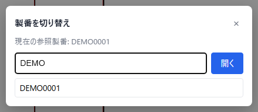
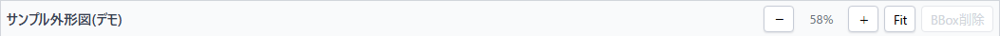
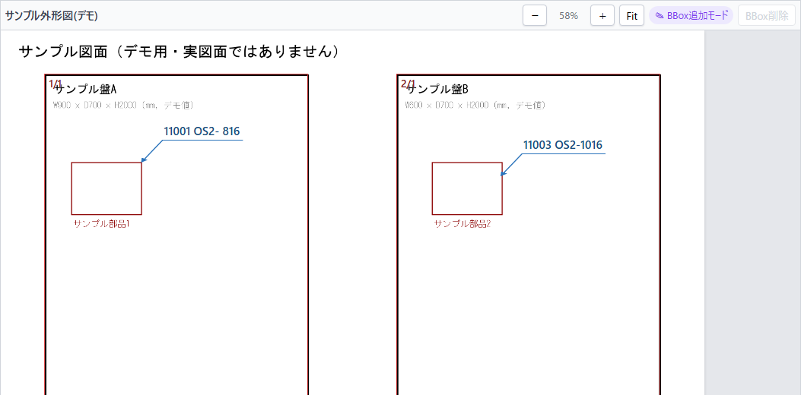
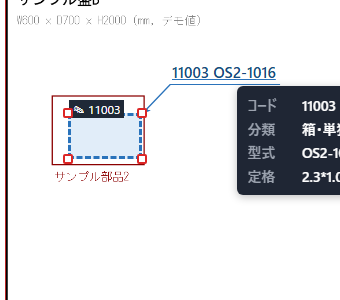
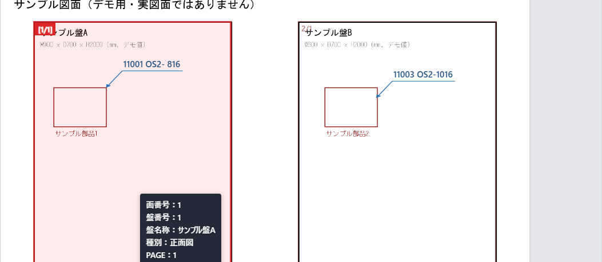
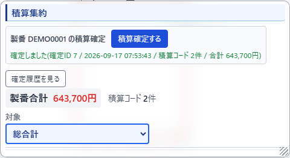

# user-guide.md — Sekisan Navi 操作ガイド(初めての方向け)

このガイドは、**パソコンの専門知識やプログラムの知識が無い方でも、Sekisan Navi
(積算ナビ)を迷わず使えるようになること**を目的にした操作マニュアルです。
専門用語が出てくる場合は、その場で簡単な説明を添えています。

開発者向けの技術的な内容(画面の内部構造・APIの仕様など)は載せていません。
そちらが必要な場合は[`README.md`](../README.md)や[`ui-spec.md`](ui-spec.md)を
参照してください。

## 目次

1. [このシステムは何をするものか](#1-このシステムは何をするものか)
2. [画面を開く](#2-画面を開く)
3. [画面全体の見方](#3-画面全体の見方)
4. [基本的な使い方(操作の流れ)](#4-基本的な使い方操作の流れ)
5. [困ったときは(よくある質問)](#5-困ったときはよくある質問)
6. [用語集](#6-用語集)

---

## 1. このシステムは何をするものか

Sekisan Naviは、電気設備の**図面**(盤や機器の配置を描いた設計図)を画面上で見ながら、
「この設備にはこの部品・工事が必要」という**積算(見積りのための数量・金額の計算)**の
作業を行うための社内システムです。

- 図面はパソコンの画面上で拡大・縮小しながら確認できます(紙に印刷する必要はありません)。
- 図面の上に四角い枠(これを本ガイドでは「**枠(BBox)**」と呼びます)を置いて、
  「ここに、この部品が必要」という情報を記録していきます。
- 記録した内容は自動的に集計され、合計金額もその場で確認できます。
- 「なぜこの金額になったか」を、あとから図面に戻って確認できるようになっています。

このシステムは**まだ開発中の試作版(プロトタイプ)**であり、今後、画面の項目や
操作方法が変わる可能性があります。あらかじめご了承ください。

## 2. 画面を開く

システム担当者から案内されたURL(例: `http://<サーバーのアドレス>:5173`)を、
お使いのWebブラウザ(Google Chrome、Microsoft Edgeなど)のアドレス欄に入力して
開いてください。

画面が表示されない、真っ白なまま止まってしまう場合は
[「5. 困ったときは」](#5-困ったときはよくある質問)を確認してください。

## 3. 画面全体の見方

画面を開くと、下の図のような画面が表示されます(下の画像はサンプルデータで
撮影したものです。実際の案件では、製番や盤の名前・図面の内容が異なります)。

画面は、大きく分けて次の領域(エリア)で構成されています。上から順に説明します。

### ① ヘッダー(画面いちばん上の帯)

- 左端に「Sekisan Navi」というシステム名。
- その右に、現在開いている案件の「整理番号」「製番」(下記用語集参照)、
  「盤名称」(現在の盤の名前)が表示されます。
- さらに右に「解析状態」という色付きのラベルがあります(現時点では表示のみで、
  自動で内容が変わる機能ではありません)。
- いちばん右に3つのボタンがあります。
  - **「製番を開く」**: 別の案件(製番)を検索して切り替えるためのボタンです。
  - **「積算資料」**: 積算作業の参考資料(PDF)を画面から離れずに参照する
    ためのボタンです。詳しくは
    [「4-11. 積算資料(参考資料PDF)を見る」](#4-11-積算資料参考資料pdfを見る)
    を参照してください。
  - **「システム設定」**: 図面データの参照先を変更するための管理者向けの
    設定(パスワードが必要、通常の作業では使いません)に加えて、
    floating panel(④〜⑦)の背景の透け具合(透過度)を調整するスライダーが
    あります。透過度の調整はパスワード不要で、どなたでも使えます。詳しくは
    [「4-7節」](#4-7-floating-panel盤情報積算集約積算明細部品台帳を表示移動大きさ変更透過度調整する)
    を参照してください。

### ② 図面一覧(画面左側)

現在の案件に含まれる図面のページが、縮小した画像(サムネイル)の一覧として
表示されます。「外形図」「基礎図」のように、図面の種類ごとにグループ分けされています。

見たいページの画像をクリックすると、中央の「図面Viewer」にそのページが
拡大表示されます。今見ているページには青い枠が付きます。

### ③ 図面Viewer(画面中央)

選んだ図面のページが大きく表示される場所です。ここで図面を拡大・縮小したり、
枠(BBox)を置いたり動かしたりします(詳しい操作は次の章で説明します)。

画面右上に、次の操作ボタンが並んでいます。

| ボタン | 内容 |
|---|---|
| `−` | 図面を縮小します |
| (数字)% | 現在の拡大率です(クリックはできません、表示のみ) |
| `＋` | 図面を拡大します |
| `Fit` | 図面全体が画面にちょうど収まる大きさへ戻します |
| `BBox削除` | 選択中の枠(BBox)を削除します(何も選んでいない間は押せません) |

ツールバーのボタン以外に、マウス操作でも拡大・縮小・表示位置の移動(Pan)が
できます。詳しくは[「4-3. 図面を拡大・縮小・移動して見る」](#4-3-図面を拡大縮小移動して見るzoomfitpan)
を参照してください。

### ④〜⑦ floating panel(図面の上に重ねて表示される4つの領域)

図面Viewerの上には、次の4つの領域が**floating panel**として重ねて表示されます
(以前は画面の右側や下段に常時表示されていましたが、図面をできるだけ大きく
見られるよう、現在はすべて図面の上に浮かせて表示する方式に変わっています)。

| 名前 | 何を表示する場所か |
|---|---|
| 部品台帳 | 「この部品・工事にはこのコードを使う」という一覧表(カタログ)。上部の「カテゴリ」欄(プルダウン)で種類(箱・単独、内部パネルなど)を切り替えると、その種類の部品・工事だけが下の表(コード・型式・定格の3項目)に表示されます。この一覧から行を選ぶことで、図面上に枠を置く準備ができます。 |
| 盤情報 | 現在の案件に含まれる「盤」(制御盤・配電盤などの設備1台1台)ごとの寸法(高さ・幅・奥行き)や型式の一覧。 |
| 積算集約 | 今まで置いた枠(BBox)の内容を集計した金額が表示される場所。「対象」欄で集計範囲を切り替えられます(4-8節で詳しく説明します)。 |
| 積算明細 | 置いた枠(BBox)を1件ずつ、表形式で確認できる一覧。 |

4つとも、**既定では図面Viewerの右端に寄せて、少しずつ位置をずらしながら
重なり合わないように表示されます**。表示のON/OFF・好きな位置への移動・
大きさの変更・背景の透け具合(透過度)の変え方は、
[「4-7. floating panel(盤情報・積算集約・積算明細・部品台帳)を表示/移動/
大きさ変更/透過度調整する」](#4-7-floating-panel盤情報積算集約積算明細部品台帳を表示移動大きさ変更透過度調整する)
でまとめて説明します。

**図面をもっと大きく見たいときは**: 使っていないfloating panelを隠すと、
その分だけ図面Viewerが広く見えるようになります。BBoxの位置を確認・編集
しながら金額や明細も見たいときは、必要なものだけを表示に戻してください。

---

## 4. 基本的な使い方(操作の流れ)

ここでは、実際の作業の流れをステップごとに説明します。初めての方は、
上から順番に試してみてください。

### 4-1. 案件(製番)を開く

1. ヘッダー右上の**「製番を開く」**ボタンをクリックします。
2. 検索欄に、案件の番号(製番。例: `A1GV24`のように一部分でも構いません)を
   入力します。入力すると、候補が自動的に一覧表示されます。
3. 開きたい案件の名前をクリックするか、完全な製番が分かっている場合は
   そのまま入力して**「開く」**ボタンをクリックします。
4. 案件が開くと、ヘッダーの表示と左側の図面一覧が切り替わります。

上の画像は、検索欄に「DEMO」と入力し、候補として「DEMO0001」が表示された
状態です(サンプルデータでの撮影)。「現在の参照製番」の表示や「開く」ボタンも
確認できます。

### 4-2. 図面のページを選ぶ

左側の「図面一覧」から、確認したいページの画像をクリックします。
中央のViewerに、そのページが表示されます。

### 4-3. 図面を拡大・縮小・移動して見る(Zoom/Fit/Pan)

- 図面の上でマウスホイールを回すと、その位置を中心に拡大・縮小(Zoom)できます。
- ツールバーの`−`/`＋`ボタンでも拡大・縮小できます。
- **表示位置を動かす(Pan)には、マウスの中央ボタン(ホイールを押し込む)を
  押したまま動かします**。マウスの左ボタンでドラッグしても表示位置は
  動きません(左ドラッグは、後述するBBox・盤・引出線ラベルの選択や編集に
  使うためです)。
- 中央ボタンを**すばやく2回クリック(ダブルクリック)**すると、図面全体が
  画面にちょうど収まる大きさへ一気に戻ります(下記「Fit」ボタンと同じ効果です)。
- 表示が分からなくなってしまったときは、**「Fit」**ボタンを押しても、
  図面全体がきれいに画面へ収まります。

左から「−」(縮小)・現在の拡大率・「＋」(拡大)・「Fit」・「BBox削除」の順に
並んでいます(「BBox削除」は枠を選んでいない間は灰色で押せません)。

### 4-4. 部品台帳から部品を選ぶ

図面の上に重ねて表示されている「部品台帳」で、これから記録したい
部品・工事の行を1件クリックして選びます。

- 上部の「カテゴリ」欄(プルダウン)で種類(箱・単独、内部パネルなど)を
  選ぶと、その種類の行だけに切り替わります。

行を選ぶと、図面Viewerの右上あたりに「✎ BBox追加モード」という
表示が出ます。これは「今クリックした部品・工事を、次に図面へ置く準備が
できました」という合図です(下の4-5の画像で、実際の表示を確認できます)。

### 4-5. 枠(BBox)を置く・選ぶ・動かす・大きさを変える・削除する

**置く**: 4-4で部品を選んだ状態のまま、図面上で「ここに置きたい」という
場所を**左ボタン**でマウスドラッグ(クリックしたまま動かして、離す)します。
ドラッグした範囲に四角い枠が作られ、その部品・工事が記録されます。

枠のそばには、選んだコードと型式が書かれた小さなラベル(引出線)が
表示されます。ラベルの位置によって、引出線が枠のどちらの角から伸びるかが
自動的に変わります(ラベルが枠の中心より左にあれば左上角から、それ以外は
右上角から伸びます)。見やすい位置にラベルを動かすと、線の伸びる向きも
自動的に読みやすい側へ切り替わります。

右上の紫色の「BBox追加モード」表示が出ている間に、右側の盤(サンプル盤B)へ
新しく枠を配置した直後の様子です。左側の盤(サンプル盤A)には、あらかじめ
置かれていた枠(コード`11001`)が引出線ラベル付きで表示されています。

**選ぶ・動かす・大きさを変える・削除する**:

- 図面上の枠(または引出線のラベル)を**左クリック**すると、その枠が選択され、
  四隅に小さな四角い取っ手(ハンドル)が表示されます。
- 枠の内側を左ドラッグすると、位置を動かせます。
- 四隅のハンドルを左ドラッグすると、大きさを変えられます。
- 削除したい場合は、枠を選んだ状態でツールバーの**「BBox削除」**ボタンを
  クリックします。
- 何もない場所を左クリックすると、選択が解除されます。

枠(またはラベル)を選ぶと、このように青い点線の枠と、四隅に赤い四角の
ハンドルが表示されます。カーソルを乗せると、コード・分類・型式・定格の
詳しい内容もポップアップで確認できます。

### 4-6. 操作を取り消す・やり直す(Undo/Redo)

画面左上にある**「元に戻す」**ボタンで、直前の操作(枠の作成・移動・
大きさ変更・削除)を1つ取り消せます。取り消した操作をもう一度行いたい
場合は**「やり直す」**ボタンを使います。

ただし、この取り消し履歴は**画面を閉じたり、別の案件に切り替えたりすると
消えてしまいます**。長時間置いた操作を確実に取り消したい場合は、
枠を選んで手動で位置を直す・削除するなどしてください。過去の操作を
あとから見返したい場合は、[「4-10. 操作履歴・確定履歴を見返す」](#4-10-操作履歴確定履歴を見返す)
の「操作履歴を見る」を使ってください。

### 4-7. floating panel(盤情報・積算集約・積算明細・部品台帳)を表示/移動/大きさ変更/透過度調整する

3章で説明した4つのfloating panel(盤情報・積算集約・積算明細・部品台帳)は、
いずれも次の操作が共通してできます。

- **表示/非表示**: ツールバー(元に戻す/やり直すボタンの並び)右端にある
  4つのボタン(「盤情報」「積算集約」「積算明細」「部品台帳」)で、それぞれ
  個別に切り替えます。ボタンの色が濃く塗りつぶされているときが「表示中」、
  薄い色のときが「非表示中」です(ボタンの文字自体は常に同じ名前のまま
  変わりません。マウスを乗せると今の状態が「隠す」か「表示する」かの
  説明が出ます)。
- **好きな位置へ動かす**: 見出し(タイトルが書かれた部分、例:「盤情報
  ○件」)を掴んでドラッグすると、図面の上の好きな位置へ移動できます。
  図面の邪魔になる場所にあるときに使ってください。
- **大きさを変える**: 枠の右下すみ(斜線が引かれた小さな部分)をドラッグすると、
  大きさを変えられます。
- **前面に出す**: 複数のfloating panelが重なっている場合、いずれかの
  panelをクリックすると、そのpanelが自動的にいちばん手前に表示されます。

移動・大きさの変更は、画面を開いている間(リロードするまで)は覚えています。
ブラウザの幅を変えたときも、位置関係を保ったまま追従します。

**背景の透け具合(透過度)を変える**: ヘッダー右端の「システム設定」ボタンを
押すと、「表示設定」欄に「floating panel透過度」というスライダーがあります
(パスワードは不要で、どなたでも調整できます)。値を下げるほど、floating panel
の背景から図面が透けて見えるようになります(文字や表の内容の見やすさは
変わりません)。4つのpanelすべてに共通の設定です。

### 4-8. 盤情報・積算集約・積算明細を確認する

- **盤情報**: 現在の案件に含まれる盤(制御盤・配電盤など)ごとの寸法・型式の
  一覧が表示されます。図面Viewer上に薄い色で表示されている盤の範囲を
  クリックすると、その盤を選択でき、「盤情報」側でも対応するカードが
  強調表示されます。選択を解除したいときは、図面の何もない場所をクリック
  してください。

  

  盤の範囲(この例では左側の「サンプル盤A」)をクリックすると、その部分が
  濃い色で強調され、面番号・盤番号・盤名称などを書いたポップアップが表示されます。

- **積算集約**: 今まで置いた枠の内容が自動的に集計され、金額が表示されます。
  - 「対象」の選択欄で、集計の範囲を切り替えられます。選べる範囲は次の4種類です。
    - **総合計**: 案件全体の合計。
    - **製品全体**: どの盤にも属さない(盤の範囲の外に置かれた)枠だけの集計。
    - **各盤の名前**: その1つの盤に属する枠だけの集計。
    - **要確認**: 複数の盤の範囲にちょうど同じくらい重なっていて、システムが
      自動でどちらの盤に属するか決められなかった枠の集計です。これが表示された
      場合は、図面上でその枠の位置を少しずらすなどして、どちらの盤に属するかが
      はっきり分かるよう調整してください。
  - 「製番合計」(または選んだ対象の小計)が、赤い文字で大きく表示されます。
  - 表には、コードごとの単価・数量・金額が並びます。見出し(コード・内容など)を
    クリックすると、その項目で並べ替えができます。
  - 「※単価は…暫定的に表示しています」という注意書きがある通り、表示される
    単価は正式に確定した金額ではありません。あくまで現時点の目安です。
  - 「積算確定する」ボタンについては、[4-9節](#4-9-内容を確定する積算確定)で説明します。

- **積算明細**: 置いた枠を1件ずつ、表形式で確認できます。
  - 上部のタブ(全て/AI/設計情報/マニュアル)で、記録した方法ごとに
    絞り込めます。通常の作業で置いた枠は「マニュアル」に分類されます。
  - 「状態」の列には、○(確定)・△(要確認)・×(不備)の記号が表示されます。
  - 行をクリックすると、対応する図面のページ・場所へ自動的に移動します。
    「この金額はどの図面のどの部分から来たのか」を確認したいときに使います。

表示されていない場合は、[4-7節](#4-7-floating-panel盤情報積算集約積算明細部品台帳を表示移動大きさ変更透過度調整する)
のツールバーボタンから表示に戻してください。

### 4-9. 内容を確定する(積算確定)

ある程度作業が進み、内容を確認できたら、**「積算確定する」**ボタンを
押すことで、その時点の集計結果を記録として残せます。

1. 「積算集約」欄の**「積算確定する」**ボタンをクリックします。
2. 確認のポップアップ(ダイアログ)が表示されるので、内容を確認して
   問題なければ「OK」を選びます(キャンセルすれば何も記録されません)。
3. 少し待つと、「確定しました(確定ID … / 確定日時 … / 積算コード…件 /
   合計…円)」という結果が表示されます。

緑色の文字で「確定しました(確定ID … / 確定日時 … / 積算コード…件 /
合計…円)」と表示されれば、記録が完了しています。

**注意**: この「確定」は、あとから同じボタンを押すたびに**新しい記録が
追加される**仕組みです(すでにある記録を上書きすることはありません)。
過去に確定した記録をあとから見返す方法は、次の4-10節で説明します。

### 4-10. 操作履歴・確定履歴を見返す

#### いつ・どう変えたかを見返す(操作履歴を見る)

「元に戻す」「やり直す」ボタンの隣にある**「操作履歴を見る」**ボタンから、
これまでにこの案件(製番)で行った枠(BBox)の操作を、行った順に見返す
ことができます。

1. **「操作履歴を見る」**ボタンをクリックします。
2. 枠の**追加・削除・移動/サイズ変更**の記録が、行った順(古い順)に
   一覧表示されます(まだ何も操作していない場合は「まだ操作履歴が
   ありません」と表示されます)。
3. 移動・サイズ変更の記録には、**変更前→変更後**の位置・大きさが
   あわせて表示されます。

この画面は「元に戻す」ボタンとは異なり、あとから記録を取り消したり
編集したりすることはできません。過去の操作内容を確認するためだけの
画面です。また、この履歴は「元に戻す」履歴とは異なり、画面を閉じても
消えません。

#### 過去に確定した記録をあとから見返す(確定履歴を見る)

「積算確定する」ボタンの隣にある**「確定履歴を見る」**ボタンから、
これまでにこの案件(製番)で確定した記録を一覧・詳細で見返すことができます。

1. **「確定履歴を見る」**ボタンをクリックします。
2. 過去に確定した記録が、確定日時の新しい順に一覧表示されます
   (まだ一度も確定していない場合は「まだ積算確定されていません」と
   表示されます)。
3. 一覧から見たい記録をクリックすると、確定日時・件数・合計金額と、
   確定した時点の積算コードの明細(コード・内容・型式・定格・単価(暫定)・
   数量・金額)が表示されます。
4. 「← 一覧へ戻る」で一覧に戻れます。「×」ボタンまたは画面の外側を
   クリックすると閉じます。

**注意**: この画面に表示される内容は、確定した**その時点の記録そのもの**
です。あとから部品台帳の単価等が変わっても、この画面の表示内容
自体は変化しません(記録を確認するための画面であり、編集はできません)。

### 4-11. 積算資料(参考資料PDF)を見る

画面右上の**「積算資料」**ボタンを押すと、積算作業の参考資料(PDF)を
画面から離れずに参照できます(Issue #19 Phase 3)。

- 部品台帳(品目の選択)を置き換えるものではなく、あくまで
  **参考資料**です。
- ボタンを押すと、資料を大きく表示するウィンドウ(モーダル)が開きます。
- 資料が複数ページある場合は、ウィンドウ内でスクロール・ページ送りして
  確認できます(お使いのブラウザに備わっている、通常のPDF表示機能を使います)。
- ウィンドウを閉じても、現在開いている製番・図面のページ・積算対象の選択・
  枠(BBox)の選択状態はそのまま維持されます。
- 資料がまだ用意されていない場合は「積算資料が配置されていません。管理者に
  配置を依頼してください。」と表示されます。この場合はシステム担当者に
  資料の配置を依頼してください(利用者自身がこの画面から資料を
  追加・削除することはできません)。
- 閉じるには、右上の「×」ボタンをクリックするか、ウィンドウの外側(暗く
  なっている部分)をクリックしてください。

---

## 5. 困ったときは(よくある質問)

**Q. 画面が真っ白のまま何も表示されません。**
A. まず数秒待ってみてください。それでも表示されない場合は、ブラウザの
再読み込み(F5キー、またはブラウザの更新ボタン)を試してください。
それでも直らない場合はシステム担当者に連絡してください。

**Q. 図面が表示されず、「読み込めませんでした」というメッセージが出ます。**
A. 図面データの保存場所(共有フォルダ)に一時的に接続できない可能性が
あります。時間をおいて再度お試しいただくか、システム担当者に連絡してください。

**Q. 図面を左ボタンでドラッグしても表示位置が動きません。**
A. 表示位置の移動(Pan)は、マウスの**中央ボタン(ホイールを押し込む)**での
ドラッグ専用です。左ボタンのドラッグはBBox・盤・引出線ラベルの選択や移動に
使うため、意図的にPanしない仕様になっています。詳しくは
[「4-3. 図面を拡大・縮小・移動して見る」](#4-3-図面を拡大縮小移動して見るzoomfitpan)
を参照してください。

**Q. 「BBox削除」ボタンが押せません(灰色のまま)。**
A. 削除するには、先に図面上の枠を1つクリックして選択する必要があります。
何も選んでいない状態ではこのボタンは押せない仕様です。

**Q. 枠(BBox)を間違えて削除・移動してしまいました。**
A. すぐに気づいた場合は、画面左上の「元に戻す」ボタンで取り消せます。
別の案件に切り替えた後や、画面を閉じた後は取り消せませんので、
操作前に「本当にこの内容でよいか」を確認する習慣をおすすめします。

**Q. 「積算確定する」ボタンを間違えて2回押してしまいました。**
A. 確定は「記録を追加する」操作のため、2回押すと記録が2件残ります
(悪い状態にはなりません)。「確定履歴を見る」ボタンから、実際に何件・
どんな内容で記録されたかを確認できます。気になる場合はシステム担当者に
相談してください。

**Q. 表示されている単価や金額は、そのまま正式な見積り金額として
使ってよいですか。**
A. いいえ。表示されている単価はマスター(積算コードの一覧表)に基づく
暫定的な目安であり、正式な見積り金額として確定したものではありません。
画面にも「(暫定)」と注記されています。

**Q. もっと詳しい仕様(画面の細かい仕様や、開発者向けの情報)を知りたい。**
A. [`ui-spec.md`](ui-spec.md)(画面仕様)や[`README.md`](../README.md)を
参照してください。

---

## 6. 用語集

初めて聞く言葉が出てきたときに参照してください。

| 用語 | 説明 |
|---|---|
| 製番 | 案件(工事・設備)ごとに付けられる管理番号。この番号で図面や積算データが
  ひとまとまりに管理されます。 |
| 盤 | 制御盤・配電盤など、電気設備の箱(筐体)1台のこと。1つの案件(製番)に
  複数の盤が含まれることがあります。 |
| 枠(BBox) | 図面の上に置く四角い枠。「ここにこの部品・工事がある」ということを
  示すための印です。専門的には「Bounding Box」の略で「BBox」と呼ばれます。 |
| 積算コード | 部品や工事の種類ごとに割り振られた管理コード。部品台帳という
  一覧表(カタログ)から選びます。 |
| 部品台帳 | 積算コードの一覧表(カタログ)。会社で管理している価格表を
  元にしています。 |
| 積算集約 | 置いた枠(BBox)の内容を、金額として集計・表示する画面領域。 |
| 積算明細 | 置いた枠(BBox)を1件ずつ、表形式で確認できる画面領域。 |
| 対象 | 積算集約で金額を集計する範囲(案件全体、または特定の1つの盤など)を
  選ぶための言葉。 |
| 積算確定 | その時点の積算集約の内容を、記録として残す操作。あとから内容が
  勝手に変わらないよう、その瞬間の金額・内容を保存します。 |
| 確定履歴 | 過去に「積算確定」した記録の一覧・詳細を見返せる画面。「確定履歴を
  見る」ボタンから開きます。編集はできず、確定した時点の内容を確認するだけの
  画面です。 |
| 操作履歴 | 枠(BBox)の追加・削除・移動/サイズ変更を、行った順に見返せる画面。
  「操作履歴を見る」ボタンから開きます。「元に戻す」とは異なり、記録を
  取り消すことはできません。 |
| 単価(暫定) | 部品台帳に登録されている参考価格。正式に確定した価格
  ではないことを示すため「(暫定)」と表示されています。 |
| Viewer | 図面を表示する画面領域(中央の大きな図面表示エリア)のこと。 |
| floating panel | 盤情報・積算集約・積算明細・部品台帳の4つのように、図面
  Viewerの上に重ねて表示される、表示ON/OFF・移動・大きさ変更ができる画面領域。 |
| Pan | 図面の表示位置を動かすこと。マウスの中央ボタン(ホイール押し込み)を
  押したままドラッグして行います。 |
| Fit | 図面全体が画面にちょうど収まる大きさへ戻すこと。ツールバーの「Fit」
  ボタン、または中央ボタンのダブルクリックで行えます。 |
| データ参照ルート | 図面データが保存されている共有フォルダの場所。通常の作業では
  意識する必要はなく、システム担当者のみが「システム設定」から変更します。 |
| 積算資料 | 画面右上の「積算資料」ボタンから参照できる、積算作業の参考資料
  (PDF)。部品台帳を置き換えるものではなく、あくまで参考資料です。 |
